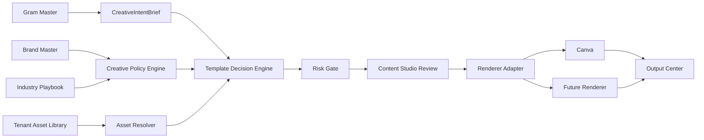

# Controlled Creative Production and Canva Risk Plan

## Amaç

Bu doküman, Canva entegrasyonunu sadece kampanya üretimi olarak değil, farklı sektörlerden farklı tenant'lara sosyal medya, reklam, yorum, duyuru, eğitim, ürün/hizmet tanıtımı ve marka iletişimi desteği verecek kontrollü bir üretim sistemi olarak değerlendirir.

Hedef, geliştirmeye başlamadan önce üç şeyi netleştirmektir:

1. Bugüne kadar üründe ne kuruldu?
2. Bu akışlar bugün nasıl çalışıyor, hedefte nasıl çalışmalı?
3. Riskleri en aza indirmek için sprint bazlı hangi işleri yapmalıyız?

Ana karar: Canva ürünün beyni olmamalı. Canva, seçilmiş template'i dolduran ve export eden bir renderer adapter olarak konumlanmalı. Template seçimi, risk kontrolü, tenant izolasyonu, manual override, approval ve lineage SmartAgency içinde kalmalı.

## Mevcut Durum Özeti

Mevcut sistemde Canva ve dinamik içerik tarafında aşağıdaki temel parçalar oluşmuş durumda:

- `docs/dynamic-content-and-canva-standard.md` sektör bağımsız use-case ve Canva field standardını tanımlıyor.
- `apps/web/src/lib/canva-field-dictionary.ts` standart autofill alanlarını tanımlıyor: `headline`, `subtitle`, `caption`, `cta`, `offer`, `price`, `date`, `location`, `hero_image`, `product_image`, `logo` vb.
- `apps/web/src/lib/canva-template-selection.ts` template skorlaması yapıyor: content kind, aspect ratio, objective, tone, industry, use-case, tags, brand fit, priority ve field compatibility.
- `apps/web/src/components/pages/BrandHubPage.tsx` tenant/office bazlı Canva bağlantısı, template registry, asset library, office brand profile ve field health görünümü için operasyon ekranı sağlıyor.
- `apps/api/src/Nexus.Api/Controllers/BrandContextController.cs` tenant scoped asset, office profile ve Canva template assignment API'lerini sağlıyor.
- `apps/web/src/app/api/canva/autofill-design/route.ts` otomatik template seçimi veya manuel `templateId` override ile Canva autofill job oluşturuyor, design lineage metadata'sını artifact içine kaydetmeye çalışıyor.
- `apps/web/src/app/api/canva/export-design/route.ts` Canva export job çalıştırıyor, entitlement kontrolü yapıyor ve preview çıktısını kalıcı dosyaya indiriyor.
- `apps/web/src/lib/canva-template-catalog.ts` Canva Brand Template listesini çekiyor, dataset hydrate ediyor, local registry ve Nexus assignment metadata'sı ile birleştiriyor.

Bu parçalar doğru yönde; fakat üretim seviyesinde riskleri azaltmak için karar katmanı, süreç sahipliği ve veri kaynağı sınırları daha net olmalı.

Sprint 0 kapsamında davranış değiştirmeden eklenen ortak sözleşmeler:

- `apps/web/src/lib/creative-production-contracts.ts`
- `apps/api/src/Nexus.Contracts/Dtos/SetupDto.cs`
- `backend/app/crew/creative_profile.py`

Bu sözleşmeler Setup Wizard, CrewAI discovery, Content Studio, Template Decision Engine ve renderer adapter'ların aynı kavramları kullanması için referans olacak.

## AI Tenant Discovery Yaklaşımı

Bu ürün yönü, kullanıcıya uzun form doldurtmak yerine şirketi minimum sinyallerle anlamaya dayanır.

Hedef setup akışı:

```text
Minimum tenant input
→ CrewAI company research
→ Customer-visible company summary
→ AI recommended content needs
→ User multi-select confirmation
→ TenantCreativeProfile
→ Template family activation
→ Agent prompts + Content Studio + Output Center
```

İlk adımda kullanıcıdan alınacak minimum bilgiler:

- Web sitesi URL'i
- Instagram, TikTok, YouTube, LinkedIn, Google Business profilleri
- Şirket adı veya marka adı
- Lokasyon
- Ana hedef: satış, rezervasyon, bilinirlik, lead, yorum yönetimi

AI araştırmasının üretmesi gereken iki ayrı çıktı:

1. `SystemIntelligence`
  - Agent promptları, template seçimi, risk policy ve asset resolver için kullanılır.
  - Keywordler, sektör, alt sektör, ürün/hizmet listesi, hedef kitle, CTA önerileri, content need önerileri ve risk sinyallerini içerir.
2. `CustomerVisibleSummary`
  - Setup ekranında müşteriye gösterilir.
  - "Sizi böyle anladık, doğru mu?" onayı için kısa ve anlaşılır şirket raporudur.

Kullanıcı ikinci aşamada AI'ın önerdiği sosyal medya ihtiyaçlarını çoklu seçimle doğrular. Örnek content need setleri:

- Kampanya / teklif paylaşımı
- Event / duyuru paylaşımı
- Menü paylaşımı
- Ürün / hizmet öne çıkarma
- Eğitici içerik
- Sosyal kanıt
- Sahne arkası / süreç
- Lead / randevu toplama

Bu seçimler `TenantCreativeProfile.SelectedContentNeeds` olarak kaydedilecek ve ileride Gram Master, Content Studio, Canva template seçimi, approval policy ve Output QA Gate tarafından kullanılacak.

## Ürün Diff'i: Bugün ve Hedef

### 1. Canva'nın Rolü

Bugün:

- Canva entegrasyonu Brand Hub içinde görünür.
- Canva Brand Template dataset'i okunur.
- Template metadata'sı kısmen local registry, kısmen Nexus assignment üzerinden taşınır.
- Autofill sonucu Canva design linki ve thumbnail metadata'sı artifact'e yazılır.

Hedef:

- Canva sadece renderer/export adapter olur.
- Template seçimi SmartAgency Template Decision Engine tarafından yapılır.
- Aynı karar sistemi ileride Figma, SVG/HTML renderer, Bannerbear, Placid veya internal renderer ile de çalışabilir.
- Canva template id doğrudan agent tarafından seçilmez; agent sadece intent, içerik alanları ve risk sinyali üretir.

Fark:

```text
Before: Agent or UI signal -> Canva template match -> Canva autofill
After: IntentBrief -> Brand/Industry/Asset/Template policy -> Risk gate -> Renderer adapter
```

### 2. Template Seçimi

Bugün:

- Template scoring içerik türü, aspect ratio, objective, tone, industry, use-case ve field doluluğu üzerinden yapılıyor.
- Manuel `templateId` verilirse autofill route'u manuel seçim kabul ediyor.
- Required field eksikleri score'u düşürüyor; hiç field dolmuyorsa autofill engelleniyor.

Hedef:

- Template seçimi tenant/office scope içinde zorunlu hale gelir.
- `approved`, `enabled`, `riskTier`, `allowedIntents`, `allowedChannels`, `requiredAssets`, `manualApprovalRequired` gibi karar alanları eklenir.
- Yüksek riskli çıktılarda AI sadece önerir; kullanıcı veya operasyon ekibi onaylamadan yayın/export tamamlanmaz.
- Seçilen template'in neden seçildiği Content Studio'da görünür.

Fark:

```text
Before: Best score wins
After: Eligibility filter -> scoring -> risk policy -> explainable recommendation -> optional manual override
```

### 3. Tenant ve Sektör Çeşitliliği

Bugün:

- Tenant media asset, office brand profile ve Canva template assignment modelleri var.
- Sektör alanı template metadata'sında var ama henüz tam bir Industry Playbook katmanı değil.

Hedef:

- Her tenant şu katmanlardan beslenir:
  - Global content standards
  - Industry playbook
  - Tenant brand profile
  - Office/location override
  - Output intent
  - Approval/risk policy
- Template'ler sadece sektör ile değil, intent + channel + brand style + asset compatibility ile eşleşir.

Fark:

```text
Before: Restaurant/campaign-like template metadata
After: Sector-agnostic intent system with industry-specific guardrails
```

### 4. Gram Master / Agent Çıktısı

Bugün:

- Gram Master ve içerik üretimi caption, başlık, görsel yön, hashtag ve sosyal medya metni üretme ekseninde.
- Canva tarafı bu sinyalleri `CanvaTemplateDecisionInput` olarak kullanabiliyor.

Hedef:

- Gram Master template id değil, `CreativeIntentBrief` üretir.
- Bu brief şunları içerir:
  - `intent`: `educational_post`, `social_proof`, `product_highlight`, `service_intro`, `offer_campaign`, `event_announcement`, `review_response`, `ad_creative`, `google_business_update`
  - `channel`: `instagram_post`, `instagram_story`, `reel_cover`, `carousel`, `google_business`, `meta_ad`
  - `riskSignals`: price, discount, health claim, legal claim, date, location, before_after, regulated_industry
  - `requiredFields`: headline, cta, image, logo, offer, date vb.
  - `assetIntent`: product image, venue image, team photo, generated visual vb.

Fark:

```text
Before: Content text becomes Canva signal
After: Agent produces structured creative intent; system resolves template, asset, renderer and approval
```

### 5. Brand Master / Brand Hub

Bugün:

- Brand Hub, Canva bağlantısı, tenant id, office id, field dictionary, media assets, office profile ve template assignment düzenleme alanlarını içeriyor.

Hedef:

- Brand Hub, "Brand Master" sorumluluğuna evrilir:
  - Tenant brand kit
  - Industry playbook seçimi
  - Approved asset library
  - Approved template library
  - Office overrides
  - Risk/approval policy
  - Renderer connections

Fark:

```text
Before: Canva operations center
After: Tenant creative governance center
```

### 6. Content Studio

Bugün:

- Content Studio içerik üretimi ve marka sinyallerini kullanıyor.
- Canva output preview artifact tarafında görünebiliyor.

Hedef:

- Content Studio kreatif karar ekranı olur:
  - Brief alır.
  - Intent çıkarır.
  - Template önerilerini ve skor nedenlerini gösterir.
  - Manuel template override sağlar.
  - Eksik bilgi varsa sadece gerekli soruyu sorar.
  - Risk seviyesine göre "draft", "needs review", "ready to render" statüsü verir.

Fark:

```text
Before: Create content
After: Create, inspect, override and approve creative production decisions
```

### 7. Output Center

Bugün:

- Outputs/artifact preview içinde Canva design badge/link görünebiliyor.
- Export route preview dosyasını kalıcı olarak indirebiliyor.

Hedef:

- Output Center render ve yayın operasyon merkezi olur:
  - Render job status
  - Canva edit link
  - Exported files
  - Approval state
  - Failed render retry
  - Publish readiness
  - Lineage: source brief, agent run, selected template, asset ids, reviewer

Fark:

```text
Before: Artifact gallery with Canva badge
After: Render, review, export and publish control tower
```

## Risk Değerlendirmesi

### Yüksek Riskler

1. Yanlış template seçimi
  - Etki: Marka kalitesi düşer, yanlış mesaj/format çıkar.
  - Azaltım: Eligibility filter, tenant approved template library, explainable score, manual override.
2. Yanlış tenant asset/template kullanımı
  - Etki: Başka müşterinin logosu, görseli veya template'i kullanılabilir.
  - Azaltım: Her resolver ve API sorgusunda tenant scope zorunlu; office sadece override.
3. Eksik veya yanlış Canva field mapping
  - Etki: Başlık yanlış alana, CTA uzun metne, logo background'a basılabilir.
  - Azaltım: Template Contract Health, required field blocking, max length validation, field dictionary.
4. Regulated veya hassas sektörlerde yanlış vaat
  - Etki: Hukuki/itibar riski.
  - Azaltım: Industry Playbook, risk signals, mandatory approval, restricted claims list.
5. Canva API / Enterprise / OAuth bağımlılığı
  - Etki: Müşteri onboard edilemez, render/export durur.
  - Azaltım: Renderer adapter pattern, fallback render strategy, retry queue, connection readiness checks.

### Orta Riskler

1. Template sayısı büyüdükçe yönetim karmaşası
  - Azaltım: Template families, tags, priority, status, owner, last reviewed at.
2. Kullanıcıya çok fazla karar bırakılması
  - Azaltım: Default recommendation, only high-risk manual approval, missing-info minimal question flow.
3. Asset kalitesi yetersizliği
  - Azaltım: Approved asset library, asset health, generated visual fallback, per-intent required asset rules.
4. Render maliyeti ve rate limitler
  - Azaltım: Quota/entitlement, async queue, cache preview, batch scheduling.
5. Local registry ve Nexus DB metadata çakışması
  - Azaltım: Production source of truth Nexus DB; local registry sadece dev fallback.

### Düşük ama İzlenmesi Gereken Riskler

1. Template naming inference yanılabilir.
  - Azaltım: Manuel metadata edit zorunlu hale getirilir.
2. Çok katmanlı model ürün ekibine karmaşık gelebilir.
  - Azaltım: UI'da "Recommended", "Needs setup", "Blocked" gibi basit statüler.
3. Canva export dosyalarının saklanması büyüyebilir.
  - Azaltım: Storage lifecycle, thumbnail/full export ayrımı.

## Hedef Mimari




## Önerilen Karar Modeli

Template kararı dört aşamada verilmeli:

1. Eligibility
  - Tenant/office scope uyuyor mu?
  - Template enabled/approved mı?
  - Channel ve aspect ratio uyuyor mu?
  - Required fields ve required assets doldurulabiliyor mu?
  - Industry risk policy izin veriyor mu?
2. Scoring
  - Intent fit
  - Brand fit
  - Field compatibility
  - Asset compatibility
  - Historical performance
  - Priority/manual preference
3. Risk Gate
  - Yüksek riskli alanlar var mı?
  - Regulated industry mi?
  - Fiyat, indirim, tarih, lokasyon, sağlık/hukuk/finans iddiası var mı?
  - Before/after veya kişisel görsel var mı?
4. Human Control
  - Düşük risk: auto-render draft olabilir.
  - Orta risk: render preview + approve.
  - Yüksek risk: manual approval before export/publish.

## Önerilen Veri Sözleşmeleri

### TenantCreativeProfile

```json
{
  "tenantId": "tenant_123",
  "officeId": null,
  "industry": "restaurant_cafe",
  "businessType": "premium casual dining",
  "platforms": ["instagram", "google_business"],
  "selectedContentNeeds": [
    "menu_share",
    "event_announcement",
    "campaign_offer",
    "social_proof"
  ],
  "selectedTemplateFamilies": [
    "restaurant_cafe.menu_share.post",
    "restaurant_cafe.event_announcement.story"
  ],
  "brandTone": ["warm", "premium", "local"],
  "keywords": ["reservation", "live music", "chef menu"],
  "defaultCtas": ["Rezervasyon Yap", "Menüyü İncele"],
  "riskRules": {
    "price": "approval_required",
    "discount": "approval_required",
    "date": "approval_required"
  },
  "customerVisibleSummary": "Müşteriye gösterilecek kısa şirket özeti.",
  "systemIntelligence": "Agent ve karar motorlarının kullanacağı detaylı rapor.",
  "discoveryConfidence": 78,
  "confirmedAt": null
}
```

### CreativeIntentBrief

```json
{
  "tenantId": "tenant_123",
  "officeId": "office_456",
  "intent": "product_highlight",
  "channel": "instagram_story",
  "format": "9:16",
  "headline": "Yeni Cold Brew Serisi",
  "subtitle": "Yaza ferah başlangıç",
  "caption": "Yeni cold brew serimiz bugün rafta.",
  "cta": "Bugün dene",
  "assetIntent": "product_image",
  "riskSignals": ["price_optional", "location"],
  "industry": "coffee_shop",
  "locale": "tr-TR"
}
```

### TemplateDecisionResult

```json
{
  "templateId": "canva_tpl_123",
  "selectedBy": "ai_match",
  "score": 87,
  "eligibility": "eligible",
  "riskTier": "medium",
  "approvalRequired": true,
  "reasons": [
    "intent matched: product_highlight",
    "channel matched: instagram_story",
    "required fields available"
  ],
  "missingFields": [],
  "validationWarnings": ["headline trimmed to 42 chars"]
}
```

## Sprint Bazlı Plan

### Sprint 0: Karar ve Güvenlik Çerçevesi

Amaç: Canva'yı renderer adapter olarak konumlandırıp ürün dilini sabitlemek.

Yapılacaklar:

- Bu dokümanı ürün referansı olarak kabul et.
- "Canva template seçer" dilini "SmartAgency template seçer, Canva render eder" olarak değiştir.
- Mevcut `docs/dynamic-content-and-canva-standard.md` dokümanını bu karar ile hizala.
- Risk tier tanımlarını sabitle: low, medium, high, blocked.
- `TenantCreativeProfile`, `CreativeIntentBrief`, `TemplateDecisionResult`, `IndustryPlaybook`, `TemplateFamilyContract` sözleşmelerini web, .NET ve Python tarafında davranış değiştirmeden tanımla.
- AI tenant discovery akışını setup'ın yeni omurgası olarak kabul et.

Kabul kriteri:

- Ürün, engineering ve ops aynı kavramları kullanır: Brand Master, Content Studio, Output Center, CreativeIntentBrief, TemplateDecisionResult.
- Contract dosyaları var olur fakat mevcut runtime davranışını değiştirmez.
- Sonraki sprintlerde Setup Wizard ve CrewAI discovery bu sözleşmelere bağlanabilir.

### Sprint 1: Tenant Creative Profile Persistence

Amaç: AI tenant discovery sonucunda öğrenilen ve müşterinin doğrulayacağı creative setup bilgisini kalıcı tenant verisine bağlamak.

Yapılacaklar:

- `CompanyProfile` üzerinde Sprint 1 için JSON tabanlı creative profile alanları ekle:
  - `PlatformProfiles`
  - `ContentNeeds`
  - `TemplateFamilies`
  - `RiskRules`
  - `CustomerVisibleSummary`
  - `SystemIntelligence`
  - `DiscoveryConfidence`
  - `CreativeProfileConfirmedAt`
- `SetupDto`, `SetupService`, web `CompanyProfile` ve `SaveCompanyProfileRequest` tiplerini bu alanlarla hizala.
- Mevcut `/api/setup/brand-discovery` sonucunu content needs, template families, risk rules ve customer/system summary alanlarına uygula.
- Onboarding status içine "content needs confirmed" kontrolü ekle.

Kabul kriteri:

- Brand discovery çalıştığında tenant'ın önerilen içerik ihtiyaçları, template family önerileri ve risk kuralları ayrı alanlarda saklanır.
- Sonraki setup kaydetmeleri bu alanları istemeden sıfırlamaz.
- Launch readiness, content needs belirlenmeden tamamlanmış sayılmaz.

Sprint 1 uygulama notu:

- Sprint 1'de yeni tablo açmak yerine `CompanyProfile` üzerinde JSON alanlarla ilerlenir. Bu, Sprint 2-3 UI akışını hızlı kurmayı sağlar.
- Daha sonra içerik ihtiyaçları ve template family ilişkileri operasyonel olarak büyürse ayrı `TenantContentNeed` ve `TenantTemplateFamilyAssignment` tablolarına taşınabilir.

### Sprint 2: Template Governance

Amaç: Tenant bazlı onaylı template library ve template sağlığı üretim seviyesine gelsin.

Yapılacaklar:

- `CanvaTemplateAssignment` üzerine governance metadata ekle:
  - status: draft, approved, disabled, needs_review
  - riskTier
  - templateFamilyId
  - allowedIntents
  - allowedChannels
  - requiredAssetIntents
  - manualApprovalRequired
  - lastReviewedAt / lastReviewedBy
- Local `.canva-template-registry.json` governance alanlarını taşıyabilir ama production kararında Nexus `CanvaTemplateAssignment` ana kaynak olarak merge edilir.
- Brand Hub'da governance status, risk tier, template family, allowed intents/channels, required asset intents ve manual approval flag düzenlenebilir.
- Template selection `disabled` ve `blocked` template'leri aday havuzundan çıkarır; draft/needs_review template'leri skor cezası ve açıklama ile taşır.

Kabul kriteri:

- AI sadece tenant/office için enabled, non-blocked ve governance metadata'sı taşınmış template'leri aday olarak alır.
- Approved template'ler skor avantajı alır; draft veya review gereken template'ler açıklanabilir şekilde geri plana düşer.
- Brand Hub kaydı hem local registry'yi hem Nexus DB assignment kaydını aynı governance alanlarıyla günceller.

Sprint 2 uygulama notu:

- Sprint 2, template governance verisini kalıcı hale getirir; henüz Content Studio'da alternatif/override UX'i tamamlamaz.
- `status = approved` üretim için hedef durumdur. Legacy/henüz assign edilmemiş Canva template'ler kırılmasın diye selection motoru bilinmeyen status'ları tamamen engellemez; fakat Nexus assignment üzerinden gelen `disabled` ve `blocked` kararları sert şekilde elenir.

### Sprint 3: Industry Playbooks

Amaç: Farklı sektör çeşitliliğini ayrı ayrı kod yazmadan yönetmek.

Yapılacaklar:

- Global industry playbook modelini oluştur.
- İlk playbook'lar:
  - restaurant/cafe
  - beauty/wellness
  - healthcare/clinic
  - real estate
  - ecommerce/retail
  - agency/web services
  - local service business
- Her playbook için allowed intents, risky claims, preferred visual rules, approval triggers tanımla.
- Tenant onboarding içinde industry seçimi ve override alanlarını ekle.
- Brand discovery çıktısını playbook ile zenginleştir:
  - `playbook_id`
  - `preferred_channels`
  - `risk_rules`
  - `approval_required_for`
  - playbook tabanlı `content_pillars`
  - playbook tabanlı `template_needs`
- Setup API üzerinden playbook katalogunu expose et.

Kabul kriteri:

- Aynı template sistemi farklı sektörlerde farklı risk ve dil kurallarıyla çalışır.
- AI discovery, sadece keyword tahminiyle değil, sektör playbook'u ile content need ve template family önerir.
- Web/API tarafı playbook katalogunu okuyabilir.

Sprint 3 uygulama notu:

- Python tarafında `backend/app/crew/industry_playbooks.py` playbook katalogu eklendi.
- `brand_analyzer.py` artık sektör id'sini normalize eder ve report içine playbook kaynaklı preferred channel/risk rule/template family bilgilerini ekler.
- .NET `SetupController` içinde `/api/setup/industry-playbooks` endpoint'i eklendi.
- Web `apiClient.getIndustryPlaybooks()` ve `IndustryPlaybookDto` tipi eklendi.

### Sprint 4: Template Decision Engine V2

Amaç: Skorlamayı "best score wins" modelinden policy-aware karar modeline taşımak.

Yapılacaklar:

- Eligibility filter ekle.
- Risk penalty ve approval policy ekle.
- Required asset ve required field blocking'i sertleştir.
- Decision explainability response'unu Content Studio'da gösterecek hale getir.
- Manuel override için "neden override edildi" ve reviewer bilgisi tut.

Kabul kriteri:

- Content Studio template önerisini, alternatifleri, eksikleri ve risk nedenlerini açıkça gösterir.

Sprint 4 uygulama notu:

- `selectCanvaTemplate` artık her aday için şu decision alanlarını üretir:
  - `eligibility`: eligible, needs_setup, blocked
  - `riskTier`: low, medium, high, blocked
  - `approvalRequired`
  - `blockedReasons`
  - `policyWarnings`
  - `requiredAssetIntents`
  - `missingAssetIntents`
  - `riskSignals`
- `disabled`, `blocked`, allowed channel/use-case mismatch, required field eksikliği ve required asset eksikliği hard block sayılır.
- `draft` ve `needs_review` template'ler tamamen engellenmez; `needs_setup` olarak işaretlenir ve skor cezası alır.
- Autofill route blocked decision dönerse Canva job başlatmaz.
- Template match route response'u explainability alanlarını döndürür; Content Studio bunları görünür hale getirebilir.

### Sprint 5: Content Studio Manual Control

Amaç: Kullanıcı veya operasyon ekibi AI kararını kontrollü şekilde yönetebilsin.

Yapılacaklar:

- Content Studio'da template öneri paneli ekle.
- Alternatif template listesi, skor ve risk nedeni göster.
- Eksik bilgi varsa tek soru mekanizması kur.
- Manual override seçeneğini bağla.
- Orta/yüksek riskte render öncesi approval state oluştur.

Kabul kriteri:

- Kullanıcı aynı içeriği farklı onaylı template ile manuel deneyebilir; sistem lineage kaydeder.

Sprint 5 uygulama notu:

- Content Studio kart ve detay modalındaki `CanvaMatchCard` artık decision explainability alanlarını gösterir: eligibility, risk tier, manual approval, required asset sayısı, blocked reasons, missing fields, missing asset intents, policy warnings ve risk signals.
- Template selector, AI match dışındaki seçimlerde `Manual override` durumunu açıkça gösterir.
- Manual override seçildiğinde kullanıcıya autofill sırasında policy gate'in tekrar çalışacağı ve blocked/missing durumlarında Canva job başlatılmayacağı anlatılır.
- Eligible AI template bulunamadığında Content Studio, Brand Hub template contract'ını genişletme veya manuel template seçerek policy kontrolünü çalıştırma aksiyonunu görünür hale getirir.
- Batch/autonomy akışı artık blocked reason ve missing asset intent bilgilerini tek soru/uyarı mekanizmasına dahil eder.
- Autofill `422` policy gate hataları Content Studio'da blocked reason, missing field ve missing asset detaylarıyla kullanıcıya döner.

### Sprint 6: Output Center Render ve Approval Operasyonu

Amaç: Render, export, approval, publish süreçlerini tek merkezden izlemek.

Yapılacaklar:

- Output Center'da render job status ve retry görünümü ekle.
- Canva edit link, exported preview, source brief, selected template, asset ids ve approval history göster.
- Failed render ve missing field durumlarını operasyonel aksiyonlara çevir.
- Export/publish öncesi risk tier'a göre approval gate uygula.

Kabul kriteri:

- Bir output'un hangi brief'ten, hangi template ile, hangi assetlerle, kim tarafından onaylanarak üretildiği izlenebilir.

Sprint 6 uygulama notu:

- Output Center artifact preview modalına `Render operasyonu` paneli eklendi.
- Panel şu izleri tek yerde gösterir: lifecycle status, Canva render job id/status, selected template id/title, AI match vs manual override seçimi, source lineage, edit link, export preview link, export status ve retry export aksiyonu.
- Canva export retry, artifact içinde `canvaDesign.designId` varsa `/api/canva/export-design` üzerinden tekrar denenebilir; sonuç modalda anlık olarak görünür.
- Panel risk/approval context'ini de gösterir: eligibility, risk tier, approval required, policy warnings, risk signals, required/missing asset intents.
- Asset lineage için yeni Canva artifact kayıtlarında kullanılan Canva asset id'leri metadata içine `canvaAssetIds` olarak yazılır.
- Yeni Canva autofill artifact persist akışı artık decision explainability alanlarını metadata ve rendered preview içine kaydeder: eligibility, risk tier, approval required, policy warnings, risk signals, required/missing asset intents, selectedBy.

### Sprint 7: Renderer Adapter Abstraction

Amaç: Canva bağımlılığını azaltıp gelecekte farklı renderer'lara geçişi kolaylaştırmak.

Yapılacaklar:

- `RendererAdapter` arayüzü tasarla:
  - listTemplates
  - getTemplateDataset
  - render
  - export
  - getJobStatus
- Canva route'larını bu adapter mantığına yaklaştır.
- Internal renderer veya üçüncü parti alternatif için stub adapter ekle.
- Output lineage içine `rendererProvider` ekle.

Kabul kriteri:

- Template decision katmanı Canva bilmeden renderer provider seçebilir.

Sprint 7 uygulama notu:

- `apps/web/src/lib/renderer-adapters.ts` eklendi.
- `RendererAdapter` arayüzü şu operasyonları standartlaştırır: `listTemplates`, `getTemplateDataset`, `render`, `export`, `getJobStatus`.
- `CanvaRendererAdapter`, mevcut Canva Connect API çağrılarını adapter arkasına aldı: Brand Template listeleme/dataset okuma, autofill render, export ve job status polling.
- `InternalRendererAdapter` stub olarak eklendi; henüz template/render üretmez ama aynı contract'ı uyguladığı için üçüncü parti veya internal renderer geçişine hazır bir provider noktası oluşturur.
- `/api/canva/template-matches`, template listesini artık doğrudan Canva token/catalog yerine renderer adapter'dan alır; template decision katmanı provider'dan bağımsız metadata üzerinde çalışır.
- `/api/canva/autofill-design`, render işini `renderer.render()` üzerinden yürütür ve response/lineage içine `rendererProvider` ekler.
- `/api/canva/export-design`, export işini `renderer.export()` üzerinden yürütür; export preview dosyaları provider bazlı `public/generated/{provider}` altında saklanır.
- Yeni Canva artifact persist akışı `rendererProvider` değerini metadata, rendered preview ve lineage içine yazar; Output Center da renderer provider bilgisini render operasyon panelinde gösterir.

### Sprint 8: QA, Observability ve Scale

Amaç: Süreci sorunsuz işletmek için hata, performans ve kalite görünürlüğü sağlamak.

Yapılacaklar:

- Template decision audit log ekle.
- Render/export job metrics ekle.
- Canva API rate limit ve failure categorization ekle.
- Brand/template health dashboard oluştur.
- İlk müşteriler için manual QA checklist hazırla.

Kabul kriteri:

- Operasyon ekibi hangi tenant'ın neden üretim yapamadığını görebilir.

Sprint 8 uygulama notu:

- `apps/web/src/lib/renderer-observability.ts` eklendi.
- Template decision audit event'leri tenant, office, renderer provider, signal, selected template, selectedBy, eligibility, risk tier, blocked reasons, policy warnings, missing fields/assets ve risk signals ile kaydedilir.
- Render/export/template list/template match metric event'leri operation, provider, status, duration, job/template/design id ve failure category ile kaydedilir.
- Failure categorization eklendi: `rate_limited`, `auth`, `policy_blocked`, `missing_template`, `missing_fields`, `provider_unavailable`, `provider_error`, `export_failed`, `unknown`.
- Canva API hata tipi `CanvaApiError` olarak zenginleştirildi; status bilgisi categorization için korunur.
- `/api/canva/template-matches`, `/api/canva/autofill-design` ve `/api/canva/export-design` audit/metric kayıtları üretir ve hata response'larında okunabilir `failure` objesi döndürür.
- Brand Hub içine `Brand/template health dashboard` eklendi; ready, partial fields, missing required, needs review ve blocked/disabled template özetleri operasyon için görünür.
- İlk müşteri kurulumları için `docs/creative-production-manual-qa-checklist.md` manual QA checklist'i eklendi.

### Sprint 9: Template Preview Snapshot & Flip Card UX

Amaç: Template'leri sadece property listesi olarak değil, default bilgilerle render edilmiş görsel snapshot olarak yönetmek.

Yapılacaklar:

- Template default autofill data builder ekle.
- Preview render/export endpoint ekle.
- Preview cache metadata sakla.
- Brand Hub template kartını flip card UX'e çevir.
- `Preview stale / refresh preview` aksiyonu ekle.
- Content Studio template önerisinde preview göster.

Kabul kriteri:

- Operasyon ekibi Brand Hub'da template'in ön yüzünde default preview'i, arka yüzünde contract/governance property'lerini görebilir.
- Property güncellenince preview stale olur; kullanıcı tek aksiyonla yeni preview snapshot üretebilir.

Sprint 9 uygulama notu:

- `apps/web/src/lib/template-preview-snapshot.ts` eklendi; template dataset'inden default text autofill data ve preview hash üretir.
- `/api/canva/template-preview` endpoint'i eklendi; seçili template'i default data ile render eder, export alır, `public/generated/{provider}/template-previews` altında saklar ve registry'ye preview cache metadata yazar.
- Registry metadata genişletildi: `previewUrl`, `previewUpdatedAt`, `previewStale`, `previewRendererProvider`, `previewDesignId`, `previewJobId`, `previewHash`.
- Brand Hub template kartları iki yüzlü çalışır: ön yüzde preview snapshot ve health badge'leri, arka yüzde contract/governance formu.
- Template property kaydedildiğinde mevcut preview `stale` işaretlenir; `Preview yenile` aksiyonu snapshot'ı yeniden üretir.
- Content Studio'daki template match kartı, varsa cached preview'i gösterir ve stale durumunu badge olarak belirtir.

## Öncelikli Uygulama Sırası

1. Sprint 0 ve 1: Kavramları ve agent output contract'ını sabitle.
2. Sprint 2 ve 4: Template kararını güvenli hale getir.
3. Sprint 5 ve 6: Kullanıcı/operasyon kontrolünü Content Studio ve Output Center'a taşı.
4. Sprint 3: Sektör çeşitliliğini playbook'larla ölçekle.
5. Sprint 7 ve 8: Canva bağımlılığını azalt, production observability ekle.

Bu sıralama, hızlı ürün değeri ile teknik risk azaltımını dengeler. Önce kullanıcıya görünen kontrol ve güvenilirlik gelir; renderer bağımsızlığı daha sonra soyutlanır.

## En Kritik Ürün Kararları

1. Canva kalacak mı?
  - Öneri: Evet, ama renderer adapter olarak.
2. AI template seçebilir mi?
  - Öneri: Evet, ama sadece approved eligible set içinden ve risk gate ile.
3. Manuel yönetim nerede olmalı?
  - Öneri: Brand Master template/asset/policy yönetir; Content Studio karar ve override yönetir; Output Center render/export/approval yönetir.
4. Sektör çeşitliliği nasıl yönetilmeli?
  - Öneri: Her sektör için ayrı sistem değil; global standard + industry playbook + tenant brand profile + content intent.
5. Ne zaman otomatik yayın yapılabilir?
  - Öneri: İlk versiyonda otomatik yayın yok. Low risk içerikte auto-render draft olabilir; export/publish için approval politikası uygulanır.

## Başarı Kriterleri

- Farklı sektörlerde aynı sistem çalışır, sadece playbook ve tenant profile değişir.
- AI yanlış tenant template veya asset kullanamaz.
- Required field eksikse render başlamaz.
- Kullanıcı template kararını görebilir, değiştirebilir ve nedenini anlayabilir.
- Canva API başarısız olsa bile karar ve içerik üretim süreci kaybolmaz.
- Her output için lineage tutulur: brief, agent, template, asset, renderer, approval, export.

