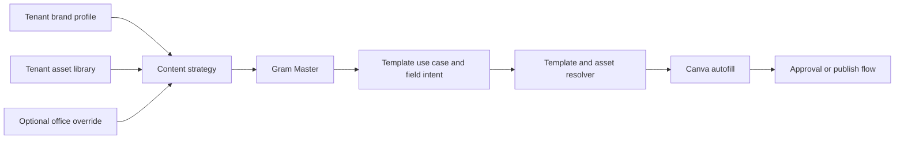

# Dynamic Content and Canva Standard

## Amaç

SmartAgency içerik üretimi beach club, coffee shop, prodüksiyon şirketi, el işi markası veya farklı bir sektör için aynı çekirdek sistemle çalışmalı. Mevcut Gram Master, haftalık plan, approval ve Canva akışları bozulmadan; tenant'ın marka DNA'sına, assetlerine ve hedeflerine göre dinamik karar veren otonom bir içerik katmanı eklenmelidir.

Temel prensip:

- AI doğrudan Canva template id seçmez.
- AI önce içerik niyetini, hedefini ve doldurulacak alanları üretir.
- Sistem tenant/office kapsamına göre doğru template, asset ve field mapping kararını verir.

## Tasarım İlkeleri

1. **Sektör bağımsız çekirdek**
   - Sistem template mantığını beach club gibi tek bir dikeye bağlamaz.
   - `event_announcement`, `product_showcase`, `offer_campaign`, `behind_the_scenes`, `social_proof`, `educational_post`, `daily_story`, `weekly_plan` gibi genel use-case'ler kullanılır.

2. **Tenant-first model**
   - Her tenant'ın ana marka profili, template seti, asset library'si ve içerik pillar'ları olur.
   - Office/mekan sadece override katmanıdır. Örneğin ana marka aynı kalır, Bodrum şubesi farklı lokasyon, görsel veya template kullanabilir.

3. **Standart contract, dinamik anlam**
   - Canva field isimleri standart kalır: `headline`, `subtitle`, `date`, `location`, `caption`, `cta`, `hero_image`, `logo`, `product_image`.
   - Bu alanların anlamı tenant'a göre değişir.
   - Coffee shop için `headline` ürün adı olabilir; beach club için sanatçı adı; prodüksiyon şirketi için proje/sahne adı; el işi markası için koleksiyon adı olabilir.

4. **Minimum kullanıcı girdisi**
   - Kullanıcıdan sadece ilk kurulum ve eksik kritik bilgiler istenir.
   - Sistem marka profili, geçmiş çıktılar, asset library ve entegrasyonlardan içerik kararlarını kendi üretir.

5. **Güvenli tenant izolasyonu**
   - Agentlar sadece kendi tenant assetlerini ve kendi tenant/office template assignment'larını görebilir.
   - Template ve asset resolution her zaman tenant scope ile başlar.

## Hedef Otonom Akış



## Kullanıcıdan Alınacak Minimum Bilgiler

İlk onboarding veya Brand Hub içinde:

- Marka ne iş yapıyor?
- Hedef kitle kim?
- Marka tonu nasıl?
- Ana hedef nedir: satış, rezervasyon, bilinirlik, topluluk, sadakat?
- Logo, marka renkleri, ürün/mekan/ekip görselleri nelerdir?
- Onay politikası nedir: öneri, onay bekle, otomatik onay?

Sistem bunlardan şunları üretir:

- Tenant içerik pillar'ları.
- Haftalık içerik planı.
- Use-case dağılımı.
- Template ihtiyaçları.
- Asset intent kuralları.
- Eksik bilgi listesi.

## Sektör Bağımsız Use-Case Standardı

Başlangıç use-case seti:

- `event_announcement`: etkinlik, workshop, lansman, canlı müzik, üretim günü.
- `product_showcase`: ürün, hizmet, menü, paket, sahne kurulumu, el işi ürün.
- `offer_campaign`: indirim, rezervasyon çağrısı, sezon kampanyası, paket teklif.
- `behind_the_scenes`: üretim arkası, mutfak, prova, ekip hazırlığı, atölye süreci.
- `social_proof`: müşteri yorumu, başarı hikayesi, etkinlik görüntüsü, memnuniyet kanıtı.
- `educational_post`: ipucu, nasıl yapılır, ürün bilgisi, sektör bilgisi.
- `daily_story`: günlük atmosfer, mekan ruhu, ekip, anlık paylaşım.
- `weekly_plan`: haftalık içerik veya etkinlik takvimi.

Örnek dönüşüm:

- Beach club: `event_announcement` -> sanatçı story.
- Coffee shop: `event_announcement` -> latte art workshop duyurusu.
- Prodüksiyon şirketi: `behind_the_scenes` -> sahne kurulumu hazırlığı.
- El işi markası: `product_showcase` -> yeni seramik koleksiyon tanıtımı.

## Gram Master Output Standardı

Gram Master mevcut caption/plan üretimini korur; ek olarak her içerik fikrine template intent alanları ekler.

Örnek payload:

```json
{
  "template_use_case": "product_showcase",
  "content_kind": "instagram_story",
  "headline": "Yeni Cold Brew Serisi",
  "subtitle": "Yaza ferah başlangıç",
  "caption_draft": "Yeni cold brew serimiz bugün rafta.",
  "cta": "Bugün dene",
  "event_date": null,
  "location": "Moda",
  "asset_intent": "product_image",
  "visual_direction": "Minimal, ferah, yaz ışığında ürün fotoğrafı",
  "hashtags": ["#coldbrew", "#coffeeshop"]
}
```

Geriye uyumluluk:

- Mevcut `title`, `caption_draft`, `visual_direction`, `hashtags`, `posting_time_suggestion` alanları korunur.
- Yeni alanlar yoksa sistem mevcut alanlardan fallback üretir.

## Template Contract Standardı

Canva template'leri Data Autofill alanlarıyla sözleşmeli olmalı.

Çekirdek alanlar:

- `headline`: ana dikkat çekici mesaj.
- `subtitle`: destekleyici kısa metin.
- `body`: uzun açıklama veya detay.
- `caption`: sosyal medya açıklaması.
- `cta`: kısa aksiyon çağrısı.
- `hashtags`: hashtag metni.
- `brand_name`: tenant marka adı.
- `date`: etkinlik, kampanya veya yayın tarihi.
- `location`: mekan, şehir veya hizmet bölgesi.
- `contact`: telefon, e-posta veya WhatsApp.
- `website`: web veya rezervasyon linki.
- `hero_image`: ana görsel.
- `product_image`: ürün/hizmet görseli.
- `background_image`: atmosfer/arka plan görseli.
- `logo`: tenant veya office logosu.

Template seçimi:

- Required alanlar doldurulamıyorsa template seçilmez.
- Optional alanlar varsa doldurulur; yoksa boş bırakılır.
- Template scope önce office override, sonra tenant default olarak çözülür.

## Asset Library Standardı

Kalıcı model önerisi:

- `TenantMediaAsset`
  - `TenantId`
  - optional `OfficeId`
  - `AssetType`: `logo`, `hero_image`, `product_image`, `artist_photo`, `venue_photo`, `background_image`, `team_photo`, `generated_visual`
  - `Url` veya storage key
  - `Tags`
  - `UsageContext`
  - `IsApproved`
  - `Priority`

Asset çözümleme:

1. Tenant scope zorunlu.
2. Office override varsa önce o assetler denenir.
3. `asset_intent` ile `AssetType` eşleşir.
4. Tag, use-case ve content kind ile skorlanır.
5. Uygun asset yoksa generated visual veya kullanıcıdan minimum soru fallback'i kullanılır.

## Template Assignment Modeli

Kalıcı model önerisi:

- `CanvaTemplateAssignment`
  - `TenantId`
  - optional `OfficeId`
  - `CanvaTemplateId`
  - `Name`
  - `ContentKinds`
  - `UseCases`
  - `AspectRatio`
  - `DatasetContract`
  - `Enabled`
  - `Priority`
  - `BrandFitScore`

Çözümleme sırası:

1. Aynı tenant ve aynı office için aktif template.
2. Aynı tenant için genel aktif template.
3. Global starter template varsa sadece explicit izinle.
4. Hiçbiri yoksa kullanıcıya template kurulumu önerilir.

## Minimum Soru Mekanizması

Sistem üretimi durdurmadan önce sadece gerçekten gerekli eksikleri sormalı.

Örnek:

- Template `date` required ama içerikte tarih yoksa: “Bu duyuru için tarih gerekiyor.”
- Template `hero_image` required ama asset yoksa: “Bu içerik için görsel seç veya AI görsel üretimine izin ver.”
- `cta` required ama hedef yoksa: tenant default CTA kullanılır.

Varsayılan fallback'ler:

- CTA: tenant hedefinden üretilir. Örnek: “Rezervasyon Yap”, “Şimdi İncele”, “İletişime Geç”.
- Location: office override, yoksa company profile location.
- Logo: office logo override, yoksa tenant logo.
- Hero image: asset intent eşleşmesi, yoksa approved background, yoksa generated visual.

## İlk Uygulama Aşamaları

### Aşama 1: Standardı Sabitle

- Use-case listesini tanımla.
- Canva field contract listesini genişletmeden önce mevcut alanlarla çalış.
- Gram Master output'una `template_use_case`, `content_kind`, `headline`, `cta`, `event_date`, `location`, `asset_intent` ekle.

### Aşama 2: DB Modelini Kur

- `TenantMediaAsset` ekle.
- `OfficeBrandProfile` veya office override alanlarını ekle.
- `CanvaTemplateAssignment` ekle.
- Tenant izolasyonunu API seviyesinde zorunlu yap.

### Aşama 3: Resolver Katmanı

- Gram Master payload + tenant profile + office override + asset library birleşsin.
- Template matcher required/optional alanlara göre seçim yapsın.
- Asset resolver sadece tenant scope içinde doğru görseli seçsin.

### Aşama 4: UI

- Brand Hub içinde asset library yönetimi.
- Template assignment ekranı.
- Content Studio içinde otomatik seçilen template ve neden seçildiği.
- Manual override imkanı.

### Aşama 5: Otonomi

- Haftalık plan tenant content pillar'larına göre otomatik üretilsin.
- Eksik bilgi yoksa içerik + Canva design + approval akışı uçtan uca ilerlesin.
- Eksik bilgi varsa sadece gerekli tek soru kullanıcıya sorulsun.

## İlk Template Seti

Sektör bağımsız ilk set:

- `generic_story`
  - Required: `headline`, `hero_image`
  - Optional: `subtitle`, `cta`, `logo`

- `event_announcement_story`
  - Required: `headline`, `date`, `location`, `hero_image`
  - Optional: `subtitle`, `cta`, `logo`

- `product_showcase_post`
  - Required: `headline`, `caption`, `product_image`
  - Optional: `price`, `offer`, `cta`, `hashtags`, `logo`

- `behind_the_scenes_story`
  - Required: `headline`, `hero_image`
  - Optional: `caption`, `location`, `logo`

- `offer_campaign_post`
  - Required: `headline`, `offer`, `cta`
  - Optional: `price`, `date`, `hero_image`, `logo`

## Başarı Kriterleri

- Aynı sistem beach club, coffee shop, prodüksiyon şirketi ve el işi markası için çalışır.
- Kullanıcı sadece marka/asset/onay bilgisini verir; içerik niyeti ve template seçimi otonom yapılır.
- Template required alanları dolmuyorsa yanlış design üretilmez.
- Her Canva design lineage içinde template id, field map, asset id ve kaynak action/artifact bilgisi tutulur.
- Tenantlar birbirinin template veya assetlerini göremez.

