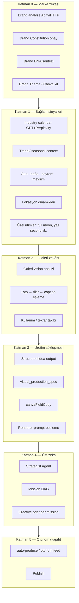

# Foundation-First Yol Haritası
## Otonomiye geçmeden önce çıktı kalitesi temeli

**Temel ilke:** Feed auto-trigger, sessiz Canva burst ve “sıfır tık onay” **kalite kapıları geçilene kadar kapalı veya sınırlı** kalır.  
**Ürün vaadi:** Marka bazlı **üst zeka** (Strategist) doğru sinyallerle mission üretir → alt katmanlar doğru brief + foto + renderer ile **tutarlı çıktı** verir.

**Vizyon:** Autonomous Brand Creative OS — önce **Brand Intelligence OS**, sonra otonom üretim.

---

## Mimari katmanlar (alttan üste)



---

## Mevcut durum özeti

| Katman | Olgunluk | Durum |
|--------|----------|--------|
| **0 Marka** | 🟡 %60 | Apify analyze, constitution, DNA, theme var; **tamamlanma kapısı yok** |
| **1 Bağlam** | 🟡 %50 | `industry_intelligence_service`, `trend_intelligence_service`, seasonal mission; **full moon / günlük ritim yok** |
| **2 Galeri** | 🟡 %55 | GPT-4o-mini analyze, matcher skorları; **agent’a zayıf besleme**, düşük skor UX yok |
| **3 Sözleşme** | 🔴 %35 | Prompt’ta alanlar var; **parse kaybı**, Canva/Runway beslemesi parçalı |
| **4 Üst zeka** | 🟡 %65 | Strategist güçlü prompt; **galeri + takvim + learning tek paket değil** |
| **5 Otonom** | 🔴 erken | auto-trigger, sessiz Canva — **temel oturmadan risk** |

---

# FAZ A — Marka analizi (Katman 0)
*“Sistemin kime hizmet ettiğini kesin bil”*

### Mevcut
- `analyze_brand()` — website, Instagram, Google Maps (Apify)
- `BrandInfo` + `build_brand_context_prompt()` — agent backstory
- `brand_dna_service` — sentez
- `brand_theme_service` — görsel token
- Setup / Brand Constitution mobil + desktop
- `confirm-constitution` pipeline

### Eksik / zayıf
| # | Eksik | Etki |
|---|--------|------|
| A0.1 | **Marka hazırlık kapısı** — galeri + constitution + DNA yoksa mission/otonom blok | Yanlış markaya içerik |
| A0.2 | **Discovery confidence skoru UI** — düşükse “tamamlayın” | Zayıf prompt |
| A0.3 | **Website intelligence** (menü, ürün kataloğu) agent’a sistematik gitmiyor | Halüsinasyon içerik |
| A0.4 | **content_pillars + default_ctas** onboarding’de zorunlu doğrulama | Strategist generic kalır |
| A0.5 | **Per-tenant creative profile** (`creative_profile.py`) UI ile bağlı değil | Sektör ihtiyaçları kayıp |
| A0.6 | **Brand Genome tek okuma modeli** (henüz yok) | Parçalı context |

### Mikro adımlar (sırayla)
1. **Brand Readiness API** — `GET /api/brand-readiness/{tenantId}` → checklist + `canRunMissions` / `canAutoProduce`
2. Mission Hub + Feed: readiness < %80 → otonom kapalı, net CTA “Markayı tamamla”
3. Constitution sonrası **otomatik Brand DNA refresh** (zaten kısmen var — gate bağla)
4. `content_pillars` + `default_ctas` — Hub’da düzenleme + strategist’e zorunlu inject
5. Discovery raporu: “sunduğunuz hizmetler / görsel envanter özeti” operatöre göster

**Kalite kapısı A:** `brand_constitution_confirmed` + `reference_image_urls.length >= N` + `discovery_confidence >= 70`

---

# FAZ B — Sektör & zaman dinamikleri (Katman 1)
*“Beach restaurant için full moon, yaz açılışı, Cuma akşamı…”*

### Mevcut
- `industry_intelligence_service` — GPT + Perplexity, `industry_calendar` JSON
- `trend_intelligence_service` — haftalık lokasyon + mevsim ipucu
- `scheduler_service` — seasonal phase change → `create_seasonal_mission_from_phase_change`
- Strategist prompt — tarih kuralı, sektör uygunluğu, tekrar yasağı
- `BrandInfo.industry_calendar` → agent prompt inject

### Eksik / zayıf
| # | Eksik | Etki |
|---|--------|------|
| B0.1 | **Full moon / lunar calendar** — kodda yok | Beach club / nightlife fırsatı kaçar |
| B0.2 | **Haftanın günü + saat ritmi** (Cuma-Cumartesi, brunch Pazar) | Zamanlama zayıf |
| B0.3 | **Sektör şablon kütüphanesi** — beach_restaurant vs clinic trigger set | Her seferinde sıfırdan LLM |
| B0.4 | **Takvim yenileme SLA** — `industry_intelligence_updated_at` stale uyarısı | Eski sezon brief’i |
| B0.5 | **Strategist ↔ takvim somut bağ** — `trigger_evidence` doğrulanmıyor | Generic mission |
| B0.6 | **Hava / yoğunluk sinyali** (opsiyonel API) — yaz sezonu Bodrum | Fırsat kaçırma |

### Önerilen: Context Signal Registry

Tenant + sektör için yapılandırılabilir sinyaller:

```yaml
signals:
  - id: full_moon
    type: astronomical
    relevance: [beach_club, restaurant_seafront, hotel]
    lead_days: 5
    content_hook: "Full moon dinner / beach evening"
  - id: summer_season_opening
    type: seasonal_phase
    months: [4, 5]
  - id: friday_evening
    type: weekly_rhythm
    dow: [5]
```

**Mikro adımlar:**
1. `context-signals/` modülü — full moon hesaplama (astronomy lib, API yok)
2. Sektör paketleri: `beach_hospitality`, `urban_restaurant`, `wellness` — starter trigger list
3. Industry calendar refresh job — haftalık zorunlu + stale badge Brand Hub
4. Strategist input’a **“BU HAFTA SİNYALLER”** bloğu (JSON, LLM değil kural)
5. Mission `trigger_field` + `trigger_evidence` UI’da göster — operatör güvenir
6. İçerik agent’a `posting_time_suggestion` + gün ritmi inject

**Kalite kapısı B:** `industry_calendar` < 14 gün eski değil + en az 1 aktif seasonal signal

---

# FAZ C — Galeri zekâsı (Katman 2)
*“En güçlü farkımız — gerçek mekân fotoğrafı”*

### Mevcut
- `POST /api/analyze-gallery` — GPT-4o-mini vision, zengin tag seti
- Persist: `brand_context.gallery_analysis` (JSON by URL)
- `gallery-photo-matcher.ts` — skor, batch assign, agent URL arbitration
- `gallery-usage-tracker` — tekrar önleme
- Agent prompt: `content_tasks.py` gallery scene inventory
- `visual_production_spec.selected_gallery_url` — content ideation’da isteniyor

### Eksik / zayıf
| # | Eksik | Etki |
|---|--------|------|
| C0.1 | **Analyze kalitesi** — `detail: low`, mini model; fine detail kaybı | Yanlış eşleşme |
| C0.2 | **Tüm galeri analyze edilmeden mission** — kısmi cache | Kör üretim |
| C0.3 | **Caption ↔ foto semantic skor** kullanıcıya görünmüyor | Güven yok |
| C0.4 | **Düşük skor fallback politikası** — üret mi, dur mu? | Kötü foto yayın |
| C0.5 | **Galeri ↔ idea bidirectional** — sadece foto seçimi, “bu foto bu caption’ı destekler mi?” | Zayıf anlatı |
| C0.6 | **Yeni foto upload → otomatik analyze** — kısmen var, tutarsız | Stale analysis |
| C0.7 | **Embeddings / Qdrant** — planlı, bağlı değil | Semantik arama zayıf |

### Mikro adımlar
1. **Galeri tamamlanma kapısı** — analyze edilmemiş URL varsa mission propose uyarısı
2. Kritik fotoğraflar için `detail: high` + gpt-4o (tier: premium analyze)
3. **Match score UI** — otonom kartta “Galeri eşleşmesi: 78/100” + düşükse uyarı
4. **MIN_ACCEPT_SCORE altı → üretim dur** (veya operatör onayı iste) — politika flag
5. Content ideation prompt: her fikir için **zorunlu** `selected_gallery_url` + `match_rationale`
6. Galeri özet bloğu Strategist’e — “bu hafta kullanılmayan güçlü sahneler”
7. (Orta vade) Qdrant embedding index — caption query → top photos

**Kalite kapısı C:** %90+ galeri URL analyzed + ortalama match score > 55 (pilot ölçüm)

---

# FAZ D — Prompt & renderer besleme (Katman 3)
*“Canva, Runway, announcement doğru brief almalı”*

### Mevcut
- `canva-mission-signal.ts` — field trim, registry limits
- `canva-template-selection` — template score + autofill
- `reel-prompt.builder` — director prompt, caption-driven
- `announcement-template-engine` — brand kit SVG
- `content_prompts.py` — template_use_case, visual_production_spec, canva fields
- `action_extractor.py` — canvaFieldCopy parse

### Eksik / zayıf
| # | Eksik | Etki |
|---|--------|------|
| D0.1 | **Tek ProductionIdea contract** — parse’da alan kaybı | Renderer’lar aç kalır |
| D0.2 | **canvaFieldCopy** `artifactIdeaToRecord`’da yok | Canva’da kırpık metin |
| D0.3 | **Gallery description → Runway/Canva** sistematik inject | Generic motion |
| D0.4 | **template_use_case → template router** (manuel) | Yanlış şablon |
| D0.5 | **Renderer trace** — neden bu araç? | Kara kutu |
| D0.6 | **auto-produce vs client farklı sinyal** | Tutarsız çıktı |

### Mikro adımlar
1. `ProductionIdea` type — tek parse çıkışı (Hub, Factory, auto-produce)
2. `canvaFieldCopy`, `asset_intent`, `event_details` taşıması
3. **Prompt Builder Service** — `buildRendererPayload(idea, rendererId, brandGenome, galleryMeta)`
4. Runway: `photoDescription` + caption + vibe — director input birleşik
5. Canva: field limits API → agent copy generation (ideation sırasında)
6. Announcement: `template_use_case` → `smartSelectTemplate` bağlantısı
7. auto-produce: `canva-mission-signal` import (B2)

**Kalite kapısı D:** Pilot 10 fikir — Canva field trim uyarısı <%20, Runway brief caption ile manuel QA uyumu >%80

---

# FAZ E — Üst zeka / Mission üretici (Katman 4)
*“Sürekli mission üreten marka bazlı beyin”*

### Mevcut
- `StrategistAgent` + `run_mission_planning`
- Zengin backstory: brand_dna, industry_calendar, learning, competitor
- Mission DAG + task_graph_executor
- Seasonal auto-propose (scheduler)
- Debounce: aynı anda çok propose yok

### Eksik / zayıf
| # | Eksik | Etki |
|---|--------|------|
| E0.1 | **Readiness gate yok** — eksik markayla mission üretir | Çöp mission |
| E0.2 | **Mission brief’te galeri senaryoları yok** — “şu 3 foto ile şu hook” | Alt katman kör |
| E0.3 | **Learning tek kaynak değil** | Tekrar hata |
| E0.4 | **Feed auto-trigger** — kalite kapısı bypass | Erken otonom |
| E0.5 | **Mission çeşitlilik ölçümü** — format/use_case rotasyonu takip | Tek tip içerik |
| E0.6 | **CEO Intelligence vs Strategist** rol ayrımı belirsiz | Çakışma |

### Mikro adımlar
1. `propose_missions` öncesi **Brand Readiness** kontrolü
2. Strategist output’a `recommended_gallery_urls[]` + `content_calendar_hints[]` (yeni schema)
3. Mission `creative_brief` içine **bağlam sinyali özeti** (full moon, sezon fazı)
4. **Feed auto-trigger OFF** default; sadece `readiness.canAutoProduce`
5. Mission Hub: “Bu mission şu sinyale dayanıyor” kartı
6. Haftalık strategist job + manual propose — auto-trigger yerine bilinçli ritim

**Kalite kapısı E:** Operatör onaylı pilot — mission brief galeri + sinyal içeriyor %100

---

# FAZ F — Otonom üretim (Katman 5) — **SON**
*Kapılar geçilince açılır*

### Şu an erken olanlar
- PlatformFeed `auto-trigger` on mount
- Otonom sessiz Canva tüm formatlarda
- auto-produce without readiness
- Onayla = publish (güven olmadan)

### Açılış sırası (kapılardan sonra)
1. Manuel mission → ideation → **manuel** Factory → onay (mevcut)
2. Mission → auto-produce **tek primary renderer** (Canva veya announcement)
3. Otonom feed **sadece primary** gösterir
4. Feed auto-trigger (günlük cap + readiness)
5. Publish otomasyonu (unified publish sonrası)

### Otonom açılış kapıları (tümü gerekli)

| Kapı | Kaynak faz |
|------|------------|
| Brand readiness ≥ %80 | A |
| Industry calendar < 14 gün | B |
| Galeri analyze ≥ %90, avg match ≥ 55 | C |
| ProductionIdea parse tam | D |
| Strategist brief galeri+sinyal | E |
| Bundle v0 tek kart | (quality backlog A4) |
| Publish export gate | (quality backlog A2) |

---

## Öncelik sırası (ürün kararı)

**Otonom ve büyük router refactor şimdilik geri planda.**

```
1. FAZ A  Marka hazırlık kapısı
2. FAZ C  Galeri zekâsı güçlendirme  ← en yüksek çıktı ROI
3. FAZ D  Prompt / renderer besleme
4. FAZ B  Sektör + zaman sinyalleri (full moon dahil)
5. FAZ E  Strategist ↔ alt katman bağlantısı
6. FAZ F  Otonom (kapılı)
```

**Neden C, B’den önce?** Beach restaurant’ta full moon mission üretirsin ama yanlış foto ile kalite düşer — önce galeri+eşleşme, sonra sinyal zenginliği.

**Neden A en başta?** Sinyal ve galeri olmadan strategist halüsinasyon üretir.

---

## Modül haritası (güncellenmiş sıra)

| Sıra | Modül | Faz |
|------|--------|-----|
| M00 | Brand Readiness & Constitution | A |
| M01 | Mission Hub (otonom kapalı) | A, E |
| M02 | Fikir parse / ProductionIdea | D |
| M04 | **Galeri zekâsı** | C |
| M03 | auto-produce (readiness gated) | D, F |
| M06 | Canva prompt besleme | D |
| M07 | Runway / announcement besleme | D |
| M10 | Context signals (moon, sezon) | B |
| M11 | Strategist / üst zeka | E |
| M05 | Otonom Feed | F |
| M09–M12 | Bundle, publish, learning | F sonrası |

---

## İlk 2 haftalık iş paketi (öneri)

| Gün | İş | Faz |
|-----|-----|-----|
| 1–2 | Brand Readiness API + Hub gate | A |
| 3–4 | `ProductionIdea` + canvaFieldCopy parse | D |
| 5–6 | Galeri analyze gate + match score UI | C |
| 7–8 | MIN_ACCEPT_SCORE politika + düşük skor uyarısı | C |
| 9–10 | Feed auto-trigger **devre dışı** (flag) | E/F |

**Bilinçli yapılmayacak (şimdilik):** Content Router tam modül, Bundle v0, unified learning, auto-trigger fix (kapı açılınca anlamlı).

---

## Başarı metrikleri (foundation)

| Metrik | Hedef (8 hafta) |
|--------|-----------------|
| Marka readiness tamamlama oranı | >%70 yeni tenant |
| Galeri analyze coverage | >%90 URL |
| Ortalama match score (otonom) | >58 |
| Ideation’da VPS + gallery URL dolu | >%85 fikir |
| Canva trim/rewrite uyarısı | <%15 |
| Operatör “yanlış foto” şikayeti | ↓ sıfıra yakın |
| Otonom auto-trigger | kapalı → kapı sonrası açık |

---

## İlgili dosyalar

| Konu | Path |
|------|------|
| Brand analyze | `backend/app/crew/brand_analyzer.py` |
| Brand context prompt | `backend/app/crew/context.py` |
| Industry calendar | `backend/app/services/industry_intelligence_service.py` |
| Trend / seasonal | `backend/app/services/trend_intelligence_service.py` |
| Strategist | `backend/app/crew/prompts/strategist_prompts.py` |
| Gallery analyze | `apps/web/src/app/api/analyze-gallery/route.ts` |
| Photo matcher | `apps/web/src/lib/gallery-photo-matcher.ts` |
| Canva signal | `apps/web/src/lib/canva-mission-signal.ts` |
| Reel prompts | `apps/web/src/lib/runway/builders/reel-prompt.builder.ts` |
| Content ideation prompt | `backend/app/crew/prompts/content_prompts.py` |

---

*Bu doküman `quality-priority-backlog.md` ile birlikte okunur; çelişki halinde **foundation-first** önceliklidir.*
