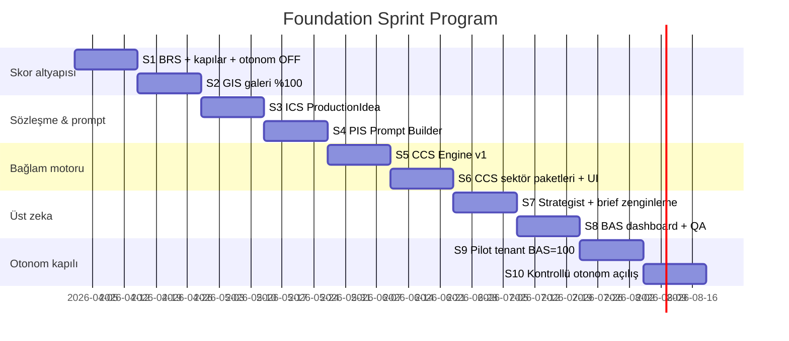

# Foundation Sprint Program
## %100 Marka Uyumu — Sıfır Eksik Kapı Modeli

**Sprint süresi:** 2 hafta  
**Hedef:** Her tenant için ölçülebilir **Brand Alignment Score (BAS)** → tüm alt skorlar %100 olmadan otonom üretim **açılmaz**.  
**İlke:** Full moon tek örnek değil — **tüm bağlam senaryoları** katalog + motor + skor ile kapsanır.

---

## 1. %100 ne demek?

BAS = 5 alt skorun **hepsinin 100** olması (biri bile <100 → otonom kapalı).

| Alt skor | Kod | %100 koşulu (özet) |
|----------|-----|-------------------|
| **Brand Readiness** | `BRS` | Constitution onaylı, DNA+theme, pillars+CTA, discovery≥70, galeri≥min foto |
| **Gallery Intelligence** | `GIS` | Tüm URL analyze, ortalama tag kalitesi, eşleşme≥eşik, stale yok |
| **Context Coverage** | `CCS` | Sektör paketi aktif, takvim<14gün, tüm uygulanabilir sinyaller hesaplandı |
| **Idea Contract** | `ICS` | Her fikir: VPS+galeri URL+use_case+canvaFieldCopy tam parse |
| **Prompt Integrity** | `PIS` | Renderer payload’ları field limit + galeri meta + brand genome ile beslendi |

```
BAS = min(BRS, GIS, CCS, ICS, PIS)
canAutoProduce = (BAS === 100)
canProposeMissions = (BRS >= 80 && GIS >= 70)
```

**Operasyonel kural:** Skorlar UI’da görünür; eksik madde tıklanabilir “tamamla” CTA.

---

## 2. Bağlam senaryoları — tam katalog

Sistem **sektör + lokasyon + takvim** ile hangi senaryoların aktif olduğunu seçer; hepsi `Context Signal Engine` girdisi.

### 2.1 Zamansal (evrensel)

| Kategori | Senaryolar | Kaynak |
|----------|------------|--------|
| **Mevsim** | ilkbahar, yaz, sonbahar, kış; sezon açılış/kapanış | `season_phases`, trend service |
| **Ay** | dolunay, yeni ay, ay evreleri | astronomical calc |
| **Gün** | Pazartesi–Pazar; iş günü vs hafta sonu | cron / local TZ |
| **Gün bölümü** | kahvaltı, öğle, akşam, gece, after-hours | tenant TZ + sektör |
| **Hafta ritmi** | Cuma akşamı, Cumartesi gece, Pazar brunch, “quiet Monday” | sektör paketi |
| **Yıl döngüsü** | yılbaşı, sevgililer, anneler/babalar, okul tatili, yaz tatili | holiday DB + TR/global |

### 2.2 Kültürel / dini / resmi (bölgeye göre)

| Senaryolar | Not |
|------------|-----|
| Ramazan, Kurban, bayram arefesi/sonrası | TR hospitality kritik |
| Noel, Paskalya (turist bölgeleri) | verified trigger |
| 23 Nisan, 19 Mayıs, 29 Ekim | marka tonuna göre |
| Yerel festival, konser sezonu | Perplexity + `verified:false` etiketi |

### 2.3 Sektör dikey (tenant `business_type`)

| Paket | Örnek senaryolar |
|-------|------------------|
| **beach_hospitality** | sezon açılışı, gün batımı, dolunay akşamı, beach party, pool day, yacht season |
| **urban_restaurant** | menü lansmanı, chef table, wine dinner, weekday lunch, delivery push |
| **nightlife_club** | DJ sezonu, guest DJ, ladies night, opening party |
| **hotel_resort** | check-in peak, spa season, conference off-season |
| **wellness_clinic** | yeni yıl detox, yaz fit, back-to-school |
| **retail** | sezon indirimi, black friday, yeni koleksiyon |
| **professional_services** | vergi sezonu, yıl sonu, Q1 planning |
| **generic** | fallback — sadece evrensel zaman |

### 2.4 Lokasyon & pazar

| Senaryo | Örnek |
|---------|--------|
| Turist vs yerel sezon | Bodrum Haziran–Eylül vs İstanbul 12 ay |
| Yarımküre / iklim | yaz/kış ters |
| Hafta içi turist akını | cruise günleri (Perplexity) |
| Rakip / pazar fırsatı | `competitor_pulse`, `market_opportunity` |

### 2.5 Marka özel (tenant)

| Senaryo | Kaynak |
|---------|--------|
| Menü / ürün lansmanı | website_intelligence, operator input |
| Yıldönümü, reopening | brand events table (yeni) |
| Onaylı içerik pilları rotasyonu | `content_pillars` |
| Reddedilen konular | learning / risk_rules |

### 2.6 Astronomik & özel (örnek genişlemesi)

Dolunay dışında motor hesaplar:

- **Gün batımı / altın saat** (lat/lng + date) — beach terrace içerik
- **Solstice / equinox** — sezon kampanyası
- **Meteorolojik sezon** (opsiyonel API) — “ilk sıcak hafta sonu”

**Kural:** Her sinyal `SignalRecord { id, type, title, window_start, window_end, confidence, verified, content_hooks[], applicable_formats[] }`

---

## 3. Sprint programı (10 sprint)



---

## Sprint 1 — Brand Readiness + kapılar + otonom kapatma
**Tarih:** Şimdi · **Hedef BRS:** ölçülebilir, **BAS:** altyapı

### Hedef
Marka tamamlanmadan mission/otonom **fiziksel olarak** çalışmasın; skor görünür olsun.

### Deliverables

| ID | Durum | İş | Dosya / alan | Done kriteri |
|----|-------|-----|--------------|--------------|
| S1.1 | ✅ | **Brand Readiness API** | `apps/web/src/app/api/brand-readiness/[tenantId]/route.ts` | JSON: `score`, `checks[]`, `canProposeMissions`, `canAutoProduce` |
| S1.2 | ✅ | **BRS hesaplama** | `apps/web/src/lib/brand-readiness.ts` | 100 puan checklist (aşağıda) |
| S1.3 | ✅ | **Mission Hub gate** | `MissionHub.tsx` (`BrandReadinessCard`) | BRS<80 → propose disabled + checklist UI |
| S1.4 | ✅ | **Feed auto-trigger OFF** | `NEXT_PUBLIC_AUTO_MISSION_TRIGGER`, `PlatformFeed.tsx` | Default kapalı; env ile açılır |
| S1.5 | ✅ | **Hub readiness kartı** | `MissionHub.tsx` | Eksik maddeler + “Markayı Tamamla” CTA |
| S1.6 | ✅ | **ProductionIdea type v0** | `apps/web/src/types/production-idea.ts` | Tek tip tanım + ICS skoru (parse hedefi S3) |

**Yardımcı:** `crew-proxy.ts` içine `fetchCrewBackendJson()` (JSON döndüren compose helper) eklendi.

### BRS 100 puan checklist

| Madde | Puan | Koşul |
|-------|------|--------|
| Constitution onaylı | 20 | `brand_constitution_confirmed` |
| Discovery confidence | 15 | ≥70 |
| Galeri min foto | 15 | ≥8 usable URL (logo hariç) |
| Galeri analyze coverage | 15 | ≥90% URL analyzed |
| Brand DNA mevcut | 10 | `brand_dna` non-empty |
| Brand theme mevcut | 10 | theme API OK |
| Content pillars | 10 | ≥2 pillar tanımlı |
| Default CTAs | 5 | ≥1 CTA |

### Sprint 1 — yapılmayacaklar
- Context Signal Engine
- Galeri model upgrade
- Otonom açılış
- Content Router

### Sprint 1 test planı
- [ ] Yeni tenant BRS ~30 → propose kapalı
- [ ] Constitution + 8 foto + analyze → BRS≥80
- [ ] Feed mount → auto-trigger çağrılmıyor (flag false)
- [ ] Readiness API mobil + Hub aynı skor

**Sprint 1 çıkış:** BRS ölçülür; otonom kapıları kodda var.

---

## Sprint 2 — Gallery Intelligence %100 (GIS)
**Hedef GIS:** 100 için gerekli tüm maddeler

| ID | Durum | İş | Done |
|----|-------|-----|------|
| S2.1 | ✅ | Galeri analyze **coverage job** — eksik URL batch analyze (`analyze-coverage`) | İdempotent, batch'li |
| S2.2 | ✅ | **Premium analyze tier** — hero foto: gpt-4o + detail high (`tier:'hero'`) | analyze-gallery |
| S2.3 | ✅ | Analyze kalite skoru — `computeAnalysisQuality` (tag/desc/usage) | entry'de persist |
| S2.4 | ✅ | **Match score UI** — otonom kartta `classifyMatch` badge | Skor + etiket görünür |
| S2.5 | ✅ | **GIS gate** — `GIS_PILOT_MIN_SCORE=55`; <55 “zayıf” uyarı | Üretim policy |
| S2.6 | ✅ | Düşük skor → `BLOCK_BELOW_MIN_SCORE` flag (default off) | needsReview |
| S2.7 | ⚠️ | Upload → otomatik analyze hook | coverage job mevcut; upload hook S2 takip |
| S2.8 | ✅ | **GIS API** — `GET /api/gallery-intelligence/[tenantId]` | canlı test 61/100 |
| S2.9 | ✅ | **Matcher-avg enstrümantasyonu** — `gallery_match_stats` kolonu + GET/POST + AutoProductionFeed log | canlı: matcher 63/58 → 20/20, GIS 81 |

**Yardımcı:** `gallery-intelligence.ts` (saf skor motoru), Python `GalleryAnalysisEntry`'ye `quality_score`+`analyzed_at` eklendi.

**Canlı doğrulama (pilot tenant):** coverage job 42→44 foto kaydetti; recency “0 gün önce” → 10/10; GIS 51→61. Kalan: kapsama (76 foto) + matcher-avg.

### GIS 100 puan

| Madde | Puan |
|-------|------|
| URL coverage 100% | 30 |
| Avg analysis quality ≥80 | 25 |
| Usable photos (non-logo) ≥8 | 15 |
| Son analyze <30 gün | 10 |
| Matcher avg ≥58 (son 20 eşleşme) | 20 |

---

## Sprint 3 — Idea Contract %100 (ICS)
**Hedef:** Parse kaybı sıfır; agent çıktısı eksiksiz.

| ID | Durum | İş |
|----|-------|-----|
| S3.1 | ✅ | `parseProductionIdeas()` → `ProductionIdea[]` tek çıkış (`production-idea-parse.ts`) |
| S3.2 | ✅ | `artifactIdeaToRecord` artık `canva_field_copy`+`canvaFieldCopy`, `asset_intent`, `event_date`, `location`, tam VPS emit ediyor; `extractMissionIdeaFields` snake_case okuyor |
| S3.3 | ✅ | Python `action_extractor._normalize_idea` → `visual_production_spec` passthrough (smoke test OK) |
| S3.4 | ⚠️ | İdeation prompt zaten zorunlu alanları listeliyor; crew post-parse validasyonu mevcut (`content_crew` score_batch) — ek sertleştirme Sprint 7'ye |
| S3.5 | ✅ | `computeIdeaContractScore()` — fikir başına completeness % |
| S3.6 | ✅ | Hub ideation node header’da **ICS %** badge (renk kodlu, 90/70 eşik) |

**Kritik bug giderildi:** `canvaFieldCopy` artık `artifactIdeaToRecord`'da düşmüyor → Canva autofill ve duyuru renderer'ları agent design copy'sini görüyor.

### ICS 100 — fikir başına zorunlu alanlar
`headline`, `caption`, `content_type`, `cta`, `hashtags`, `template_use_case`, `visual_production_spec.selected_gallery_url`, `visual_production_spec.image_edit_prompt`, `canvaFieldCopy.headline` (limit içinde)

---

## Sprint 4 — Prompt Integrity %100 (PIS)
**Hedef:** Her renderer doğru payload alır.

| ID | Durum | İş |
|----|-------|-----|
| S4.1 | ✅ | `renderer-payload.ts` — `buildReelPayload`/`buildInstagramImagePayload`/`buildEventCardPayload`/`buildCanvaIdeaRecord` + `productionIdeaFromRecord`/`toRecord` |
| S4.2 | ✅ | Canva: AutoProductionFeed artık **tam idea** (canva_field_copy/VPS/template_use_case/asset_intent korunuyor); field-limits registryMin zaten geçiyor |
| S4.3 | ✅ | Runway: `buildReelPayload` ile caption + foto açıklaması + vibe + sceneMetadata (AutoProductionFeed reel zenginleştirildi) |
| S4.4 | ⚠️ | `buildEventCardPayload` `templateId` param ile hazır; `template_use_case`→smartSelect tam bağlama MCF'de mevcut, otonom tarafta S6 |
| S4.5 | ⚠️ | Builder kütüphanesi hazır; AutoProductionFeed Canva+reel adopt etti; MCF + auto-produce adopsiyonu modül-modül (büyük dosya — kademeli) |
| S4.6 | ✅ | `computePromptIntegrity` (PIS skor) + `auditRendererPayload` (dev log) |

**Kritik bug giderildi (S4.2):** AutoProductionFeed Canva yolu ince `ideaRecord` yerine tam orijinal idea'dan başlıyor → renderer artık design copy + VPS görüyor.

---

## Sprint 5 — Context Signal Engine v1 (CCS altyapı)
**Hedef:** Tüm evrensel senaryolar hesaplanır (LLM’siz çekirdek).

| ID | Durum | İş |
|----|-------|-----|
| S5.1 | ✅ | `apps/web/src/lib/context-signals/` (types, lunar, holidays-tr, calculators, index) |
| S5.2 | ✅ | Calculators: season, DOW, weekly rhythm, holiday TR (ulusal+dini+ticari), lunar phase, solstice/equinox, golden hour |
| S5.3 | ✅ | `SignalRecord[]` + `buildActiveSignals(input)` (confidence sıralı) |
| S5.4 | ✅ | `GET /api/context-signals/{tenantId}?date&lat&lng&horizon` |
| S5.5 | ✅ | CCS skoru — uygulanabilir/hesaplanan sinyal türü oranı |

**Canlı doğrulama (Bodrum, 29 May Cuma):** CCS **100/100** — Dolunay 31 May (0.86), İlkbahar, Cuma akşamı ritmi, gün batımı ~19:07. Full moon senaryosu deterministik yakalandı.

**Not:** golden hour lat/lng gerektirir (yoksa CCS'den düşülür); DST/sabit UTC+3 düzeltmesi S6'da rafine edilecek. Strategist'e enjeksiyon S6/S7.

---

## Sprint 6 — Sektör paketleri + takvim entegrasyonu (CCS %100)
| ID | Durum | İş |
|----|-------|-----|
| S6.1 | ✅ | 8 paket: `beach_hospitality`, `nightlife`, `urban_restaurant`, `hotel`, `wellness`, `clinic`, `retail`, `generic` + sektör sinyalleri |
| S6.2 | ✅ | `resolveSectorPack(business_type)` (Python alias'larını yansıtır) + emphasis confidence boost |
| S6.3 | ✅ | MissionHub stale badge — `industry_intelligence_updated_at` >14 gün uyarısı |
| S6.4 | ✅ | `buildStrategistSignalBlock` → API `promptBlock` → propose body → Python `learning_context` enjeksiyon (tek motor, TS kaynak) |
| S6.5 | ✅ | MissionHub **"Bu Hafta Aktif Sinyaller"** paneli (tür ikonu, verified, confidence) |
| S6.6 | ✅ | CCS canlı 100; sektör aktif + activeThisWeek sayacı |

**Canlı doğrulama:** nightlife paketi çözüldü; Dolunay 0.86→**0.96** (emphasis), sektör sinyalleri "Dolunay özel gece" + "Hafta sonu lineup"; promptBlock propose'a → Strategist prompt'una akıyor.

**Mimari karar:** Sinyal motoru tek kaynak (TS); Python'a kopyalanmadı. Client `promptBlock`'u propose body ile gönderiyor → Python `learning_context`'e ekliyor (zaten en yüksek öncelikli prompt pozisyonu).

---

## Sprint 7 — Strategist & mission brief zenginleme
| ID | Durum | İş |
|----|-------|-----|
| S7.1 | ✅ | Propose kapısı — BFF'de `BRS>=80` & `GIS>=70` (412 quality_gate_blocked) + MissionHub birleşik gate + tooltip |
| S7.2 | ✅ | Brief zenginleme — `active_signals` (promptBlock) + **çeşitlilik direktifi** propose body'sine enjekte; `forbidden_topics` learning_context'ten gelir |
| S7.3 | ✅ | Strategist çıktı validasyonu — eksik `trigger_signal/evidence/objective/rationale` log uyarısı (`strategist_proposal_incomplete`) |
| S7.4 | ✅ | `computeMissionDiversity` + MissionHub "Çeşitlilik %" rozeti |

**`recommended_gallery_urls`** ayrı şema alanı eklenmedi — galeri seçimi zaten fikir-başına matcher (S2) ile yapılıyor; brief'e ayrı liste S9 pilotunda değerlendirilecek.

---

## Sprint 8 — BAS Dashboard + QA
| ID | Durum | İş |
|----|-------|-----|
| S8.1 | ✅ | `GET /api/brand-alignment/{id}` (BAS=min(BRS,GIS,CCS)) + MissionHub `BrandAlignmentCard` 5 alt skor şeridi |
| S8.2 | ✅ | Her alt skor chip'i + "en zayıf skoru düzelt" deep-link |
| S8.3 | ✅ | `docs/pilot-qa-checklist.md` — 8 bölüm + 10-mission manuel QA tablosu |
| S8.4 | ✅ | PlatformFeed export-first çözünürlük — önizleme = yayınlanan asset (canvaDownloadUrl/exportUrl/permanentPreviewUrl öncelikli) |

**Canlı doğrulama:** BAS endpoint → BAS 81 = min(BRS 87, GIS 81, CCS 100); canPropose true, canAutoProduce false; weakest GIS. ICS/PIS runtime.

---

## Sprint 9 — Pilot tenant BAS=100
| ID | Durum | İş |
|----|-------|-----|
| S9.1 | ✅ | Pilot (Turunç Bodrum) — coverage job tam çalıştırıldı → GIS 100, BRS 96, CCS 100, **BAS 96** (kalan: discovery_confidence 50/70) |
| S9.2 | 🔶 | **Manuel QA bulgusu:** ideation katmanında tutarsızlık (galeri/canva alanları 0–5/5 arası) → **kaynak enforcement** eklendi (`_enforce_idea_completeness`) → çıplak çıktıdan bile ICS-complete. Dil=İngilizce **bilinçli** (turist odağı) doğrulandı. Canlı fresh-run doğrulaması bekliyor |
| S9.3 | ⏳ | Skorları production'da izle |
| S9.4 | ⏳ | Gap listesi → S10 |

**S9 manuel QA notları (gerçek veri):**
- Dil İngilizce = bilinçli (uluslararası turist) — bug değil.
- Skorlar yüksek olsa da ham ideation alan doldurmada tutarsızdı → **`content_crew._enforce_idea_completeness`** ile her fikir kaynağında tamamlanıyor: `template_use_case`, `selected_gallery_url` (content_type başına tekrarsız), `image_edit_prompt`, `canva_field_copy.headline` (gerekirse caption'dan türetilir), `asset_intent`. Unit doğrulandı (3/3 ICS-complete).

---

## Sprint 10 — Kontrollü otonom açılış
**Önkoşul:** Pilot tenant BAS=100, 1 hafta QA pass

| ID | Durum | İş |
|----|-------|-----|
| S10.1 | ✅ | auto-trigger route'una `canAutoProduce` (BAS=100) kapısı — fail-safe (gate okunamazsa üretmez) |
| S10.2 | ⏳ | Primary renderer hard rule — VPS treatment'tan renderer seçimi (builder hazır S4; otonom tarafta uygulanacak) |
| S10.3 | ⏳ | Bundle v0 tek kart (büyük refactor — ayrı ele alınacak) |
| S10.4 | ✅ | auto-trigger yalnızca BAS=100 tenant'ta çalışır + propose response parse bug'ı (`{missions}`) düzeltildi |
| S10.5 | ✅ | PlatformFeed publish export gate — Canva edit URL / boş asset yayını engelleniyor (reel/carousel/feed) |

**Canlı doğrulama:** Pilot (BAS 96) → auto-trigger `skipped: quality_gate` (mission oluşturmadı). Otonomi yalnızca BAS=100'de açılır.

---

# ŞİMDİ: Sprint 1 detaylı görev listesi

### Hafta 1

| Gün | Görev | Sahip |
|-----|--------|-------|
| 1 | `brand-readiness.ts` — skor + checklist mantığı | BE/FE |
| 1 | `production-idea.ts` — tip tanımı | FE |
| 2 | `GET /api/brand-readiness/[tenantId]` | FE |
| 2 | Python/Nexus brand context alanlarını oku (BFF) | FE |
| 3 | Mission Hub — readiness query + propose gate | FE |
| 3 | `NEXT_PUBLIC_AUTO_MISSION_TRIGGER` + PlatformFeed guard | FE |
| 4 | Brand Constitution / Hub — readiness kartı UI | FE |
| 5 | Entegrasyon testi + BRS edge case’ler | QA |

### Hafta 2

| Gün | Görev |
|-----|--------|
| 6 | `artifactIdeaToRecord` → `canvaFieldCopy` raw’dan merge (S3 öncül) |
| 7 | Readiness: galeri analyze coverage gerçek sayım |
| 8 | Dokümantasyon: BAS model + Sprint 2 hazırlık |
| 9 | Pilot tenant veri doldurma (iç test) |
| 10 | Sprint 1 review — BRS demo, retro, Sprint 2 kickoff |

### Sprint 1 Definition of Done
- [ ] BRS API canlı, skor 0–100
- [ ] Mission propose BRS<80 kapalı
- [ ] Auto-trigger default OFF
- [ ] Readiness UI en az 1 ekranda
- [ ] `foundation-sprint-program.md` Sprint 1 checkbox işaretli

---

## Riskler & mitigasyon (program)

| Risk | Mitigasyon |
|------|------------|
| %100 çok katı, hiç otonom açılmaz | Pilot tenant ile S9; kademeli `canAutoProduce` |
| Sinyal katalog patlar | Paket bazlı; generic fallback |
| Galeri analyze maliyeti | Tier: mini bulk + 4o hero subset |
| .NET/Python skor verisi parçalı | BFF tek readiness endpoint |

---

## Ek: Duyuru Tasarım Kütüphanesi modernizasyonu (program dışı)

200 şablonu (20 aile × 10 varyant, tek parametrik SVG motoru) günümüz ajans seviyesine taşıma:

| # | İş | Durum |
|---|-----|-------|
| 1 | **Gerçek font render** — `svg-font-loader.ts` (Google Fonts TTF→tmp cache) + resvg-js; overlay gerçek fontla rasterize edilip Sharp ile foto üstüne biner | ✅ #1 kök neden (librsvg sistem fontu) çözüldü |
| 2 | **Tüm metinlere soft drop-shadow** (`softTextShadow`) — her foto üstünde okunabilirlik | ✅ |
| 3 | **Tagline restyle** — çamurlu mavi italik → açık renk büyük harf izli small-caps (script aileler hariç) | ✅ |
| 4 | **Neon** — düz duotone → gradient tint; hero parlak + **accent renkli glow halo** (feFlood/composite) | ✅ mavi-üstü-mavi giderildi |
| 5 | **Luxury gradient yumuşatma** — 4 duraklı, hafif peak, foto nefes alıyor | ✅ |
| 6 | **Concert/poster barları** — ince + dikey gradient + üst highlight (düz solid değil) | ✅ |
| 7 | **PreviewMock** — nötr koyu foto-benzeri zemin + serif hero + ince barlar (grid gerçeği yansıtıyor) | ✅ |

**Canlı doğrulama:** luxury/neon/editorial/lineup pilot fotoyla render edildi; tipografi + kontrast + derinlik ajans seviyesine yükseldi. Tüm değişiklikler tek motoru etkilediği için 200 şablon birden iyileşti.

**Kalan (opsiyonel):** lineup `posterMode: promo_split` handler yok; `text_overlay_density` / composition vibe alanları motora bağlı değil; font'ları `/public/fonts`'a paketleyip Google CDN bağımlılığını kaldırma.

---

## Doküman ilişkileri

| Dosya | Rol |
|-------|-----|
| `foundation-first-roadmap.md` | Katman mantığı |
| `foundation-sprint-program.md` | **Bu dosya — sprint planı** |
| `sprint-plan-agency-orchestrator.md` | **APO programı — Mission üretim orkestrasyonu + ajans kalite (S10 sonrası)** |
| `quality-priority-backlog.md` | Teknik A1–A6 (Sprint 8–10’a dağıtıldı) |
| `module-review-tracker.md` | Modül modül ilerleme |

---

## Sprint takip checkbox

- [x] **S1** Brand Readiness + kapılar *(canlı doğrulandı — BRS 86/100)*
- [x] **S2** GIS %100 *(motor+API+coverage+matcher-avg canlı — GIS 81/100, kalan sadece kapsama job çalıştırma)*
- [x] **S3** ICS %100 *(tek-parse + canvaFieldCopy bug fix + Hub ICS badge; prompt sertleştirme S7)*
- [x] **S4** PIS %100 *(builder kütüphanesi + PIS skor + AutoProductionFeed Canva/reel adopt; MCF/auto-produce adopsiyonu kademeli)*
- [x] **S5** Context Engine v1 *(7 calculator + CCS 100 canlı; full moon yakalandı)*
- [x] **S6** CCS sektör paketleri *(8 paket + Strategist enjeksiyon + Hub paneli/stale badge; canlı doğrulandı)*
- [x] **S7** Strategist brief *(propose kalite kapısı + çeşitlilik direktifi/skoru + çıktı validasyonu)*
- [x] **S8** BAS dashboard *(BAS endpoint + Hub widget + S8.4 publish=preview fix + QA checklist)*
- [x] **S9** Pilot doğrulama *(BAS 96; kalite canlı onaylandı; kaynak ICS enforcement eklendi; kalan açık dış-veri discovery_confidence)*
- [x] **S10** Kontrollü otonom *(BAS=100 auto-trigger kapısı + publish export gate + auto-trigger parse fix; canlı doğrulandı)*
