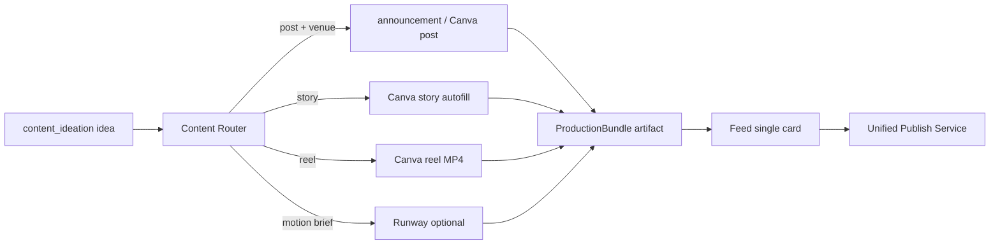

# Smart Agency — Çıktı Kalitesi ve Üretim Hattı Analiz Raporu

**Kapsam:** Mission Hub → İçerik Fabrikası → Feed/Outputs → Instagram yayını  
**Amaç:** Başka bir AI ile proje değerlendirmesi için kod tabanlı, detaylı durum tespiti  
**Repo:** `smart-agency` (`apps/web`, `backend`, `apps/api`)  
**Son güncelleme:** Kod incelemesi (Mart 2026)

---

## 1. Ürün amacı ve hedef çıktı

Smart Agency, marka bağlamı (galeri, vibe, Canva şablonları, brand kit) üzerinden **sosyal medya içeriğini uçtan uca üretmeyi** hedefliyor:

| Hedef | Açıklama |
|--------|----------|
| **Stratejik üretim** | Mission DAG ile `content_ideation` / `content_calendar` / `content_strategy` |
| **Görsel kalite** | Marka fotoğrafı + ajans şablonları (SVG/Sharp) + Canva Brand Templates + isteğe bağlı Runway reel |
| **Operasyonel hız** | Mümkün olduğunda sıfır tık: auto-produce → Feed'de `pending_review` |
| **İnsan onayı** | Nexus `OutputArtifacts` → Onayla → Instagram (Mertcafe veya Meta) |
| **Öğrenme** | Onay/red → marka hafızası (çift sistem — Bölüm 7) |

**İdeal kullanıcı yolculuğu (tasarım niyeti):**

```
Mission öner → Onayla → Agent fikir üretsin
    → (A) Otomatik: Feed'e hazır kartlar
    → (B) İsteğe bağlı: İçerik Fabrikası'nda ince ayar
    → Feed'de onayla → Instagram
```

**Gerçekte:** (A) ve (B) **paralel ve kısmen çakışan** pipeline'lar; aynı fikir için birden fazla artifact ve farklı render kaliteleri mümkün.

---

## 2. Mimari özet

```mermaid
flowchart TB
  subgraph UI["Next.js Mobile + Desktop"]
    MH[MissionHub]
    MCF[MissionContentFactory]
    APF[AutoProductionFeed / IdeaCard]
    PF[PlatformFeed / Outputs]
    CP[ContentPage desktop]
  end

  subgraph BFF["Next.js API Routes"]
    MI[/api/missions/*]
    AP[/api/auto-produce]
    CV[/api/canva/*]
    IMG[/api/generate-*]
    MC[/api/mertcafe/post]
    META[/api/meta/publish]
  end

  subgraph PY["Python FastAPI :8000"]
    DAG[task_graph_executor]
    CREW[CrewEngine agents]
    BC[brand_context / gallery]
    TL[tenant_learning suggestions]
  end

  subgraph NET[".NET Nexus :5050"]
    ART[OutputArtifacts CRUD]
    REV[ReviewService + BrandLearning]
  end

  MH --> MI --> PY
  PY -->|content_ideation done| AP
  AP --> ART
  MCF --> APF
  APF --> CV & IMG & ART
  PF --> MC --> ART
  CP --> META
  REV --> NET
  CREW --> PY
```

**Kritik ayrım:** Mission çalıştırması **Python DAG** üzerinden gider; desktop'taki ad-hoc agent koşuları **.NET → Python `/internal/v1/orchestration/execute`** kullanır. İki yol **aynı learning store'u paylaşmıyor**.

### 2.1 Backend sorumlulukları

| Katman | Port | Rol |
|--------|------|-----|
| Next.js | 3000 | UI, BFF, Canva/ görsel API'leri, proxy |
| Python | 8000 | Missions DAG, CrewAI, brand_context, tenant_learning |
| .NET Nexus | 5050 | Artifacts, review, brand learning (Qdrant), müşteri API |
| Mertcafe | harici | Mobile Feed Instagram publish |
| Meta Graph | Python BFF | Desktop / ApprovalFeedback publish |

---

## 3. Aşama bazlı akış

### 3.1 Mission Hub

| Özellik | Dosya / mekanizma |
|---------|-------------------|
| Mission önerme | `apps/web/src/app/mobile/_components/screens/MissionHub.tsx` → `POST /api/missions/{ws}/propose` → `backend/app/services/strategist_service.py` |
| Onay + DAG başlatma | `PUT .../approve` → `advance_mission()` |
| İlerleme | `getMissionProgress`, 15s poll, `InFlightCard` |
| Tamamlanınca | `MissionDetailSheet` → node `output_summary` |
| İçerik Fabrikası'na geçiş | `openMissionFactory(missionId, nodeKey)` — `mobile-store.ts` |
| Feed'e git | "Feed'de Gör" — auto-produce sonrası |

**Task tipleri (içerik odaklı):**

| agent_role | task_type |
|------------|-----------|
| content_agent | `content_ideation`, `content_calendar`, `visual_design_cards` |
| content_strategy_agent | `content_strategy` |
| review_agent | `review_analysis`, `single_review_response` |
| ads_agent | `campaign_analysis`, `ad_creative_generation`, … |
| analytics_agent | `traffic_analysis`, `conversion_report`, … |

**Serialize edilen content task'lar (aynı tenant'ta sırayla):** `content_ideation`, `content_calendar`, `content_strategy`, `visual_design_cards`.

**Node çıktısı:** `MissionNodeProgress.output_summary` — ham agent metni (JSON/markdown karışık, ~8K char).

**Parse (Fabrikaya giriş):** `MissionContentFactory.parseIdeas()` → `signalFromArtifact()` + legacy array → `ArtifactIdea` → `Record` for UI.

**Mission başlatma yolları:**

1. Manuel: Mission Hub "Yeni Öneri" → propose → approve  
2. Feed mount: `POST /api/missions/{tenantId}/auto-trigger` (propose+approve, fire-and-forget)  
3. Scheduler: `backend/app/services/scheduler_service.py` — `_daily_auto_content_job`

---

### 3.2 Otomatik üretim (Mission tamamlanmadan Feed)

**Tetik:** Python `task_graph_executor` → `content_ideation` bitince → `POST /api/auto-produce`

| Bileşen | Rol |
|---------|-----|
| `apps/web/src/app/api/auto-produce/route.ts` | Galeri eşleme, announcement template, Runway (bütçeli), Nexus'a `saveArtifactToNexus` |
| `apps/web/src/lib/gallery-photo-matcher.ts` | Skor, batch atama, agent URL önceliği |
| `apps/web/src/lib/announcement-template-library.ts` | Etkinlik/kampanya SVG şablonları |
| `apps/web/src/app/api/auto-produce/budget.ts` | Runway/günlük limit |

**Env:** `AUTO_PRODUCE_GALLERY_ONLY` — galeri yoksa scratch üretim atlanabilir.

**Feed auto-trigger:** `PlatformFeed` mount → auto-trigger route. **Not:** Günlük cap burada tam uygulanmıyor; asıl cap scheduler'da.

**Bilinen bug:** `auto-trigger/route.ts` propose yanıtını `{ proposals_created, missions: [...] }` yerine düz dizi gibi okuyabilir — approve adımı kırık olabilir.

---

### 3.3 İçerik Fabrikası

**Giriş:** `apps/web/src/app/mobile/_components/screens/MissionContentFactory.tsx` (~4.000 satır)

| Mod | Koşul | UX |
|-----|--------|-----|
| **Otonom** (`AutoProductionFeed`) | `ideas.length > 0` && marka galerisi var | Varsayılan |
| **Gelişmiş** (`IdeaCard`) | Galeri yok veya kullanıcı "Gelişmiş" | Swipe + overflow menü |

#### Üretim yolları (feature set)

| ID | Yol | Teknoloji | Otonom | Gelişmiş | Kalite |
|----|-----|-----------|--------|----------|--------|
| P1 | Ham foto eşleme | `gallery-photo-matcher` | Varsayılan | Evet | Orta |
| P2 | Canvas overlay | `composeBrandPhotoCard` (client canvas) | Arka plan | Overflow | Orta–iyi |
| P3 | Ajans kartı | Design Director + GPT-image-1 edit | Manuel | Overflow | İyi |
| P4 | Runway Reel | `/api/generate-reel` | Manuel | Overflow | İyi (tek kare animasyon) |
| P5 | Canva autofill | `/api/canva/autofill-design` + export | Sessiz arka plan | Overflow | İyi |
| P6 | Marka kiti önizleme | `brand-kit-preview` → event-card API | Manuel | Inline | İyi |
| P7 | Etkinlik kartı | `/api/generate-event-card` | Yok | Modal | İyi |
| P8 | AI scratch görsel | `/api/generate-instagram-image` | Galeri yoksa | Nadiren | Değişken |
| P9 | Çoklu format / seri | Paralel API | Yok | Overflow | Karmaşık |
| P10 | Ürün arka planı | `generateProductBackground` | **UI yok** | Ölü kod | — |

**Canva entegrasyonu (güncel):**

- `apps/web/src/lib/canva-mission-signal.ts` — feed caption vs `canvaFieldCopy` ayrımı  
- `GET /api/canva/field-limits` — registry + sözlük limitleri  
- Otonom: post + story + reel için sessiz Canva + ayrı artifact (`canvaSavedToOutputs`)  
- `apps/web/src/lib/canva-template-registry.ts` — `fieldContracts` persist  

**Marka Kiti Önizleme:** Eski `LayoutEngine` kaldırıldı; `generateBrandKitPreview()` önce announcement SVG (`/api/generate-event-card`), fallback `composeBrandPhotoCard`.

---

### 3.4 Feed / Outputs / Yayın

| Yüzey | Onay | Yayın API |
|--------|------|-----------|
| `PlatformFeed.tsx` | Onayla = önce publish, sonra approve | `/api/mertcafe/post` |
| `Outputs.tsx` | Benzer | Mertcafe |
| `ApprovalFeedback.tsx` | Ayrı | `/api/meta/publish` |
| `ContentPage.tsx` (desktop) | Approve ayrı | Meta publish |

**Artifact kayıt:** `apiClient.saveCreativeArtifact()` → .NET `POST /api/artifacts/creative` → `ReviewStatus.Pending`.

**URL çözümleme:** `apps/web/src/app/mobile/_components/artifact-utils.ts` — `canvaDownloadUrl`, `permanentPreviewUrl`, `videoUrl` öncelikleri.

**Gap:** `PlatformFeed` önizleme bazen daha dar `resolveArtifactImg` kullanıyor → önizleme ≠ yayın URL'si.

---

## 4. Veri sözleşmeleri

### 4.1 Agent fikir → UI (`ArtifactIdea`)

Kaynak: `apps/web/src/components/artifacts/artifact-preview.ts`

```
headline, caption, captionAlt, hashtags, contentType,
cta, visualDirection, visualProductionSpec,
canvaFieldCopy?, templateUseCase?, assetIntent?
```

### 4.2 Auto-produce / layout hedefi (`CanvasOutput`)

Kaynak: `apps/web/src/types/canvas-output.ts`

```
headline, subline, bullets, caption, cta, hashtags,
layoutId, format, visualBrief, tokensHint, brandConfidence
```

**Problem:** İki şema tam hizalı değil; parser'lar fallback ile bağlanıyor → alan kaybı / yanlış format algısı.

### 4.3 Nexus artifact

| Alan | Kullanım |
|------|----------|
| `contentUrl` | Birincil medya (tek URL modeli) |
| `content` (JSON) | `kind`, `caption`, `imageUrl`, `videoUrl`, Canva URL'leri |
| `metadata` | `visual_mode`, `source`, `auto_produced`, galeri referansları |
| `platform` | `instagram` vs `canva` |
| `reviewStatus` | `pending_review` / `approved` / `rejected` |

**Problem:** Bir fikir → foto artifact + Canva artifact = Feed'de iki kart; `bundle_id` / `idea_index` ilişkisi yok.

### 4.4 Canva sinyal

`CanvaTemplateDecisionInput` — `canvaFieldCopy`, `heroImageAssetId`, `kind`, `caption` (feed), vb.

`extractTemplateFieldContracts()` — şablon alan başına max karakter (`apps/web/src/lib/canva-template-selection.ts`).

---

## 5. Renderer / entegrasyon matrisi

| Altyapı | Dosya kökü | Güçlü yan | Zayıf yan | Kullanım |
|---------|------------|-----------|-----------|----------|
| Announcement SVG | `announcement-template-engine.ts`, `generate-event-card` | Ajans tipografi, brand kit | Etkinlik odaklı metin | auto-produce, brand kit |
| Client canvas | `composeBrandPhotoCard` | Hızlı, 4 stil | Generic fontlar | Otonom arka plan |
| Design Director + GPT-image | `design-director`, `generate-instagram-image` | Foto korunur | Maliyet, süre | Gelişmiş |
| Canva Connect | `canva-template-selection`, `autofill-design` | Gerçek şablonlar, MP4 | 429, envanter | Otonom + manuel |
| Runway Gen 4 | `generate-reel`, `reel-prompt.builder` | Caption-driven | Tek kare; time-lapse yok | Manuel / bütçeli |
| LayoutEngine | `LayoutEngine.tsx` | Hızlı React | Düşük kalite | Fabrikadan çıkarıldı |
| Flux / OpenAI | `generate-instagram-image` | Sıfırdan görsel | Marka sapması | Fallback |

**Stratejik boşluk:** `docs/dynamic-content-and-canva-standard.md` ve `docs/controlled-creative-production-and-canva-risk-plan.md` **Content Router** tanımlıyor; kodda merkezi router yok — ekran başına dağınık butonlar.

---

## 6. Kalite ve güvenilirlik mekanizmaları (mevcut)

| Mekanizma | Nerede |
|-----------|--------|
| Galeri skor eşiği (`MIN_ACCEPT_SCORE` 42) | `gallery-photo-matcher.ts` |
| Batch'te foto tekrarını engelleme | `assignPhotosToContents` |
| Session + önceki artifact dedup | Auto + `gallery-usage-tracker.ts` |
| Canva alan limiti + LLM rewrite | `autofill-design`, `canva-mission-signal` |
| CDN upscale / expired URL reddi | `upscaleCdnUrl`, media-proxy |
| Canva 429 retry + template cache | `canva-connect-api`, `canva-template-catalog` |
| Venue foto koruma | `venue-photo-policy.ts` |
| CTA/caption harmonizasyonu | `cta-localization.ts` |
| Runway bütçe cap | `auto-produce/budget.ts` |
| Agent URL skor toleransı (±12) | `resolveBestGalleryUrl` |

---

## 7. Öğrenme ve onay pipeline'ı

### 7.1 .NET (Nexus) — `approveArtifact` ile bağlı

```
POST /api/artifacts/{id}/approve
  → ReviewService
  → BrandLearningService → BrandMemoryDocuments + Qdrant
```

### 7.2 Python — ayrı store

- `tenant_learning_service.py` → `suggestions` tablosu  
- Crew prompt'larına enjekte (`build_learning_context_prompt`)  
- **Nexus approve buraya yazmıyor**

### 7.3 Frontend sinyalleri

- `gallery-usage-tracker.ts` — onaylı artifact URL'leri  
- ContentPage session `usedPhotoUrls`  
- `visual-review` BFF — skor UI, approve'a bağlı değil  

**Gap:** İki öğrenme sistemi senkron değil; dış AI değerlendirmesinde "single source of truth" kararı gerekli.

---

## 8. End-to-end: kayıttan yayına

### Tipik mobil fabrika yolu

1. **Üret** — MissionContentFactory / auto-produce / BFF görsel  
2. **Kaydet** — `saveCreativeArtifact` → Nexus `pending_review`  
3. **Listele** — `getArtifacts()` → Feed, Outputs  
4. **İncele** — Feed "Onayla" veya ApprovalFeedback  
5. **Yayınla**  
   - Mertcafe: normalize, reachability check, `MERTCAFE_BASE_URL/api/post`  
   - Meta: Python `meta_publish_service`  
6. **Sonrası** — `ReviewStatus.Approved`, `ig_media_id` metadata  

### Otonom yol (Fabrika ziyareti yok)

```
content_ideation complete
  → POST /api/auto-produce
  → saveArtifactToNexus (metadata: auto_produced)
  → PlatformFeed
```

### Çoklu çıktı örneği (mevcut davranış)

```
Otonom produceAll:
  → imageUrl (foto)
  → canvasUrl (arka plan)
  → generateCanva (sessiz) → ikinci artifact Feed'e
Kullanıcı Onayla:
  → activeVisual'a göre TEK artifact daha (photo/canvas/canva/…)
```

---

## 9. İyileştirme noktaları (öncelikli)

### P0 — Çıktı tutarlılığı ve kullanıcı güveni

| # | Sorun | Öneri |
|---|--------|--------|
| 1 | Çift artifact (foto + Canva) | `bundle_id` / `idea_index`; Feed'de tek kart, varyant sekmesi |
| 2 | Önizleme ≠ yayın URL | Tek `resolveArtifactMedia()` her yüzeyde |
| 3 | Onayla = publish UX | Mesajlaşma netleştir; isteğe bağlı ayrı aksiyonlar |
| 4 | Reel kare önizleme | Video poster / mp4 player Feed'de |
| 5 | auto-trigger propose JSON | `missions[0].id` düzeltmesi |

### P1 — Kalite standardizasyonu (Content Router)

| # | Sorun | Öneri |
|---|--------|--------|
| 6 | 10+ üretim yolu | `contentType × intent → primaryRenderer` tablosu |
| 7 | Otonom kalite hiyerarşisi yok | Story/Reel: Canva MP4 birincil; Post: announcement/Canva |
| 8 | Agent çıktı eksik alanlar | Python parse + zorunlu `canvaFieldCopy`, `visual_production_spec` |
| 9 | Runway vs Canva reel | Ürün kararı: biri birincil, ikisi otomatik değil |

### P2 — Kod sağlığı

| # | Sorun | Öneri |
|---|--------|--------|
| 10 | MissionContentFactory ~4K satır | Modüler `production/` paketi |
| 11 | AutoProductionFeed ↔ Factory circular import | Paylaşılan `lib/brand-canvas.ts` |
| 12 | auto-produce vs client drift | Ortak `produceIdeaCore()` |
| 13 | Ölü kod product background | UI veya sil |
| 14 | İki learning sistemi | Nexus → Python mirror veya tek kaynak |

### P3 — Operasyon

| # | Sorun | Öneri |
|---|--------|--------|
| 15 | Canva 429 | Global kuyruk, concurrency=1 |
| 16 | İki publish stack | Tenant `publishProvider` config |
| 17 | Caption vs tasarım metni karışıklığı | UI: "Feed metni" / "Tasarım metni" sekmeleri |
| 18 | Desktop Canva export publish'e bağlı değil | `hasMedia` + `permanentPreviewUrl` |

---

## 10. Özellik seti checklist (değerlendirme)

### Mission Hub

- [x] Propose / approve / cancel / restart  
- [x] Bütçe / token gate  
- [x] DAG ilerleme UI  
- [x] Node output görüntüleme  
- [x] İçerik Fabrikası CTA  
- [x] Feed auto-trigger (kısıtlı)  
- [ ] Güvenilir günlük cap (Feed tarafında)  
- [ ] Üretim kalitesi profili (hızlı / dengeli / premium)

### İçerik Fabrikası — Otonom

- [x] Toplu foto eşleme  
- [x] Canvas arka plan  
- [x] Sessiz Canva (post/story/reel)  
- [x] Onay → artifact  
- [x] Gelişmiş moda geçiş  
- [ ] Birincil renderer otomatik seçimi  
- [ ] Tek kart / çoklu varyant UX  
- [ ] Runway otonom (bilinçli kapalı)

### İçerik Fabrikası — Gelişmiş

- [x] Caption A/B, brief sekmesi  
- [x] Overflow: Canva, canvas, ajans, reel, event  
- [x] Marka kiti önizleme (announcement)  
- [x] Kayıtlı şablonlar (localStorage)  
- [ ] Karakter sayaçları (field-limits UI)  
- [ ] Ürün arka planı (kod var, UI yok)

### Feed / Outputs

- [x] pending / approved filtre  
- [x] Mertcafe publish + approve  
- [x] Revizyon isteği  
- [ ] Reel video önizleme  
- [ ] Canva export zorunluluğu (publish öncesi)  
- [ ] Bundle / varyant görünümü

### Entegrasyonlar

- [x] Canva OAuth + autofill + export  
- [x] Runway reel  
- [x] GPT-image / Flux  
- [x] Announcement templates  
- [x] Gallery analysis  
- [ ] Merkezi Content Router (planlı)  
- [ ] Birleşik publish + learning  

---

## 11. Hedef mimari (tartışma taslağı)



**ProductionBundle (öneri):**

```json
{
  "ideaId": "mission:{missionId}:node:{nodeKey}:index:{i}",
  "feedCaption": "...",
  "hashtags": [],
  "variants": [
    { "type": "photo", "url": "...", "isPrimary": false },
    { "type": "canva_export", "url": "...", "format": "mp4", "isPrimary": true }
  ]
}
```

Nexus'ta tek artifact veya parent-child ilişkisi.

---

## 12. Dosya ve API indeksi

### UI

| Dosya | Rol |
|-------|-----|
| `apps/web/src/app/mobile/_components/screens/MissionHub.tsx` | Mission lifecycle |
| `apps/web/src/app/mobile/_components/screens/MissionContentFactory.tsx` | Fabrika shell + IdeaCard + compositors |
| `apps/web/src/app/mobile/_components/screens/AutoProductionFeed.tsx` | Otonom üretim |
| `apps/web/src/app/mobile/_components/screens/PlatformFeed.tsx` | Onay + Mertcafe publish |
| `apps/web/src/app/mobile/_components/screens/Outputs.tsx` | Çıktılar |
| `apps/web/src/app/mobile/_components/screens/CanvaTemplatesScreen.tsx` | Canva şablon yönetimi |
| `apps/web/src/app/mobile/_components/artifact-utils.ts` | Medya URL çözümleme |
| `apps/web/src/app/mobile/_components/mobile-store.ts` | Navigation, factory params |
| `apps/web/src/components/pages/ContentPage.tsx` | Desktop studio |
| `apps/web/src/components/artifacts/artifact-preview.tsx` | Idea/signal parse |

### Lib

| Dosya | Rol |
|-------|-----|
| `apps/web/src/lib/canva-mission-signal.ts` | Mission → Canva sinyal |
| `apps/web/src/lib/canva-template-selection.ts` | Şablon seçimi, autofill, field contracts |
| `apps/web/src/lib/canva-template-registry.ts` | Persist field limits |
| `apps/web/src/lib/brand-kit-preview.ts` | Marka kiti önizleme |
| `apps/web/src/lib/gallery-photo-matcher.ts` | Foto eşleme |
| `apps/web/src/lib/gallery-usage-tracker.ts` | Kullanılmış URL takibi |
| `apps/web/src/lib/announcement-template-engine.ts` | SVG overlay |
| `apps/web/src/lib/announcement-brand-kit.ts` | Tenant renk/font |
| `apps/web/src/lib/api-client.ts` | Artifacts, missions |

### API (Next BFF)

| Route | Rol |
|-------|-----|
| `/api/missions/[workspaceId]/*` | Mission CRUD → Python |
| `/api/missions/[workspaceId]/auto-trigger` | Feed otomatik propose |
| `/api/auto-produce` | Post-ideation batch üretim |
| `/api/canva/autofill-design` | Canva render + export |
| `/api/canva/field-limits` | Karakter limitleri |
| `/api/canva/export-design` | PNG/MP4 export |
| `/api/generate-event-card` | Announcement kart |
| `/api/generate-reel` | Runway |
| `/api/generate-instagram-image` | Flux/OpenAI |
| `/api/design-director/[tenantId]` | Ajans spec |
| `/api/mertcafe/post` | Mobile Instagram |
| `/api/meta/publish` | Meta Instagram |

### Backend Python

| Dosya | Rol |
|-------|-----|
| `backend/app/services/task_graph_executor.py` | DAG, auto-produce trigger |
| `backend/app/services/strategist_service.py` | Mission propose |
| `backend/app/services/mission_service.py` | Mission CRUD |
| `backend/app/crew/engine.py` | Agent roles |
| `backend/app/crew/action_extractor.py` | Ideation parse |
| `backend/app/services/tenant_learning_service.py` | Python learning |

### .NET

| Dosya | Rol |
|-------|-----|
| `apps/api/src/Nexus.Api/Controllers/ArtifactsController.cs` | Creative artifacts |
| `apps/api/src/Nexus.Infrastructure/Services/ReviewService.cs` | Approve + learning |

### Dokümantasyon

| Dosya | Konu |
|-------|------|
| `CLAUDE.md` | Stack, portlar, mimari |
| `docs/smartagency-system-architecture.md` | Modül mimarisi |
| `docs/dynamic-content-and-canva-standard.md` | Canva use-case, alanlar |
| `docs/controlled-creative-production-and-canva-risk-plan.md` | Risk, intent, router planı |

---

## 13. Başka AI için değerlendirme soruları

1. Tek fikir için kaç artifact kabul edilebilir? (foto + Canva + reel = 3 mü, 1 mi?)  
2. Otonom modda birincil görsel standardı ne olmalı? (Canva export, announcement SVG, canvas?)  
3. Reel ürün tanımı: Canva MP4 mü, Runway mü, ikisi mi?  
4. Learning tek kaynak: Nexus BrandLearning mi, Python suggestions mi?  
5. Publish birleştirme: Mertcafe vs Meta — tek abstraction?  
6. Agent çıktı şeması: `ArtifactIdea` vs `CanvasOutput` — hangisi source of truth?  
7. ROI sırası: P0 UX mi, Content Router mi, prompt/parse kalitesi mi?

---

## 14. Kısa sonuç

**Güçlü taraflar:** Zengin renderer ekosistemi (Canva, announcement, Runway, ajans pipeline), galeri zekâsı, mission otomasyonu, Canva alan limitleri ve marka kiti önizlemenin ajans şablonuna taşınması.

**Zayıf taraflar:** Dağınık UX (çok buton, net "birincil çıktı" yok), çift/üçlü artifact, iki publish ve iki learning hattı, 4K satırlık monolit Fabrika, auto-produce ile client otonom arasında drift, Feed önizleme/yayın tutarsızlığı.

**Önerilen iyileştirme sırası:**

1. ProductionBundle + tek Feed kartı  
2. Content Router (format/intent → renderer)  
3. Agent çıktı şemasını sıkılaştırma  
4. Publish/learning birleştirme  
5. Kod modülerizasyonu  

---

*Bu dosya harici AI proje değerlendirmesi için tek kaynak olarak hazırlanmıştır. Güncel kodla drift olursa `apps/web` ve `backend` altındaki ilgili path'ler yeniden taranmalıdır.*
