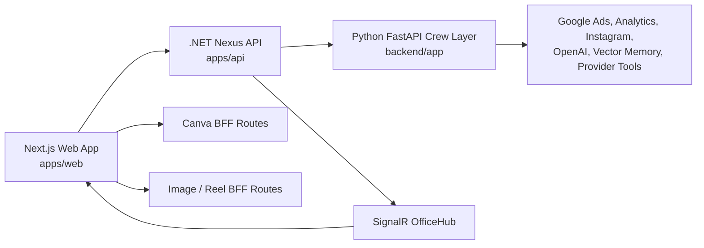
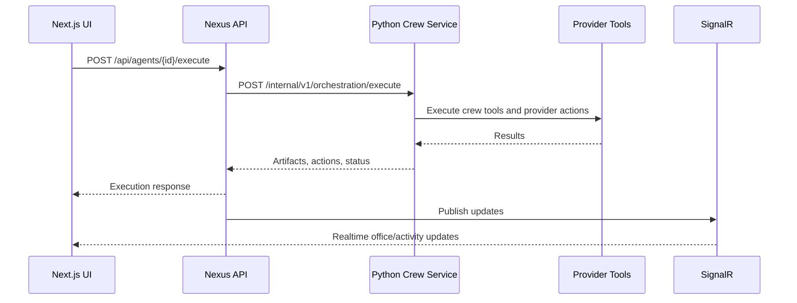

# SmartAgency System Architecture

This document describes the SmartAgency / AI Agent Office OS architecture module by module. It is intended as the project-owned reference file for product, engineering, and future agent work.

## 1. Architecture Summary

SmartAgency is a three-app system:



The frontend is a Next.js 15 application with a single-page dashboard shell. The main backend is the .NET Nexus API, which owns product API surfaces, persistence-oriented workflows, SignalR updates, and orchestration delegation. The Python FastAPI service runs the internal crew orchestration layer and provider tools.

## 2. Repository Modules

### `apps/web`

The web workspace contains the user-facing AI Agent Office OS.

Primary responsibilities:

- Dashboard shell and page navigation.
- Agent execution UX.
- Artifact review and preview surfaces.
- Content Studio, Brand Hub, Canva integration, image generation, and reel generation.
- Client state via Zustand.
- Server/cache state via TanStack Query.
- SignalR connection to the Nexus backend.
- Next.js API routes that keep third-party secrets server-side.

Important files:

- `apps/web/src/app/page.tsx` - root dashboard shell and page switch.
- `apps/web/src/app/layout.tsx` - application layout.
- `apps/web/src/app/providers.tsx` - React Query and realtime setup.
- `apps/web/src/lib/api-client.ts` - Nexus REST client.
- `apps/web/src/lib/runtime-config.ts` - frontend runtime URLs and tenant defaults.
- `apps/web/src/lib/signalr.ts` - SignalR client.
- `apps/web/src/stores/navigation-store.ts` - current page navigation.

### `apps/api`

The Nexus API is the primary product API.

Primary responsibilities:

- REST API for agents, tasks, artifacts, reviews, actions, setup, integrations, operations, and security.
- SignalR realtime hub for office state and notifications.
- Internal bridge from product API calls to the Python crew orchestration service.
- Application/domain/infrastructure layering for backend business logic.

Important files:

- `apps/api/src/Nexus.Api/Program.cs` - API composition root, CORS, SignalR, orchestration service wiring.
- `apps/api/src/Nexus.Api/Hubs/OfficeHub.cs` - realtime office hub.
- `apps/api/src/Nexus.Api/Controllers/AgentsController.cs` - agent execution API.
- `apps/api/src/Nexus.Api/Controllers/ArtifactsController.cs` - artifact lifecycle API.
- `apps/api/src/Nexus.Api/Controllers/TasksController.cs` - task API.
- `apps/api/src/Nexus.Api/Controllers/ReviewsController.cs` - review API.
- `apps/api/src/Nexus.Api/Controllers/IntegrationsController.cs` - integration status and setup API.

### `backend`

The Python backend contains the FastAPI and CrewAI-style orchestration layer.

Primary responsibilities:

- Internal orchestration endpoint consumed by Nexus.
- Public v1 API modules when enabled.
- Crew, agent, task, and tool execution.
- Provider tools for ads, analytics, Instagram, image pipelines, and other automation surfaces.

Important files:

- `backend/app/main.py` - FastAPI app and router registration.
- `backend/app/api/internal/orchestration.py` - internal orchestration API.
- `backend/app/api/v1/router.py` - public v1 API router.
- `backend/app/crew/engine.py` - crew execution engine.
- `backend/app/crew/agents/` - agent definitions.
- `backend/app/crew/tasks/` - task definitions.
- `backend/app/crew/tools/` - provider and automation tools.
- `backend/app/config.py` - Python service configuration.

## 3. Frontend Feature Modules

### Dashboard

The dashboard is the main command center for the AI office.

Key files:

- `apps/web/src/components/dashboard/AIDashboard.tsx`
- `apps/web/src/components/dashboard/DashboardShell.tsx`
- `apps/web/src/hooks/use-dashboard-snapshot.ts`

### 3D Office

The 3D office visualizes agents, zones, data flow, and office state.

Key files:

- `apps/web/src/components/3d/OfficeCanvas.tsx`
- `apps/web/src/components/3d/FlagshipOfficeScene.tsx`
- `apps/web/src/components/3d/OfficeArchitecture.tsx`
- `apps/web/src/components/3d/AgentStation.tsx`
- `apps/web/src/components/3d/DataFlowLines.tsx`

### Agents

The Agents module presents agent inventory, status, and execution entry points.

Key files:

- `apps/web/src/components/pages/AgentsPage.tsx`
- `apps/web/src/components/dashboard/AgentDetailPanel.tsx`
- `apps/web/src/components/dashboard/AssignTaskModal.tsx`
- `apps/web/src/lib/agent-runtime.ts`
- `apps/web/src/lib/agent-specialties.ts`

### Content Studio

Content Studio turns AI outputs into platform-ready content and Canva/media assets.

Key files:

- `apps/web/src/components/pages/ContentPage.tsx`
- `apps/web/src/components/artifacts/artifact-preview.tsx`
- `apps/web/src/app/api/generate-instagram-image/route.ts`
- `apps/web/src/app/api/generate-reel/route.ts`

### Brand Hub

Brand Hub explains and monitors the tenant-to-Canva workflow.

Key files:

- `apps/web/src/components/pages/BrandHubPage.tsx`
- `apps/web/src/app/api/canva/status/route.ts`
- `apps/web/src/app/api/canva/templates/route.ts`

### Artifact Center

Artifact Center is the review, approval, and preview workspace for generated outputs.

Key files:

- `apps/web/src/components/dashboard/ArtifactCenter.tsx`
- `apps/web/src/components/artifacts/artifact-preview.tsx`
- `apps/web/src/components/pages/OutputsPage.tsx`
- `apps/web/src/components/pages/ApprovalsPage.tsx`

### Business Modules

These pages expose business-specific AI workflows and operational surfaces.

Key files:

- `apps/web/src/components/pages/AdsPage.tsx`
- `apps/web/src/components/pages/ReviewsPage.tsx`
- `apps/web/src/components/pages/ExecutionsPage.tsx`
- `apps/web/src/components/pages/VisitorPage.tsx`
- `apps/web/src/components/pages/BillingPage.tsx`
- `apps/web/src/components/pages/SystemCommandPages.tsx`
- `apps/web/src/components/setup/SetupWizard.tsx`

## 4. Canva Integration Module

The Canva integration is implemented as a Next.js server-side BFF module. Secrets and tokens stay server-side.

Primary responsibilities:

- OAuth 2.0 login and callback.
- Token storage and refresh.
- Brand Template inventory listing.
- Template metadata inference.
- Template matching.
- Autofill design creation.
- Canva output display inside Content Studio and previews.

Key files:

- `apps/web/src/lib/canva-oauth.ts`
- `apps/web/src/lib/canva-connect-api.ts`
- `apps/web/src/lib/canva-template-catalog.ts`
- `apps/web/src/lib/canva-template-selection.ts`
- `apps/web/src/app/api/canva/oauth/login/route.ts`
- `apps/web/src/app/api/canva/oauth/callback/route.ts`
- `apps/web/src/app/api/canva/template-matches/route.ts`
- `apps/web/src/app/api/canva/autofill-design/route.ts`

Current selection model:

1. Content Studio creates a `CanvaTemplateDecisionInput`.
2. `/api/canva/template-matches` scores visible Brand Templates.
3. The matched template appears as the default selected template in the UI.
4. The user can override the selected template.
5. `/api/canva/autofill-design` creates the Canva design from the selected template.

## 5. Media Generation Module

Media generation is also handled by Next.js API routes so provider keys do not enter the browser.

Image generation:

- Route: `apps/web/src/app/api/generate-instagram-image/route.ts`
- Providers: OpenAI image model and optional FAL/Flux.

Reel generation:

- Route: `apps/web/src/app/api/generate-reel/route.ts`
- Still/keyframe: OpenAI.
- Video: Runway.
- Runway service files:
  - `apps/web/src/lib/runway/services/runway-video.service.ts`
  - `apps/web/src/lib/runway/config/runway.config.ts`
  - `apps/web/src/lib/runway/builders/reel-prompt.builder.ts`
  - `apps/web/src/lib/runway/types/reel.types.ts`

## 6. Agent Execution Flow

The primary agent execution flow is:



Important contracts:

- Web client: `apps/web/src/lib/api-client.ts`
- Nexus orchestration wiring: `apps/api/src/Nexus.Api/Program.cs`
- Python internal endpoint: `backend/app/api/internal/orchestration.py`
- Python internal schemas: `backend/app/schemas/internal.py`

## 7. Artifact Lifecycle

Artifacts are the main output format for agent work.

Lifecycle:

1. Agent or crew generates a structured output.
2. Nexus persists or exposes the artifact through the artifacts API.
3. UI lists artifacts in Output and Artifact Center surfaces.
4. User reviews, approves, rejects, or asks for revision.
5. Content Studio can turn selected content artifacts into Canva designs, generated images, or reels.

Key files:

- `apps/web/src/components/dashboard/ArtifactCenter.tsx`
- `apps/web/src/components/artifacts/artifact-preview.tsx`
- `apps/web/src/components/pages/ContentPage.tsx`
- `apps/web/src/lib/api-client.ts`
- `apps/api/src/Nexus.Api/Controllers/ArtifactsController.cs`
- `backend/app/api/internal/orchestration.py`

## 8. State, Data, and Realtime

Client state:

- `apps/web/src/stores/navigation-store.ts`
- `apps/web/src/stores/office-store.ts`
- `apps/web/src/stores/interaction-store.ts`
- `apps/web/src/stores/activity-store.ts`
- `apps/web/src/stores/notification-store.ts`

Server/cache state:

- TanStack Query in `apps/web/src/app/providers.tsx`.
- Query hooks in `apps/web/src/hooks/`.
- API calls centralized through `apps/web/src/lib/api-client.ts`.

Realtime:

- Backend hub: `apps/api/src/Nexus.Api/Hubs/OfficeHub.cs`
- Frontend client: `apps/web/src/lib/signalr.ts`

## 9. Runtime Configuration

### Web

Key environment variables:

- `NEXT_PUBLIC_API_URL`
- `NEXT_PUBLIC_SIGNALR_URL`
- `NEXT_PUBLIC_TENANT_ID`
- `NEXT_PUBLIC_OFFICE_ID`
- `NEXT_PUBLIC_APP_ENV`
- `CANVA_CLIENT_ID`
- `CANVA_CLIENT_SECRET`
- `CANVA_REDIRECT_URI`
- `CANVA_SCOPES`
- `CANVA_APP_ORIGIN`
- `OPENAI_API_KEY`
- `SMART_AGENCY_IMAGE_PROVIDER`
- `FAL_API_KEY`
- `RUNWAY_API_SECRET`

Key file:

- `apps/web/src/lib/runtime-config.ts`

### Nexus API

Key configuration areas:

- Database connection.
- CORS allowed origins.
- Orchestration service base URL.
- SignalR.
- Action execution settings.
- Rate limits.
- Frontend base URL.

Key file:

- `apps/api/src/Nexus.Api/Program.cs`

### Python Backend

Key configuration areas:

- Database and Redis.
- OpenAI/Ollama.
- Google and Meta providers.
- Crew settings.
- Internal API key.
- Public API toggle.
- CORS.

Key file:

- `backend/app/config.py`

## 10. Current Canva Production Notes

For accurate template matching, Canva Brand Template titles should behave like metadata.

Recommended naming pattern:

```text
SA | CHANNEL | FORMAT | OBJECTIVE | TONE | VARIANT
```

Examples:

- `SA | IG_REEL | 9x16 | EVENT_PROMO | LUXURY | V01`
- `SA | IG_REEL | 9x16 | SHOW_NIGHT | ENERGETIC | V02`
- `SA | IG_POST | 1x1 | MENU_LAUNCH | PREMIUM | V01`
- `SA | IG_POST | 1x1 | REVIEW_TESTIMONIAL | WARM | V01`
- `SA | IG_STORY | 9x16 | OFFER_DISCOUNT | URGENT | V01`

Required autofill fields:

- `TITLE`
- `SUMMARY`
- `CAPTION`
- `CTA`
- `HASHTAGS`

Optional future fields:

- `TEMPLATE_FAMILY`
- `DATE`
- `PRICE`
- `LOCATION`
- `BRAND_NAME`

## 11. Recommended Next Architecture Improvements

1. Store Canva OAuth tokens per tenant/workspace instead of local dev token files.
2. Store template metadata in the product database instead of relying only on Canva template titles.
3. Add a tenant-level Brand Template registry with manual tags and approved use cases.
4. Add artifact-to-asset lineage so generated Canva links can be traced back to agent runs.
5. Add observability around agent execution, Canva autofill jobs, and media generation jobs.
6. Add integration health checks to Brand Hub and System pages.
7. Add a multi-page architecture deck generator when Canva exposes richer text/page composition APIs or when a dedicated Brand Template is available.

