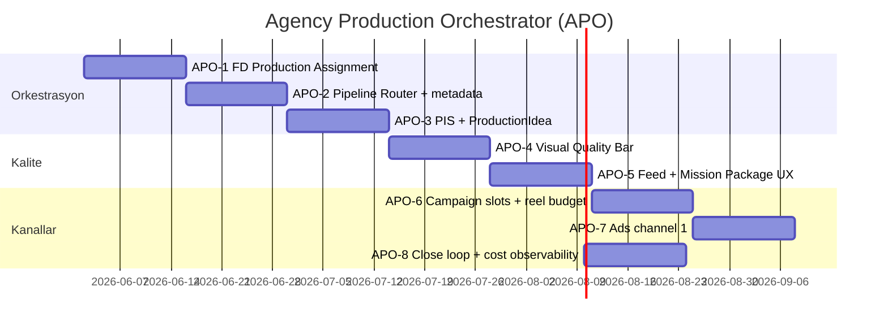
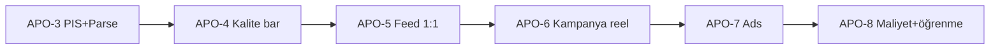

# Agency Production Orchestrator (APO)
## Sprint Program — Kalite Öncelikli, Tenant Maliyet Esnek

**Kaynak konuşmalar (May–Haz 2026):** Mission Hub üretim mantığı, Feed/poster kalite (2/10), Kaçta tenant, promo_split bug, manifest + orkestrasyon önerisi, tool’ların daha iyi kullanımı.

**İlke:** Tenant başına maliyet **artırılabilir**; hedef **ajans kalitesi çıktı** ve Feed’de **1:1 yansıma**. RASGELE üretim yok — brief kilitlenir, slot atanır, pipeline çalışır.

**North Star:** Bir Mission Hub üretimi bittiğinde müşteri şunu görür: organik post + tasarım post + story(ler) + reel(ler) + (varsa) kampanya motion + (varsa) reklam — hepsi **aynı copy bundle**, farklı **production_role**, Feed sekmelerinde doğru önizleme.

### Stratejik karar (2026-06): Canva kullanılmayacak

| Eski yol | Yeni birincil yol |
|----------|-------------------|
| Canva autofill (post/story/reel) | **Remotion** (poster + motion story) + **announcement-template-engine** (event/canvas) |
| Canva Meta ad şablonları | **Remotion ad still** (1:1 / 4:5 / 9:16) veya statik poster + Meta API metin |
| `canvaFieldCopy` (agent JSON) | **Tasarım metni** — ICS alan adı aynı kalır; sadece Remotion/announcement’a beslenir |
| Creative OS Canva router | **APO pipeline router** — `remotion_poster` / `remotion_story` / `gallery_photo` |

Canva API, `canva-mission-signal`, field-limits ve otonom autofill sprint kapsamı **dışı** (bakım modu / feature flag OFF). Bkz. `docs/sprint-plan-creative-os.md` — Canva maddeleri ertelendi.

**Süre:** 8 sprint × 2 hafta (~4 ay)  
**Foundation (S1–S10) üzerine inşa** — BAS/ICS/CCS tamam; bu program **üretim orkestrasyonu + görsel kalite + Feed ayrımı** katmanı.

**Multi-tenant üretim:** Tüm slotlar giriş yapan markanın `workspaceId` / brand mirror / galeri / sektörü ile çalışır. Kaçak analizi ve MT sprint backlog → **`docs/sprint-plan-multi-tenant-production.md`** (MT-1..MT-3 kodda düzeltildi, 2026-05-31).

---

## 1. Konuşmalardan çıkarımlar (özet)

| # | Bulgu | Karar |
|---|--------|--------|
| 1 | Mission çıktıları rasgele; araştırma + gönderi iç içe | **Copy bundle** ideation’da kilitlenir; görsel **slot_role** ile ayrılır |
| 2 | Tüm postlar Remotion poster → düşük kalite / yanlış estetik | **organic_post** = galeri; **designed_post** = Remotion/şablon |
| 3 | `promo_split` posterMode metin stack’i kapatıyordu → sadece “Türkiye” | Engine fix (lineup dışı posterMode’da stack açık) — **APO-4’te doğrulama** |
| 4 | Poster 2/10 — tekrarlı tarih, düz panel, yanlış sektör foto | **poster-quality.ts** + premium panel + SaaS template routing |
| 5 | Feed Art Director var ama slot atamıyor | FD raporuna **`production_assignments`** ekle (yeni agent yok) |
| 6 | `renderer-payload` + PIS yazıldı | **APO-3 W1** gate ✅; W2 reel payload |
| 7 | `ProductionIdea` / ICS var, auto-produce ham JSON | **parseProductionIdeas** tek giriş |
| 8 | İki yol: server auto-produce + client AutoProductionFeed | Otonom mission’da **tek yol** (server); **Canva client branch OFF** (APO-3.7) |
| 9 | Haftalık hedef 3+1+1; kampanya/reklam slot yok | **mission-production-manifest.ts** checklist + FD assignment |
| 10 | Reklam agent var, görsel üretim yok | **paid_ad_creative** ayrı pipeline — **APO-7** |
| 11 | CD sadece story’deydi | Post + kampanya slotlarında CD — maliyet kabul |
| 12 | Context signals sadece propose’da | Üretimde `publish_schedule` + sinyal → slot ipucu |
| 13 | Kaçta: brand name, synthetic gallery, GIS gate | **APO-1 öncesi tamamlandı** (bakım sprintinde regresyon test) |
| 14 | Runway: 1 hero reel / batch | Tenant tier: **kampanya reel #2** opsiyonel (**APO-6**) |

---

## 2. Mimari karar: Orkestratör-önce

Yeni agent ordusu değil; **mevcut stack sırası**:

```
content_ideation (ICS-complete ideas)
    → Feed Art Director (+ production_assignments)   ← APO-1
    → parseProductionIdeas + PIS gate                 ← APO-3
    → Pipeline Router (slot_role → tool chain)        ← APO-2, APO-4
    → artifact.metadata.production_role               ← APO-2
    → PlatformFeed 1:1 + Mission package UI           ← APO-5
```

**Manifest** (`apps/web/src/lib/mission-production-manifest.ts`) = zorunlu slot checklist.  
**Gerçek atama** = Feed Art Director `production_assignments`.

---

## 3. Tool kullanım matrisi (hedef durum)

| slot_role | Pipeline | Araçlar (sıra) | CD | Scene Brief | Maliyet notu |
|-----------|----------|----------------|-----|-------------|----------------|
| `organic_post` | `gallery_photo` | GIS match → (opsiyonel hafif overlay) | Hayır | Hayır | Düşük |
| `designed_post` | `remotion_poster` | GIS → **CD** → Remotion SpecPoster | Evet | Opsiyonel | Orta |
| `organic_story_still` | `story_still` | GIS → statik story | Hayır | Hayır | Düşük |
| `campaign_story_motion` | `remotion_story` | GIS → Scene brief → **CD** → Remotion MP4 | Evet | Evet | Yüksek |
| `organic_reel` | `runway_reel` | GIS → Scene brief → **buildReelPayload** → Runway | Hayır | Evet | Yüksek |
| `campaign_reel_motion` | `runway_reel` | Aynı + kampanya motion spec | Evet | Evet | Yüksek+ |
| `organic_carousel` | `carousel_gallery` | Multi-match compositor | Hayır | Hayır | Orta |
| `paid_ad_creative` | `meta_ad` | ads_agent copy → **Remotion ad still** / PNG export → Meta API | Evet | Opsiyonel | Reklam bütçesi ayrı |

**Fallback:** `designed_post` Remotion fail veya PIS &lt; 70 → **announcement SVG still** (`generateMarkyLayerCard` / `poster-render-service`) veya galeri-only degrade — Canva yok.

---

## 4. Sprint programı



---

## APO-1 — Feed Art Director: Production Assignment (2 hafta)

**Hedef:** Haftalık batch için her fikre **slot_role + pipeline** atanır; copy aynı kalır.

### Deliverables

| ID | İş | Dosyalar |
|----|-----|----------|
| 1.1 | FD task JSON şemasına `production_assignments[]` ekle | `backend/app/crew/tasks/feed_art_director_tasks.py` |
| 1.2 | FD crew parse + persist `production_assignments` node output | `feed_art_director_crew.py`, `task_graph_executor.py` |
| 1.3 | TS tipi: `FeedArtDirectorReport` genişlet | `weekly-publish-package.ts` |
| 1.4 | Manifest ile çapraz doğrulama: zorunlu slotlar dolu mu? | `mission-production-manifest.ts` + Hub helper |
| 1.5 | Strategist/ideation prompt: her fikirde `template_use_case` + format zorunlu (ICS) | `content_prompts.py` (sertleştirme) |

### Kabul kriterleri

- [ ] FD raporu 10 fikir için 10 assignment döner (veya flagged + backup planı)
- [ ] En az 1× `organic_post`, 1× `designed_post`, 3× `organic_story_still`, 1× `organic_reel` ataması (haftalık manifest)
- [ ] Kampanya mission’ında `campaign_story_motion` assignment zorunlu
- [ ] Mission Hub node detayında assignment tablosu görünür

### Maliyet

- +1 LLM turu (zaten FD çalışıyor — şema genişlemesi, ek agent yok)

---

## APO-2 — Pipeline Router + Artifact Metadata (2 hafta)

**Hedef:** auto-produce assignment’a göre dallanır; Feed karışmaz.

### Deliverables

| ID | İş | Dosyalar |
|----|-----|----------|
| 2.1 | `resolvePipelineForAssignment()` — slot → pipeline | Yeni: `production-pipeline-router.ts` |
| 2.2 | `organic_post`: Remotion poster **kapalı**; galeri URL primary | `auto-produce/route.ts` |
| 2.3 | `designed_post`: mevcut Remotion poster yolu | `auto-produce/route.ts`, `poster-render-service.ts` |
| 2.4 | Artifact metadata: `production_role`, `pipeline`, `copy_bundle_id`, `publish_channel` | `saveArtifactToNexus`, auto-produce |
| 2.5 | FD `recommended_order` + `publish_schedule` → üretim sırası | `auto-produce/route.ts` |
| 2.6 | Otonom mission: AutoProductionFeed skip / “server produced” kilidi | `AutoProductionFeed.tsx`, `MissionContentFactory.tsx` |

### Kabul kriterleri

- [ ] Pilot tenant’ta post feed kartı: organik = foto, tasarım = poster PNG (badge)
- [ ] Aynı caption iki kartta (organik + designed) görünür; görsel farklı
- [ ] `metadata.production_role` Nexus’ta persist
- [ ] Çift üretim (client + server) aynı mission için yok

### Ön koşul kod (kısmi yapıldı)

- `mission-production-manifest.ts` — checklist
- `poster-copy.ts` / `poster-quality.ts` — designed post copy

---

## APO-3 — PIS + ProductionIdea Tek Giriş (2 hafta)

**Hedef:** Foundation S4 borcu kapanır; kırık payload üretilmez.

### Deliverables

| ID | İş | Dosyalar |
|----|-----|----------|
| 3.1 | auto-produce giriş: `parseProductionIdeas(ideas)` | `production-idea-parse.ts`, `auto-produce/route.ts` |
| 3.2 | Üretim öncesi `computePromptIntegrity()` — eşik 70, altı backup/skip | `renderer-payload.ts` |
| 3.3 | Runway: `buildReelPayload()` zorunlu | `auto-produce/route.ts` |
| 3.4 | Event/canvas: `buildEventCardPayload()` → announcement / Marky | `auto-produce/route.ts` |
| 3.5 | Designed post PIS: `remotion_poster` → announcement payload + **design copy** (`canvaFieldCopy` alanı) | `renderer-payload.ts` |
| 3.6 | PIS özet + Hub uyarı | produce `pis` + `MissionHub.tsx` |

### Kabul kriterleri

- [x] PIS &lt; 70 fikirler üretilmez (log + `results[].error`) — W1
- [ ] Tasarım metni (`canvaFieldCopy.headline`) PIS/Remotion’a kaybolmaz (regresyon)
- [ ] Runway: `buildReelPayload()` zorunlu body — W2
- [ ] Canva API çağrısı otonom mission’da **0** (grep / feature flag)

---

## APO-4 — Görsel Kalite Bar (Grafiker ≥8) (2 hafta)

**Hedef:** Tasarım postları ajans seviyesi; SaaS yanlış şablona düşmez.

### Deliverables

| ID | İş | Dosyalar |
|----|-----|----------|
| 4.1 | `promo_split` stack + panel gradient + copy dedupe (regresyon suite) | `announcement-template-engine.ts` |
| 4.2 | `applyPremiumPosterLayoutPatch` + sector routing | `poster-quality.ts`, `announcement-template-library.ts` |
| 4.3 | CD tüm `designed_post` + `campaign_story_motion` | `remotion/render`, `remotion-brand-kit.ts` |
| 4.4 | Product Scene Director: sadece runway + remotion slotları | `production-stack.ts` |
| 4.5 | Grafiker skor &lt; 8 → 1 retry (layoutOverrides patch) | `remotion-quality.ts`, render route |
| 4.6 | `rankPosterFamiliesForSector` — agency_services → editorial/luxury önce | `brand-template-library.ts` (başladı) |
| 4.7 | Showcase + pilot golden PNG set (Kaçta + 1 nightlife) | `public/remotion-showcase/`, QA doc |

### Kabul kriterleri

- [ ] Promo demo: tarih 1 kez; pill footer marka+CTA
- [ ] Kaçta designed post: headline+support+CTA panelde; “sadece Türkiye” yok
- [ ] agency_services batch’te ≥50% editorial/luxury poster (promo sadece % indirim fikirlerinde)
- [ ] Grafiker retry ortalama skor ≥8 (pilot 20 render sample)

### Maliyet (kabul)

- CD post başına +~$0.02–0.05; Scene brief + Runway zaten yüksek — tenant `quality_tier: agency` flag

---

## APO-5 — Feed 1:1 + Mission Paket UX (2 hafta)

**Hedef:** Müşteri Feed = Mission çıktısı birebir; paket tamamlanma görünür.

### Deliverables

| ID | İş | Dosyalar |
|----|-----|----------|
| 5.1 | `detectKind` + `production_role` alt badge (Galeri / Tasarım / Kampanya) | `PlatformFeed.tsx` |
| 5.2 | Sekme filtresi: post alt tür, story motion vs still | `PlatformFeed.tsx` |
| 5.3 | Mission Hub: manifest checklist (7/9 slot ready) | `MissionHub.tsx`, `mission-feed-package.ts` |
| 5.4 | `publish_schedule` → Feed sıralama / “Pazartesi 18:00” etiketi | `PlatformFeed.tsx`, `weekly-publish-package.ts` |
| 5.5 | Story onay: caption strip (mevcut davranış genişlet) | `PlatformFeed.tsx` |
| 5.6 | `selectWeeklyPublishPackage` manifest slotlarına göre genişlet | `weekly-publish-package.ts` |

### Kabul kriterleri

- [ ] Tamamlanan mission kartında: organik post, designed post, 3 story, 1 reel sayıları doğru
- [ ] Feed’de designed vs organic aynı mission_id altında gruplanabilir (filtre veya badge)
- [ ] Eksik slot (rendering/failed) kırmızı CTA + retry-render

---

## APO-6 — Kampanya Kanalı + Reel Bütçesi (2 hafta)

**Hedef:** Kampanya/duyuru ayrı görevler; 2. reel tenant tier ile.

### Deliverables

| ID | İş | Dosyalar |
|----|-----|----------|
| 6.1 | Manifest addon slotlar zorunlu (`campaign_*`) | `mission-production-manifest.ts`, FD prompt |
| 6.2 | `campaign_story_motion` → Remotion campaign composition | `brand-motion-profile.ts`, auto-produce |
| 6.3 | `campaign_reel_motion` → Runway (hero + campaign index) | `production-stack.ts`, auto-produce |
| 6.4 | Tenant config: `max_runway_reels_per_mission: 2` | Nexus settings veya brand_theme |
| 6.5 | Context signals → campaign slot gün önerisi | `context-signals` → FD input |

### Kabul kriterleri

- [ ] Kampanya mission’ında ≥1 motion story + (opsiyonel) campaign reel
- [ ] Organik reel ile kampanya reel farklı `production_role`
- [ ] Tier=agency tenant 2 Runway render/mission

---

## APO-7 — Reklam Kanalı 1:1 (2 hafta)

**Hedef:** Reklam odaklı mission → Feed Reklam sekmesi birebir.

### Deliverables

| ID | İş | Dosyalar |
|----|-----|----------|
| 7.1 | Mission type `ads_focus` + `paid_ad_creative` slot | `mission_service.py`, manifest |
| 7.2 | `ad_creative_generation` node → görsel üretim tetik | `task_graph_executor.py`, ads crew |
| 7.3 | Reklam görseli: Remotion **AdStill** composition (1:1, 4:5, 9:16) + PNG export | `remotion/`, `auto-produce`, `meta_ad` pipeline |
| 7.4 | Feed `ad` tab: sadece `production_role=paid_ad_creative` | `PlatformFeed.tsx` |
| 7.5 | Native ad preview (1:1, 4:5, 9:16) | `platform-native-previews` |

### Kabul kriterleri

- [ ] Ads mission tamamlanınca Feed Reklam’da ≥1 kart
- [ ] Primary text / headline / CTA artifact’ta = önizlemede
- [ ] Organik postlarla karışmaz

---

## APO-8 — Kapalı Döngü + Maliyet Gözlemi (2 hafta)

**Hedef:** Onay/red öğrenir; kalite/maliyet tenant dashboard.

### Deliverables

| ID | İş | Dosyalar |
|----|-----|----------|
| 8.1 | Onay/red → tenant learning + FD bir sonraki batch ipucu | `tenant_learning_service.py` |
| 8.2 | Üretim maliyeti artifact metadata: `cost_usd_estimate` | auto-produce, billing |
| 8.3 | Hub: “Bu mission ~$X (CD+Runway+Remotion)” | `MissionHub.tsx`, `BillingScreen` |
| 8.4 | `quality_tier` tenant: standard | agency (CD always, 2 reel, Grafiker retry) | settings |
| 8.5 | E2E pilot playbook: Kaçta + 1 venue tenant | `docs/pilot-qa-checklist.md` güncelle |

### Kabul kriterleri

- [ ] Reddedilen designed post → sonraki mission’da layout family rotasyonu
- [ ] agency tier maliyet görünür; çıktı kalitesi standard’dan yüksek (manuel QA)

---

## 5. Foundation / Creative OS ile hizalama

| Mevcut sprint | APO karşılığı |
|---------------|----------------|
| Foundation S3 ICS | APO-3 parse zorunlu |
| Foundation S4 PIS | APO-3 üretim kapısı |
| Foundation S7 Strategist | APO-1 brief + diversity (devam) |
| Creative OS S3–S4 Router | APO-2 kalıcı router (Content Router birleşimi) |
| Creative OS S2 Bundle | APO-5 Feed 1:1 (bundle + role) |
| quality-priority A4 Bundle | APO-5 |
| quality-priority B1 Primary renderer | APO-2 pipeline |

**Öneri:** Creative OS S3–S5 ile APO-1–APO-3 **paralel değil seri** — önce APO-1→2, sonra Router modülünü refactor.

---

## 6. Zaten yapılanlar (kredi — regresyon koru)

- [x] **APO-1** FD `production_assignments` + Python normalize + Mission Hub tablo
- [x] **APO-2** `production-pipeline-router.ts` + auto-produce organic/designed ayrımı + metadata
- [x] `promo_split` metin stack fix (`announcement-template-engine.ts`)
- [x] `poster-quality.ts`, `poster-copy.ts`, premium promo_banner base
- [x] CD post üretiminde açık (`remotion-brand-kit`, auto-produce)
- [x] `mission-production-manifest.ts` slot tanımları
- [x] `rankPosterFamiliesForSector` / agency_services poster sectors
- [x] Kaçta brand name, synthetic gallery, GIS gate, MissionHub analyze trigger
- [x] Feed Art Director + Production Stack wiring (hero reel, layout hints)
- [x] Product Scene brief → Runway/CD inject
- [x] FD `weekly_theme_slug` bugfix (`feed_art_director_tasks.py`) — crew fallback engeli kalktı
- [x] `organic_story_still` → `imageUrl = referenceUrl` (`auto-produce/route.ts`) — statik story kaydı
- [x] Carousel base64 → Nexus `ContentUrl` varchar(1000) (`nexusPersistableContentUrl`)

---

## 7. Pilot tenant planı

| Tenant | APO sprintleri | Not |
|--------|----------------|-----|
| **Kaçta Info** (`agency_services`) | APO-1→5 zorunlu | editorial post ağırlık, 0 konser stock |
| **Sarnıç / venue pilot** | APO-4→6 | nightlife promo + event story |
| **Tier=agency** | APO-4, APO-6, APO-8 | CD + 2 reel + Grafiker retry |

---

## 8. Sıradaki sprint: APO-3 (2 hafta) — özet

**Hedef:** Ham JSON yerine `ProductionIdea[]`; üretim öncesi PIS ≥ 70; Runway + Remotion/announcement payload tek builder (**Canva yok**).

| Hafta | Odak | Çıktı |
|-------|------|--------|
| **W1** | Parse + gate | `productionIdeasFromParsed`; PIS&lt;70 skip + `pis` response ✅ |
| **W2** | Payload + reel | `buildReelPayload` zorunlu; `buildEventCardPayload`; Remotion poster PIS (`announcement` shape) |

**Blokerler (pilot’tan):** Runway env yok → reel slotları test dışı kalır (APO-6’da tier). `Denemeye Hazır` designed_post: Remotion fail → APO-4 retry ile kapanır.

**Maliyet switch:** `brand_theme.quality_tier = 'agency'` → CD post + Scene brief + Grafiker retry açık (APO-4).

Detay backlog: **§11** (pilot sonuçları), **§12** (APO-3 görev listesi).

---

## 9. Doküman ilişkileri

| Dosya | Rol |
|-------|-----|
| `foundation-sprint-program.md` | BAS / ICS / CCS / PIS alt skorları |
| `sprint-plan-creative-os.md` | Bundle, Router, Publish uzun vade |
| **`sprint-plan-agency-orchestrator.md`** | **Bu dosya — üretim orkestrasyonu + kalite** |
| `quality-priority-backlog.md` | A1–B8 → APO sprint ID’lerine map |
| `mission-production-manifest.ts` | Slot sözleşmesi (kod) |
| `production-stack.ts` | FD → produce zinciri (kod) |
| `pilot-qa-checklist.md` | APO-8 E2E doğrulama |

---

## 10. Sprint takip

- [x] **APO-1** Feed Art Director Production Assignment *(şema + normalize + Hub UI + TS router)*
- [x] **APO-2** Pipeline Router + metadata *(auto-produce organic vs designed + artifact metadata)*
- [x] **APO-3** PIS + ProductionIdea *(W1–W2 core ✅; Hub PIS + server-only lock; Canva yok)*
- [ ] **APO-4** Görsel kalite bar *(sync+fallback ✅; sector poster routing + poster-copy overlay ✅; CD agency hint ✅)*
- [ ] **APO-5** Feed 1:1 + Mission paket UX *(slot badge ✅; Hub manifest checklist + role sayımı ✅; Feed mission filtresi ✅)*
- [ ] **APO-6** Kampanya kanalı + reel bütçesi *(devam: CampaignHeroStory routing, 2-reel budget, kampanya manifest required — QA: `docs/pilot-qa-apo-campaign.md`)*
- [ ] **APO-7** Reklam kanalı 1:1
- [ ] **APO-8** Kapalı döngü + maliyet gözlemi

---

## 11. Pilot üretim sonuçları (2026-06-02)

Stack restart + `auto-produce` + FD ile doğrulandı.

| Tenant | Mission | FD | Üretim | Not |
|--------|---------|-----|--------|-----|
| **Turunç Bodrum** `d6b187ab…` | `df9a0fbf…` Pazar Fırsatı | 4 idea (FD yok — router infer) | **4/4** | Reel Runway ✓; poster-copy + sector routing (2026-06-02) |
| **Kaçta Info** `5feb36f7…` | `fa3df9c2…` Yaz Sezonu | score 90, 5/5 assignment | **5/5** | designed sync fix ✓; Runway reel ✓ (2026-06-02 re-pilot) |

**Doğrulanan APO-2 davranışları**

- Log: `assignments=N manifest_cov=…%` — FD raporu auto-produce’a bağlı
- `organic_story_still` → galeri URL persist (APO-2 slot + fix)
- `designed_post` → Remotion poster + CD log
- `organic_post` / carousel → galeri veya compositor (base64 Nexus fix)

**Açık maddeler → sprint map**

| Bulgu | Sprint |
|-------|--------|
| Runway devre dışı | Env + **APO-6** `max_runway_reels_per_mission` |
| Designed post bazen boş (`no contentUrl`) | **APO-4** Grafiker retry + announcement SVG fallback |
| `metadata.production_role` API response’ta görünmüyor | **APO-5** Feed badge + Nexus read model |
| AutoProductionFeed çift üretim | **APO-2.6** (henüz kapı yok) |
| ICS/PIS auto-produce’ta yok | **APO-3** (sıradaki) |

---

## 12. APO-3 — Detaylı görev listesi (uygulama sırası)

Foundation **S3 + S4** borcu. Kod hazır: `production-idea-parse.ts`, `renderer-payload.ts` — **auto-produce henüz import etmiyor**.

### 12.1 Hafta 1 — Tek giriş + bütünlük kapısı

| # | Görev | Dosya | Done when |
|---|--------|-------|-----------|
| 3.1a | `POST` body `ideas` → `productionIdeasFromParsed` | `auto-produce/route.ts` | VPS + tasarım metni (`canvaFieldCopy`) kaybolmaz |
| 3.1b | `task_graph_executor` → auto-produce payload’da parsed ideas (opsiyonel) | `task_graph_executor.py` | Python→Next aynı şekil |
| 3.2a | Üretim döngüsü başında renderer seç: slot + `primaryRenderer` | `renderer-payload.ts` `resolveProductionRenderer` | Her fikir için renderer enum |
| 3.2b | Payload build → `gatePromptIntegrity`; **&lt;70 → skip** + `results[].error` | `auto-produce/route.ts` | Log `PIS skip` + response `pis` |
| 3.2c | Mission node / Hub: `pis_warnings[]` summary (son batch) | `MissionHub.tsx` veya mission metadata | Operatör görür |
| 3.6a | Batch ortalama PIS | produce response `pis.avg` | ✅ response alanı |

### 12.2 Hafta 2 — Renderer payload zorunluluğu

| # | Görev | Dosya | Done when |
|---|--------|-------|-----------|
| 3.3 | Reel: `buildReelPayload(idea, brandCtx)` → Runway POST body | `auto-produce/route.ts`, `renderer-payload.ts` | `reel_motion_spec` + scene brief dolu |
| 3.4 | Event/canvas: `buildEventCardPayload` → announcement render | `auto-produce/route.ts` | `event_details` taşınır |
| 3.3 | Runway: `buildReelPayload` → `/api/generate-reel` | `auto-produce/route.ts` | ✅ single-reel path |
| 3.4 | Event: `buildEventCardPayload` → `/api/generate-event-card` | `auto-produce/route.ts` | ✅ + Remotion fallback |
| 3.5 | Remotion poster PIS (`announcement` shape) | `renderer-payload.ts` | ✅ Canva renderer kaldırıldı |
| 3.6b | Hub: `production_pis` on FD node | `MissionHub.tsx`, `task_graph_executor.py` | ✅ |
| 3.7 | `AutoProductionFeed` server-only when mission running/done | `AutoProductionFeed.tsx` | ✅ |

### 12.3 Kabul testleri (APO-3 bitiş)

- [ ] Bodrum + Kaçta mission: auto-produce log’da `parsed=5` / `skipped_pis=1` benzeri özet
- [ ] Bilerek boş VPS’li fikir üretilmez (Hub uyarısı)
- [ ] Reel slotunda Runway açıkken body’de `buildReelPayload` alanları dolu (mock OK)
- [ ] `MissionHub` ideation tablosu `parseProductionIdeas` ile Hub ve server aynı headline

### 12.4 APO-3 sonrası sıra (planlama)



**Paralel küçük iş (APO-3 W2):** APO-2.6 + **3.7** — server-produced mission; client Canva branch OFF.

---

## 13. Canva dışı — sprint yeniden sırası

| Sprint | Canva’sız odak |
|--------|----------------|
| **APO-3** (devam) | `buildReelPayload`; event payload; PIS `remotion_poster` → announcement |
| **APO-4** | Poster kalite, CD, Grafiker retry — **birincil çıktı Remotion PNG** |
| **APO-5** | Feed badge: Galeri / Remotion Tasarım / Motion Story — Canva thumb yok |
| **APO-6** | Kampanya = Remotion story MP4 + Runway |
| **APO-7** | Reklam = Remotion ad still + Meta metin (Canva registry kullanılmaz) |
| **APO-8** | Maliyet: CD + Runway + Remotion render USD |

**İptal / bakım:** Creative OS Sprint 1 Canva publish gate, B7 Canva kuyruk, tüm `canva-mission-signal` otonom tetikler — `CREATIVE_OS_USE_CANVA=false` (env) ile dokümante edilir.

**ICS notu:** Agent prompt’ta `canvaFieldCopy` → “poster/story design fields” olarak kalır; renderer `canva` enum ICS’te legacy, runtime’da `announcement` / `remotion_poster` pipeline kullanılır.
