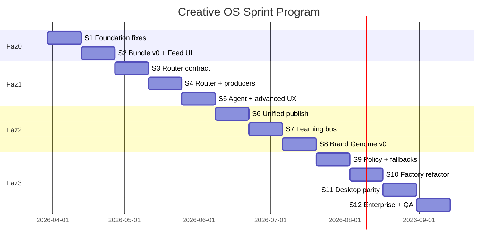

# Smart Agency — Sprint Plan
## Creative OS Dönüşüm Programı

**Kaynak:** `production-pipeline-evaluation-report.md` + `strategic-architecture-review.md`  
**Sprint süresi:** 2 hafta  
**Toplam program:** 12 sprint (~6 ay) — Faz 0–2 tamamlanır; Faz 3 devam eder  
**North Star:** *Autonomous Brand Creative OS* — tek fikir, tek kart, birincil renderer, güvenilir publish, kapalı öğrenme döngüsü

> **2026-06 güncelleme:** Canva entegrasyonu **program dışı**. Otonom görsel üretim = **APO** (`docs/sprint-plan-agency-orchestrator.md`): Remotion + announcement + galeri + Runway. Bu dosyadaki Canva maddeleri (S1 publish gate, S3 router `canva`, S4 adapter, vb.) **ertelendi**; karşılığı APO-2→APO-7.

---

## Program özeti

| Faz | Sprintler | Odak | Çıktı |
|-----|-----------|------|--------|
| **0 — Güven** | S1–S2 | Bundle v0, Feed UX, publish gate | Kullanıcı güveni ↑ |
| **1 — Router** | S3–S5 | Content Router, shared producer | Tutarlı otonom üretim |
| **2 — Unified Ops** | S6–S8 | Publish, learning, Brand Genome v0 | OS bütünlüğü |
| **3 — Olgunluk** | S9–S12 | Policy studio, self-heal, enterprise | Scale + enterprise |



---

## Zaten yapılanlar (Sprint 0 öncesi)

Bu sprint planına **başlangıç kredisi** olarak say:

- [x] `canva-mission-signal.ts` — mission → Canva sinyal + field trim  
- [x] `GET /api/canva/field-limits` — registry limitleri  
- [x] Otonom Canva: post + story + reel sessiz autofill  
- [x] `brand-kit-preview.ts` — Marka Kiti → announcement engine (LayoutEngine kaldırıldı)  
- [x] Canva template rate limit / registry field contracts  
- [x] Araştırma dokümanları (pipeline + strategic review)

---

# FAZ 0 — GÜVEN ONARIMI

## Sprint 1 — Temel onarımlar ve tek medya kaynağı

**Hedef:** Sessiz bug’ları kapat; önizleme = yayın URL’si; otonom tetikleyici güvenilir.

### Deliverables

| # | İş | Dosyalar | Öncelik |
|---|-----|----------|---------|
| 1.1 | **auto-trigger propose JSON fix** | `apps/web/src/app/api/missions/[workspaceId]/auto-trigger/route.ts` | P0 |
| 1.2 | **Unified `resolveArtifactMedia()`** — PlatformFeed, Outputs, ApprovalFeedback hepsi `artifact-utils.ts` kullanır | `artifact-utils.ts`, `PlatformFeed.tsx`, `Outputs.tsx` | P0 |
| 1.3 | **Canva publish export gate** — `canva.com/design` veya export yoksa publish blok + kullanıcı mesajı | `PlatformFeed.tsx`, `mertcafe/post/route.ts`, `artifact-utils.ts` | P0 |
| 1.4 | **Reel Feed önizleme** — `detectKind=reel` → `<video>` veya poster | `PlatformFeed.tsx` | P1 |
| 1.5 | **Auto-trigger daily cap** — scheduler ile aynı mantık veya auto-trigger’da `todayStart` kullanımı | `auto-trigger/route.ts`, `scheduler_service.py` (read-only align) | P1 |
| 1.6 | **Çift-save netliği** — otonom Canva auto-save vs Onayla: UI’da “Canva → Feed’e eklendi” tutarlılığı | `AutoProductionFeed.tsx` | P2 |

### Kabul kriterleri

- [ ] auto-trigger: propose sonrası doğru `missionId` ile approve  
- [ ] Aynı artifact Feed’de önizleme ve publish aynı URL  
- [ ] Canva edit URL ile Instagram publish **imkânsız** (422 + Türkçe mesaj)  
- [ ] Reel artifact Feed’de video oynatılır  

### Tahmini efor

~3–4 dev-gün · **Risk:** düşük

---

## Sprint 2 — ProductionBundle v0 + tek Feed kartı

**Hedef:** Aynı fikirden gelen çoklu artifact’ları grupla; kullanıcı tek kart görür.

### Deliverables

| # | İş | Dosyalar |
|---|-----|----------|
| 2.1 | **`ProductionBundle` type + helper** | `apps/web/src/lib/production-bundle.ts` (yeni) |
| 2.2 | **Bundle metadata standardı** — save sırasında `bundleId`, `ideaRef`, `variantRole`, `isPrimary` | `AutoProductionFeed`, `saveCreativeArtifact` metadata, `auto-produce/route.ts` |
| 2.3 | **`bundleId` üretimi** — `mission:{id}:node:{key}:idea:{index}` | shared helper |
| 2.4 | **Feed grouping** — `getArtifacts()` sonrası client-side group by `bundleId`; tek kart UI | `PlatformFeed.tsx` |
| 2.5 | **Varyant sekmesi** — primary büyük; foto / Canva / canvas küçük thumb | `PlatformFeed.tsx` |
| 2.6 | **Primary seçimi** — kullanıcı varyant değiştirebilir → `isPrimary` metadata PATCH | yeni BFF veya mevcut artifact update |
| 2.7 | **Onayla = bundle primary** | `PlatformFeed.tsx` approve mutation |
| 2.8 | **Otonom Canva: tek bundle, iki variant** — foto + Canva aynı bundle; Canva primary (story/reel/post policy geçici hardcode) | `AutoProductionFeed.tsx` |

### Bundle JSON (artifact `content` veya `metadata`)

```json
{
  "bundleId": "mission:uuid:node:content_ideation:idea:2",
  "ideaRef": { "missionId": "...", "nodeKey": "content_ideation", "ideaIndex": 2 },
  "feedCopy": { "caption": "...", "hashtags": [], "cta": "..." },
  "variants": [
    { "variantId": "v1", "rendererId": "photo", "mediaUrl": "...", "isPrimary": false },
    { "variantId": "v2", "rendererId": "canva", "mediaUrl": "...", "format": "mp4", "isPrimary": true }
  ]
}
```

**v0 stratejisi:** Nexus şema değişikliği yok — **metadata + content JSON** ile parent artifact; child artifact’lar `metadata.bundleId` taşır.

### Kabul kriterleri

- [ ] Aynı fikir için max **1 Feed kartı** (N artifact → 1 grup)  
- [ ] Varsayılan primary: Canva export varsa Canva, yoksa foto/canvas  
- [ ] Onayla birincil varyantı publish eder  
- [ ] Gelişmiş moddan kayıt da aynı bundle’a düşer  

### Tahmini efor

~5–6 dev-gün · **Risk:** orta (Nexus PATCH API var mı kontrol)

---

# FAZ 1 — CONTENT ROUTER

## Sprint 3 — Router contract ve policy tablosu

**Hedef:** Karar katmanını UI’dan ayır; paylaşılan modül.

### Deliverables

| # | İş | Dosyalar |
|---|-----|----------|
| 3.1 | **`content-router/` paketi** | `apps/web/src/lib/content-router/index.ts` |
| 3.2 | Types: `RouterInput`, `RenderPlan`, `RendererId`, `ProductionPolicies` | `types.ts` |
| 3.3 | **Policy table v1** — content_kind × intent → primary renderer (hardcoded JSON, tenant override yok) | `policies/default.ts` |
| 3.4 | **`routeContent(input): RenderPlan`** — skor + fallback listesi | `router.ts` |
| 3.5 | **Inventory hooks** — Canva template count, announcement template availability | `inventory.ts` |
| 3.6 | **Unit tests** — en az 12 senaryo (post/story/reel × event/product/venue) | `content-router/*.test.ts` |
| 3.7 | **`renderTrace` string** — kullanıcıya gösterilecek “neden bu renderer?” | `router.ts` |

### Policy v1 (özet)

| kind | intent / koşul | primary | fallback |
|------|----------------|---------|----------|
| reel | canva reel template var | `canva` | `announcement` → `canvas` |
| reel | motion brief + budget | `runway` | `canva` |
| story | event_details | `announcement` | `canva` |
| story | default | `canva` | `announcement` |
| post | product_showcase | `canva` | `announcement` |
| post | default | `announcement` | `canvas` → `photo` |

### Kabul kriterleri

- [ ] Router saf fonksiyon; UI/API import edebilir  
- [ ] Canva envanter yoksa otomatik fallback (409 simülasyonu)  
- [ ] Her plan `reason` + `fallbacks[]` içerir  

### Tahmini efor

~4–5 dev-gün

---

## Sprint 4 — Shared producer (server + client)

**Hedef:** `auto-produce` ve `AutoProductionFeed` aynı router + aynı üretim sırasını kullanır.

### Deliverables

| # | İş | Dosyalar |
|---|-----|----------|
| 4.1 | **`BundleProducer.produce(idea, plan)`** | `apps/web/src/lib/content-router/bundle-producer.ts` |
| 4.2 | **Renderer adapters (thin wrap)** | `renderers/canva.ts`, `announcement.ts`, `canvas.ts`, `photo.ts`, `runway.ts` |
| 4.3 | **`auto-produce/route.ts` refactor** — router + producer | mevcut route |
| 4.4 | **`AutoProductionFeed.produceAll` refactor** — router + producer; paralel varyant sadece plan izin verirse | `AutoProductionFeed.tsx` |
| 4.5 | **Primary-first latency** — önce primary render, UI “hazır”; fallbacks arka plan | producer |
| 4.6 | **Canva stagger policy** — router `estimatedCost` → global queue (basit in-memory mutex v0) | `canva-queue.ts` |
| 4.7 | **Runway gate** — router budget check; otonomda default kapalı | `budget.ts` entegrasyon |

### Kabul kriterleri

- [ ] Aynı idea input → auto-produce ve otonom feed **aynı primary renderer** (envanter eşitken)  
- [ ] Gereksiz silent Canva tetiklenmez (router “photo_only” dediyse Canva yok)  
- [ ] Bundle v0 metadata producer’dan çıkar  

### Tahmini efor

~6–8 dev-gün · **Risk:** yüksek — en kritik sprint

---

## Sprint 5 — Creative Director + agent çıktı + Fabrika UX

**Hedef:** Agent structured output; UI’da trace; galeriş mod sadeleşir.

### Deliverables

| # | İş | Dosyalar |
|---|-----|----------|
| 5.1 | **Python prompt güncelleme** — `template_use_case`, `asset_intent`, `canvaFieldCopy`, `visual_production_spec` zorunlu | `backend/app/crew/`, prompt JSON |
| 5.2 | **`parse_ideation_output` / action_extractor** — yeni alanları koru | Python |
| 5.3 | **`ArtifactIdea` ↔ `CanvasOutput` hizalama** — tek `ProductionIdea` type | `types/production-idea.ts` |
| 5.4 | **Otonom UI: render trace** — “Canva Reel seçildi · şablon X · galeri eşleşme 78” | `AutoProductionFeed.tsx` |
| 5.5 | **Gelişmiş: field-limits UI** — brief sekmesinde karakter sayaçları | `MissionContentFactory` IdeaCard |
| 5.6 | **Overflow sadeleştirme** — “Varyant ekle ▾” (Canva, Runway, Ajans); birincil router’dan | IdeaCard |
| 5.7 | **Runway ürün kararı dokümante** — reel = Canva primary, Runway “motion ekle” | `docs/` + policy |

### Kabul kriterleri

- [ ] Yeni ideation çıktısında en az 4/5 fikirde `template_use_case` dolu  
- [ ] Otonom kartta renderer trace görünür  
- [ ] Parser kaybı %50↓ (manual test 10 fikir)  

### Tahmini efor

~5–6 dev-gün (+ prompt iterasyon)

---

# FAZ 2 — UNIFIED OPS

## Sprint 6 — Unified Publish

**Hedef:** Tek publish abstraction; mobile + desktop aynı kurallar.

### Deliverables

| # | İş | Dosyalar |
|---|-----|----------|
| 6.1 | **`PublishService` interface** | `apps/web/src/lib/publish/publish-service.ts` |
| 6.2 | **Adapters:** `MertcafePublisher`, `MetaPublisher` | `publish/mertcafe.ts`, `publish/meta.ts` |
| 6.3 | **`resolvePublishProvider(tenantId)`** — config/env | `publish/config.ts` |
| 6.4 | **`validatePublishable(bundle|artifact)`** — export gate, video/image kind | `publish/validate.ts` |
| 6.5 | **PlatformFeed + Outputs** — PublishService kullan | UI |
| 6.6 | **ContentPage + ApprovalFeedback** — aynı service | desktop |
| 6.7 | **Approve / Publish ayrımı (opsiyonel flag)** — `PUBLISH_ON_APPROVE=true` default mobile | env + UX |

### Kabul kriterleri

- [ ] Tek `validatePublishable` tüm yüzeylerde  
- [ ] Hata mesajları Türkçe ve tutarlı  
- [ ] Meta ve Mertcafe adapter test (mock)  

### Tahmini efor

~5 dev-gün

---

## Sprint 7 — Learning event bus

**Hedef:** Onay/red tek event stream; Python + Nexus senkron veya tek writer.

### Deliverables

| # | İş | Dosyalar |
|---|-----|----------|
| 7.1 | **Event schema** — `ProductionApproved`, `ProductionRejected`, `VariantRejected` | `apps/web/src/lib/learning/events.ts` |
| 7.2 | **BFF: POST `/api/learning/production-event`** — Nexus approve sonrası fan-out | yeni route |
| 7.3 | **Python consumer** — event → `suggestions` + tenant_learning snapshot | `backend/app/services/` |
| 7.4 | **Bundle-aware learning** — hangi renderer onaylandı / reddedildi | event payload |
| 7.5 | **Router feedback v0** — 3+ red Canva reel → policy weight düşür (config) | `content-router/feedback.ts` |
| 7.6 | **.NET tarafı** — mevcut BrandLearning korunur; event duplicate idempotent | Nexus |

### Kabul kriterleri

- [ ] Feed’de onay → Python `suggestions`’da kayıt (dev DB)  
- [ ] Aynı event 2x gönderilse duplicate yok  
- [ ] Red sebebi metadata’da saklanır  

### Tahmini efor

~6 dev-gün · **Risk:** cross-stack

---

## Sprint 8 — Brand Genome v0 (read model)

**Hedef:** Router + agent + Brand Hub için tek tenant creative profil okuma modeli.

### Deliverables

| # | İş | Dosyalar |
|---|-----|----------|
| 8.1 | **`BrandGenome` type** — palette, fonts, tone, templateFamilies, contentNeeds, policies | `apps/web/src/lib/brand-genome/types.ts` |
| 8.2 | **`buildBrandGenome(tenantId)`** — brand context + theme + Canva registry + learning stats | `brand-genome/builder.ts` |
| 8.3 | **GET `/api/brand-genome/[tenantId]`** | BFF route |
| 8.4 | **Router input** — genome inject | `content-router/router.ts` |
| 8.5 | **Brand Hub “Genome özet” kartı** — read-only | `BrandConstitution.tsx` veya BrandHubPage |
| 8.6 | **Agent backstory block** — genome markdown snippet | Python `build_brand_context_prompt` |

### Kabul kriterleri

- [ ] Router kararları genome’daki `contentNeeds` / template inventory’yi kullanır  
- [ ] Brand Hub’da genome API yanıtı görüntülenir  

### Tahmini efor

~5 dev-gün

---

# FAZ 3 — OLgunluk

## Sprint 9 — Self-healing + policy tuning

| # | Deliverable |
|---|-------------|
| 9.1 | Primary fail → otomatik fallback chain (producer) |
| 9.2 | Canva 429 → exponential backoff + UI “sıra” |
| 9.3 | **Production quality profile** — hızlı / dengeli / premium (router policy preset) |
| 9.4 | Tenant-level policy override (JSON in brand context) |
| 9.5 | Mission Hub: günlük cap UI + auto-trigger align |

**Kabul:** Primary fail senaryosunda kullanıcı boş kart görmez; fallback ≤60s.

---

## Sprint 10 — Factory refactor (monolith parçalama)

| # | Deliverable |
|---|-------------|
| 10.1 | `production/compositors/` — canvas, agency |
| 10.2 | `production/idea-card/` — IdeaCard extract |
| 10.3 | `production/parsers/` — parseIdeas |
| 10.4 | `MissionContentFactory.tsx` <1500 satır shell |
| 10.5 | Circular import kaldır |

**Kabul:** `tsc --noEmit` clean; davranış regression manuel checklist.

---

## Sprint 11 — Desktop parity

| # | Deliverable |
|---|-------------|
| 11.1 | ContentPage → ProductionBundle + router |
| 11.2 | `hasMedia` + Canva export URL |
| 11.3 | OutputsPage bundle grouping |
| 11.4 | Desktop publish → PublishService |
| 11.5 | Tek learning event desktop approve’da |

**Kabul:** Mobile ile aynı bundle semantics desktop’ta.

---

## Sprint 12 — Enterprise hardening + QA

| # | Deliverable |
|---|-------------|
| 12.1 | Render audit log (`renderTrace` persist) |
| 12.2 | Policy blocked → 422 user message standard |
| 12.3 | E2E smoke: mission → produce → bundle → approve → publish |
| 12.4 | Load test: 10 idea otonom Canva stagger |
| 12.5 | Runbook: Canva envanter boş tenant |
| 12.6 | **Ürün metrikleri dashboard** — bundle count, primary renderer dağılımı, publish fail rate |

**Kabul:** E2E script CI’da (veya manual runbook signed off).

---

# Çapraz sprint ritüelleri

Her sprint başında:
- [ ] Önceki sprint demo (Feed’de canlı akış)
- [ ] Router policy diff review (S3’ten itibaren)

Her sprint sonunda:
- [ ] `docs/sprint-plan-creative-os.md` checkbox güncelle
- [ ] Regression: 1 mission → otonom → onay → publish
- [ ] Canva rate limit gözlem (429 count)

---

# Ekip rol önerisi ( küçük ekip )

| Rol | S1–S2 | S3–S5 | S6–S8 | S9–S12 |
|-----|-------|-------|-------|--------|
| **Full-stack (web)** | Bundle, Feed UI | Router, producer | Publish, genome UI | Refactor, E2E |
| **Backend (Python)** | auto-produce align | Agent prompts | Learning consumer | Genome builder |
| **.NET (opsiyonel)** | Artifact metadata | — | Learning Nexus | Audit |
| **Product/Design** | Feed mockup | Trace copy | Approve/publish UX | Quality profiles |

Tek geliştirici ise: **S1 → S2 → S3 → S4** sırası kesin; S6–S7 paralel değil seri.

---

# Bağımlılık grafiği

```
S1 (media resolve, bugs)
  └─► S2 (Bundle v0)
        └─► S3 (Router types)
              └─► S4 (Producer) ◄── kritik yol
                    └─► S5 (Agent + UX)
                          └─► S6 (Publish)
                                └─► S7 (Learning)
                                      └─► S8 (Genome)
                                            └─► S9–S12
```

**Paralelleştirilebilir (S4 sonrası):** S10 refactor ↔ S6 publish (farklı dosyalar)

---

# Başarı metrikleri (program KPI)

| Metrik | Baseline (tahmin) | S2 hedef | S4 hedef | S8 hedef |
|--------|-------------------|----------|----------|----------|
| Feed’de fikir başına kart sayısı | 1.5–2.5 | 1.0 | 1.0 | 1.0 |
| Publish fail (Canva edit URL) | >0 | 0 | 0 | 0 |
| Otonom primary renderer tutarlılığı | ~%40 | — | >%85 | >%90 |
| Preview ≠ publish bug | var | 0 | 0 | 0 |
| Parser field kaybı | yüksek | orta | düşük | düşük |
| Canva 429 / 10 otonom idea | riskli | — | <2 | <1 |

---

# Hızlı kazanımlar (1–3 gün, sprint arası)

Bunları S1’e sıkıştırılamazsa “buffer” olarak yap:

1. `generateProductBackground` UI’ya bağla veya sil  
2. `approve` `useCanvas` dead param temizliği  
3. `MissionContentFactory` dynamic import artığı temizliği  
4. Build errors: `generate-event-card`, `form-data` multi-reel  

---

# Sprint checklist (takip)

## Faz 0
- [ ] **S1** Temel onarımlar  
- [ ] **S2** ProductionBundle v0 + Feed tek kart  

## Faz 1
- [ ] **S3** Router contract  
- [ ] **S4** Shared producer  
- [ ] **S5** Creative Director + agent  

## Faz 2
- [ ] **S6** Unified Publish  
- [ ] **S7** Learning bus  
- [ ] **S8** Brand Genome v0  

## Faz 3
- [ ] **S9** Self-healing + policy  
- [ ] **S10** Factory refactor  
- [ ] **S11** Desktop parity  
- [ ] **S12** Enterprise + QA  

---

*Bu plan canlı dokümandır. Sprint retrospective sonrası scope kaydırılabilir; kritik yol S1→S2→S4 korunmalıdır.*
