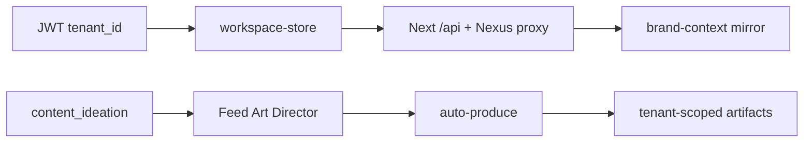

# Multi-Tenant Üretim — Kod Analizi ve Sprint Backlog

**Tarih:** 2026-05-31  
**Amaç:** Giriş yapan markanın (`workspaceId` = Nexus `tenantId`) verisi, galerisi, sektörü ve misyonları üzerinden üretim; pilot tenant sabitleri veya demo başlıklarıyla sızıntı yok.

**İlişkili program:** `docs/sprint-plan-agency-orchestrator.md` (APO), `docs/foundation-sprint-program.md` (BAS/ICS).

---

## 1. Çalışan omurga (doğrulandı)

| Katman | Tenant izolasyonu | Marka dinamikleri |
|--------|-------------------|-------------------|
| **Auth / UI** | JWT → `X-Tenant-Id`; `workspace-store` persist | Seçili tenant tüm API çağrılarında |
| **Next BFF** | `crew-proxy.ts` workspace UUID + internal key | `brand-context/{workspaceId}`, `theme` |
| **auto-produce** | `workspaceId` body; brand fetch Python mirror | `business_type`, `location`, `gallery_analysis`, `brand_vibe`, FD report |
| **Python executor** | `build_brand_info(db, workspace_id)` | Mission brief, gallery usage, tenant learning |
| **Production stack** | FD → auto-produce payload aynı `workspaceId` | `production_assignments`, GIS match, sector poster kits |
| **Artifacts (.NET)** | Nexus tenant scope | `production_role`, `metadata` |

---

## 2. Tespit edilen kaçaklar ve durum

| ID | Risk | Açıklama | Durum |
|----|------|----------|--------|
| **MT-1** | Yüksek | Strategist grafında `feed_cohesion_review` yok → FD raporu Mission Hub’da görünmüyordu | **Düzeltildi** — upsert + `ensure_feed_cohesion_review_node` + strategist prompt |
| **MT-2** | Yüksek | `auto-produce` body `workspaceId` ile JWT `X-Tenant-Id` eşleşmesi yok | **Düzeltildi** — `tenant-production-guard.ts` |
| **MT-3** | Orta | Python → Next `auto-produce` internal key göndermiyordu | **Düzeltildi** — `X-Internal-Api-Key` + `X-Tenant-Id` |
| **MT-4** | Orta | `feed_cohesion_review` node executor’da ikinci kez crew çalıştırabilirdi | **Düzeltildi** — inline stack; node sadece rapor taşıyıcı |
| **MT-6** | Orta | auto-produce / auto-trigger BAS kapısı eksikti | **Düzeltildi** — `assertAutonomousProductionAllowed` (internal bypass) |
| **MT-7** | Orta | Strategist FD node rehberi yoktu | **Düzeltildi** — prompt + `ensure_feed_cohesion_review_node` |
| **MT-8** | Orta | BFF path ≠ JWT tenant | **Düzeltildi** — `middleware.ts` + route guard’ları + `remotion/render` body |
| **MT-9** | Düşük | missionId cross-tenant | **Düzeltildi** — `assertMissionBelongsToWorkspace` |
| **MT-10** | Orta | Tenant learning üretime yansımıyordu | **Düzeltildi** — `tenant-learning` endpoint + Runway `missionBrief` |
| **MT-5** | Orta | `NEXT_PUBLIC_USE_DEMO_CONTEXT=true` → sabit demo tenant | **Açık** — prod’da kapalı |
| **MT-11** | Orta | İki DB mirror; onboarding eksik tenant | **Açık** — Hub onboarding mesajları |
| **MT-12** | Orta | FD yokken heuristik atama | **Açık** — eski misyonlar; yeni graf FD node ile |
| **APO-5** | UI | Feed slot + publish schedule | **Kısmen** — alt filtreler + Hub saat/format etiketi |

---

## 3. Kod değişiklikleri (kümülatif)

1. `apps/web/src/lib/tenant-production-guard.ts` — tenant eşleşmesi, BAS kapısı, mission IDOR, header forward.
2. `apps/web/src/app/api/auto-produce/route.ts` — tenant + BAS + mission guard.
3. BFF audit: `missions/*`, `brand-readiness`, `brand-alignment`, `gallery-intelligence`, `propose`, `auto-trigger`.
4. `backend/app/services/task_graph_executor.py` — FD upsert, executor skip, internal headers.
5. `backend/app/services/mission_service.py` + `strategist_service.py` — `ensure_feed_cohesion_review_node`.
6. `backend/app/crew/prompts/strategist_prompts.py` — FD node zorunluluğu örneği.
7. `apps/web/src/middleware.ts` — merkezi path tenant doğrulama (MT-8).
8. `GET /api/tenant-learning/{workspaceId}` + Python `tenant-learning` (MT-10).
9. `apps/web/src/lib/feed-slot-filter.ts` + PlatformFeed alt filtreler (APO-5).

---

## 4. Sprint önerisi (2 hafta — MT hardening)

### Hafta 1

| Görev | Sahip | Kabul kriteri |
|-------|-------|----------------|
| MT-5 | Platform | Prod `.env`: demo context kapalı; smoke: iki tenant login, Feed ayrık |
| MT-6 | Onboarding | `brand-readiness` &lt; eşik → auto-trigger / auto-produce blok + Hub mesajı |
| MT-8 | BFF audit | Tüm `[tenantId]` / `[workspaceId]` route’larda path === header |
| Regresyon | QA | Kaçta + Bodrum dışı yeni tenant: 1 mission, checklist 4/5+ |

### Hafta 2

| Görev | Sahip | Kabul kriteri |
|-------|-------|----------------|
| MT-7 | Strategist | `strategist_prompts.py` örnek grafa `feed_cohesion_review` (depends_on ideation) |
| MT-9 | API | auto-produce: mission `workspace_id` Nexus’tan doğrula |
| MT-10 | Learning | Onaylı/reddedilen öneriler → `tenant_learning` auto-produce prompt ipucu |
| APO-5 devam | Feed UI | `publish_schedule` + story motion alt filtre |

---

## 5. Operasyonel kontrol listesi (yeni tenant)

1. Login → `workspace-store.tenantId` JWT ile aynı mı?
2. Brand Hub: constitution onaylı, `reference_image_urls` ≥ 3?
3. `GET /api/gallery-intelligence/{tenantId}` — coverage skoru?
4. Mission propose → graf ideation içeriyor mu?
5. Ideation bitince Mission Hub: **Feed Art Director** satırı + slot checklist?
6. Platform Feed: artifact’lar yalnızca bu tenant’ta?

---

## 6. Pilot tenant’lar (regresyon only)

| Tenant | UUID | Not |
|--------|------|-----|
| Kaçta | `5feb36f7-def7-4b4a-834f-353457de57bf` | 5/5 slot regresyon |
| Bodrum | `d6b187ab-0821-43bf-8381-25f3b17f24e4` | FD node upsert sonrası Hub raporu görünmeli |

**Kural:** Üretim kodunda pilot UUID sabiti yok; testler ortam değişkeni veya QA dokümanı ile.

---

## 7. Release öncesi (ertelendi)

Prod ortam değişkenleri ve smoke listesi → **`docs/release-env-checklist.md`** (release öncesi uygulanacak; dev’de dokunulmayacak).

---

## 8. APO programı ile hizalama

| APO | Multi-tenant bağı |
|-----|-------------------|
| APO-1 | FD `production_assignments` — tenant başına manifest |
| APO-3 | PIS + `parseProductionIdeas` — brand theme |
| APO-4 | Sector poster kits — `business_type` |
| APO-5 | Slot checklist — tenant-agnostic metadata |
| APO-6+ | Kampanya/reklam — aynı tenant scope |

**Sonraki doküman güncellemesi:** `docs/sprint-plan-agency-orchestrator.md` § Pilot tablosuna MT-1..MT-3 “done” notu eklenebilir.
