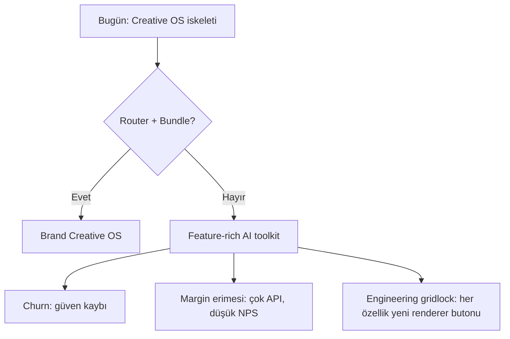
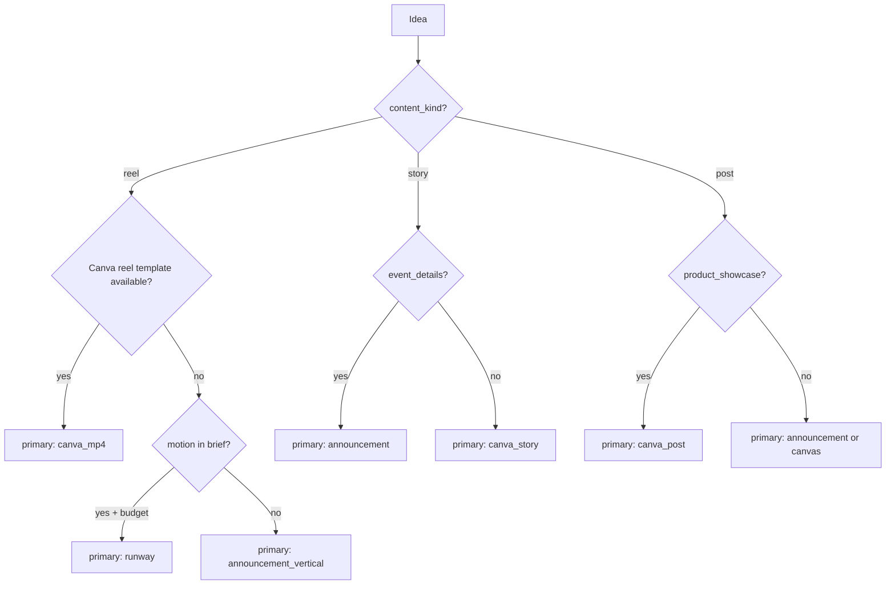

# SMART AGENCY — Strategic Architecture Review
## Autonomous Creative Operating System Evaluation

**Perspektif:** Principal Product Architect · AI Systems Designer · Creative Infrastructure PM · AI-native SaaS Strategist  
**Tarih:** Mart 2026  
**Kaynak:** Kod tabanı + `docs/production-pipeline-evaluation-report.md` + ürün dokümanları  
**Amaç:** Kod kalitesi değil — *sistem neye dönüşüyor, hangi yön doğru, tradeoff’lar ve riskler*

---

## Executive Summary

Smart Agency, yüzeyde bir “AI sosyal medya aracı” gibi görünse de **altyapı olarak çok daha iddialı bir şeye** yaklaşmış durumda: mission-orchestrated, multi-agent, multi-renderer, gallery-aware, approval-gated bir **Creative Operating System (COS)** iskeleti.

**Bugünkü gerçeklik:** Güçlü parçalar (mission DAG, brand context, Canva decision layer, announcement engine, auto-produce) var; fakat **karar katmanı dağınık**, **çıktı modeli parçalı**, **öğrenme ve yayın ikiye bölünmüş**. Bu, sistemi kullanıcı gözünde “özellik koleksiyonu”na iter; otonom vaadi ile güven arasında gerilim yaratır.

**Stratejik öneri:** Ürünü “daha çok renderer” ile büyütmek yerine — **Content Router + ProductionBundle + Unified Review/Publish/Learning** — tek bir *production contract* etrafında konsolide etmek. Bu, flexibility’den ödün vermeden *varsayılan otonomiyi* deterministik ve güvenilir kılar; power user için override katmanı korunur.

**Maturity (1–5):** Orchestration **3.5** · Renderer routing **2** · UX coherence **2.5** · Learning loop **2** · AI-native depth **3.5** · Scale readiness **2.5**

---

# 1. MEVCUT SİSTEM ANALİZİ

## 1.1 Bileşen bazlı değerlendirme

### Mission Hub — *Strategic control plane (güçlü)*

| Boyut | Değerlendirme |
|--------|----------------|
| Rol | Kampanya/intent üreten **orchestration giriş kapısı** |
| Güç | Strategist + DAG + approve/cancel/restart + bütçe gate |
| Zayıflık | Feed auto-trigger ile scheduler cap tutarsız; propose response shape riski |
| Potansiyel | “Marketing mission OS”ün görünür yüzü — doğru yerde |

Mission Hub, sistemin **tek gerçek “neden üretiyoruz?”** katmanı. Bu, klasik scheduling tool’lardan (Buffer/Later) ayrışmanın omurgası.

---

### Content Factory + Auto Production Feed — *Execution surface (güçlü ama kaotik)*

| Boyut | Değerlendirme |
|--------|----------------|
| Rol | Fikir → görsel/metin → artifact |
| Güç | Otonom mod, galeri zekâsı, çoklu renderer erişimi |
| Zayıflık | ~4K satır monolit; 10+ üretim yolu; circular import; “birincil çıktı” yok |
| UX | Gelişmiş mod = overflow menü = **tool collection hissi** |

**Auto Production Feed** doğru varsayılan (galeri varsa). Ancak arka planda **canvas + Canva + foto** paralel üretilmesi, kullanıcıya “hangisi gerçek?” sorusunu sordurur.

---

### Canva Autofill — *Renderer adapter (doğru yönde, olgunlaşmış)*

Dokümantasyon açıkça doğru kararı veriyor: *“Canva ürünün beyni olmamalı.”*

| Güç | Risk |
|-----|------|
| Template selection scoring | 429 / envanter boşluğu |
| Field dictionary + contracts | Tenant template hygiene |
| Export → publish URL | Edit URL ile publish karışıklığı |
| `canva-mission-signal` | Henüz agent çıktısına tam bağlı değil |

Canva, **premium marka tutarlılığı** için en güçlü renderer — ama **routing olmadan** her fikirde sessiz tetiklenmesi gürültü ve maliyet üretir.

---

### Runway Reel — *Motion adapter (niche, pahalı)*

| Güç | Limit |
|-----|-------|
| Caption-driven director prompt | Tek kare image-to-video |
| Brand vibe injection | “Time-lapse / ekip hazırlığı” gibi brief’ler karşılanamaz |
| Bütçe cap (auto-produce) | Otonomda kapalı; manuelde çift-save |

Runway **ayrı ürün kategorisi** (Runway.ai) ile rekabet etmez; **sosyal motion layer** olarak konumlanmalı. Canva reel MP4 ile ikili strateji netleşmeli.

---

### Gallery Intelligence — *Differentiator (çok güçlü, under-marketed)*

| Bileşen | Değer |
|---------|-------|
| Apify + gallery analysis | Gerçek mekân/ürün fotoğrafları |
| `gallery-photo-matcher` | Semantic eşleme, batch uniqueness |
| `gallery-usage-tracker` | Tekrar önleme |
| Agent `visual_production_spec` | Foto seçimini stratejiye bağlama |

Bu, **Midjourney/Flux-only** araçlardan en net ayrışma noktası: *“bizim mekânımız, bizim fotoğrafımız.”*

Zayıflık: Agent çıktısı ile matcher arasında şema kopukluğu; skorlar kullanıcıya görünmez (kara kutu).

---

### Multi-renderer system — *Capability wealth, routing poverty*

Mevcut renderer’lar:

1. Ham foto  
2. Client canvas (`composeBrandPhotoCard`)  
3. Announcement SVG (`generate-event-card`)  
4. Design Director + GPT-image edit  
5. Canva autofill + export  
6. Runway  
7. (Ölü) product background  

**Problem “renderer yok” değil — “router yok”.** Her ekran kendi butonunu ekliyor; kalite hiyerarşisi kodda değil, kullanıcı hafızasında.

---

### Artifact system — *System of record (iyi temel, yanlış granularity)*

| Güç | Zayıflık |
|-----|----------|
| Nexus `OutputArtifacts` + review states | 1 artifact = 1 URL |
| Zengin JSON metadata | Fikir bundle yok |
| `pending_review` → approve | Foto + Canva = 2 kart |

Artifact modeli **publish ve learning** için doğru soyutlama — ama **production unit** olarak yetersiz. Production unit = *idea + variants*, artifact = *variant export*.

---

### Feed / Outputs / Review — *Operational closure (parçalı)*

| Güç | Zayıflık |
|-----|----------|
| Mobile-first onay akışı | Onayla = publish (Mertcafe) |
| Revizyon isteği | Desktop Meta path ayrı |
| Canva export URL resolution | Preview vs publish URL drift |

Review, COS’un “human-in-the-loop” katmanı — kritik. İki publish stack ve iki learning, **operating system** hissini kırıyor.

---

### Publishing — *Last mile (fragile)*

- **Mertcafe** (mobile Feed)  
- **Meta Graph** (desktop / ApprovalFeedback)  

Unified publish olmadan: tenant config, hata mesajları, retry, analytics **çift maliyet**.

---

### Learning systems — *Ambitious but split brain*

| Sistem | Kaynak | Ne öğrenir |
|--------|--------|------------|
| Nexus BrandLearning | Approve/reject artifact | Qdrant brand memory |
| Python tenant_learning | `suggestions` table | Crew prompt injection |
| Gallery usage tracker | Artifacts | Foto tekrarı |
| Frontend session | sessionStorage | Geçici |

**AI-native COS için tek döngü şart:** `production decision → output → human signal → next production decision`. Bugün döngü **iki veritabanında kırık**.

---

## 1.2 Çapraz boyutlar

### Güçlü taraflar (sistem potansiyeli)

1. **End-to-end intent:** Mission → content → (auto) produce → review → publish  
2. **Brand-grounded generation:** Galeri + brand kit + vibe — generic AI’dan ayrışma  
3. **Renderer adapter düşüncesi** (özellikle Canva planı)  
4. **Multi-agent DAG** (content serialized — bilinçli tradeoff)  
5. **Dokümantasyon olgunluğu** (dynamic content standard, risk plan)  
6. **Operational hooks:** Budget, venue photo policy, rate limits  

### Teknik borç (yüksek etki)

| Borç | Etki |
|------|------|
| MissionContentFactory monolith | Velocity ↓, bug risk ↑ |
| auto-produce ∥ client otonom drift | Tutarsız çıktı |
| Dual learning / dual publish | COS bütünlüğü yok |
| Parser şema çoğaltması (`ArtifactIdea` vs `CanvasOutput`) | Agent → production kayıp |
| auto-trigger bugs | Otonom güven |

### UX problemleri

- **“Hangisini onaylıyorum?”** — foto / canvas / Canva / reel  
- **Gelişmiş = 15 seçenek** — expert-friendly, novice-hostile  
- **Kalite öngörülemez** — aynı fikir farklı renderer’da farklı sınıf  
- **Reel ≠ video UI** — Feed’de kare kart  

### Scaling riskleri

| Risk | Tetik |
|------|--------|
| Canva API 429 | Otonom burst autofill |
| Runway cost | Manuel + budget bypass |
| LLM mission propose | Strategist 30–90s, quota |
| Postgres + Python mirror | İki DB loose coupling |
| BFF timeout 360s | Uzun crew — iyi ama edge case |

### Maintainability

- Renderer ekleme = yeni buton + yeni API route + yeni save path  
- **Content Router olmadan** her özellik linear complexity artırır  

### Product consistency

- Marka kiti artık announcement engine — ama otonom hâlâ canvas+Canva  
- Desktop ContentPage ≠ mobile Feed semantics  
- `platform: canva` vs `instagram` artifact karışıklığı  

### Multi-agent orchestration seviyesi

**Orta-ileri (3.5/5):**

- ✅ Strategist mission planning  
- ✅ DAG dependencies, serialized content  
- ✅ Brand context injection  
- ⚠️ Agent output → structured production contract zayıf  
- ❌ Cross-agent “creative director” unified layer yok  
- ❌ Renderer seçimi agent’ta değil, UI’da  

### AI-native yönü ne kadar güçlü?

**Güçlü omurga, zayıf kapanış döngüsü:**

| AI-native | Durum |
|-----------|--------|
| Autonomous propose/approve | ✅ |
| Brand research / discovery (plan) | ✅ dokümante |
| Tool-using crews | ✅ |
| Structured output → deterministic render | ⚠️ |
| Closed-loop learning | ❌ split |
| Self-healing production (retry router) | ❌ |

---

# 2. MEVCUT YAPI NEYE DÖNÜŞEBİLİR?

## 2.1 Bugün hangi kategori?

| Etiket | Fit (0–5) | Gerekçe |
|--------|-----------|---------|
| AI content tool | 4 | Çok özellik, tek akış hissi zayıf |
| AI automation tool | 4 | auto-produce, auto-trigger |
| AI operating system | **3** | Parçalar var, contract yok |
| Creative infrastructure | **3.5** | Canva adapter, template registry, BFF |
| Autonomous marketing OS | **2.5** | Mission var, publish/learning bölük |

**Gerçek konum:** *“AI-native creative infrastructure with emerging OS characteristics”* — henüz tam OS değil.

## 2.2 Olması gereken category positioning

> **Autonomous Brand Creative Operating System**  
> *(veya kısa: **Brand Creative OS**)*

**Tek cümle:**  
*“Markanızın stratejik görevlerini AI agent’lar planlar; sistem galeriniz ve şablonlarınızla tutarlı içerik üretir; siz onaylarsınız; öğrenir ve tekrarlar.”*

Bu positioning:

- Canva’dan: **orchestration + brand gallery + autonomous mission**  
- Hootsuite/Buffer’dan: **generation + brand intelligence**, sadece schedule değil  
- Runway/Midjourney’den: **publish-ready bundle + brand constraint**  
- Adobe Express’ten: **tenant learning + agent strategy**, tek editör değil  

## 2.3 Rekabet — fark ekseni (feature değil)

| Rakip | Onların çekirdeği | Smart Agency farkı (hedef) |
|-------|-------------------|----------------------------|
| Canva | Design tool + Magic Studio | **Karar + routing + approval + learning**; Canva = renderer |
| Buffer/Later | Schedule + analytics | **Üretim + mission intent** upstream |
| Runway | Motion generation | **Brand photo in, social bundle out** |
| Generic AI social | Prompt → post | **Gallery + template + policy + DAG** |

**Moat adayları (savunulabilir):**

1. Gallery intelligence + usage learning  
2. Tenant template registry + field contracts  
3. Mission DAG tied to brand context  
4. ProductionBundle lineage (henüz yok — inşa edilmeli)  

---

# 3. EN KRİTİK PROBLEM NEDİR?

## 3.1 Tek cümle

> **Üretim birimi (idea) ile sistem kaydı (artifact) ve kullanıcı zihni (tek “çıktı”) hizalanmamış; karar katmanı dağınık olduğu için otonom çıktı kalitesi ve güveni öngörülemez.**

## 3.2 Çözülmezse sistem nereye gider?



**“Tool collection” yolu:** Her sprint yeni renderer/buton; onboarding karmaşıklaşır; enterprise satış zorlaşır; AI maliyeti artar, çıktı başına değer artmaz.

## 3.3 Kullanıcı neden güven kaybedebilir?

1. Feed’de **aynı kampanyadan 2–3 kart** (foto + Canva)  
2. **Onayladığını sanırken** farklı varyant yayınlanır (preview ≠ publish URL)  
3. Reel brief’i ile çıkan video uyuşmaz (Runway limiti)  
4. Marka kiti / canvas / Canva **kalite lotaryası**  
5. Otonom “hazır” dediği içerik düşük kalite canvas’tır; Canva export arkada gelir  

## 3.4 AI output neden deterministic hissettirmeyebilir?

| Sebep | Mekanizma |
|-------|-----------|
| Router yok | Aynı `content_type`, farklı renderer |
| Parser drift | Agent JSON → farklı alanlar düşer |
| Parallel pipelines | auto-produce ≠ client otonom |
| Non-deterministic LLM | Rewrite/truncate farklı sonuç |
| Template inventory | Canva şablon yoksa 409 silent fail |

**Determinism ≠ aynı pixel** — *aynı tier kalite + aynı birincil varyant + aynı publish contract* demek.

## 3.5 Neden “tool collection” hissi?

- Her renderer’ın **ayrı UI girişi** (overflow, panel, sheet)  
- Ortak **Production Contract** UI’da görünmez  
- Mission stratejisi → üretim → onay **üç ayrı mental model**  
- Desktop vs mobile **farklı publish/approve**  

---

# 4. YENİ ÖNERİLEN YAPIYI DEĞERLENDİR

Önerilen dönüşüm bileşenleri ve katkıları:

## 4.1 Content Router

**Ne yapar:** `(idea, tenantProfile, contentKind, intent, assetInventory, policy) → RenderPlan`

| Katkı | Açıklama |
|-------|----------|
| Teknik | Renderer’lar plug-in; UI buton sayısı azalır |
| Ürün | “Sistem karar verdi” narratif |
| UX | Varsayılan birincil çıktı net |
| Scale | Rate limit / cost policy merkezi |
| Otonom | auto-produce + otonom feed aynı planı kullanır |
| Maintainability | Yeni renderer = router rule + adapter |

**Risk:** Yanlış rule → sistematik hata (ama debug edilebilir; bugün debug edilemez).

---

## 4.2 ProductionBundle

**Ne yapar:** Tek fikir → `{ feedCopy, variants[], primaryVariantId, lineage, missionRef }`

| Katkı | Açıklama |
|-------|----------|
| Teknik | Nexus parent-child veya tek JSON artifact |
| Ürün | Feed’de **tek kart**, varyant sekmesi |
| UX | “Onayla” = bundle primary |
| Learning | Approve/reject **fikir + varyant** seviyesinde |
| Otonom | Secondary varyantlar arka planda |

---

## 4.3 Single Feed Card

Bundle’ın UI yansıması. **Güvenin #1 UX onarımı.**

---

## 4.4 Primary Renderer

Router çıktısı: `primary: canva_reel_mp4`, `fallbacks: [announcement_story, canvas]`

Politika örneği:

| content_kind | intent | primary |
|--------------|--------|---------|
| reel | venue_showcase | canva_mp4 |
| reel | motion_brief | runway (if budget) |
| story | event | announcement |
| story | daily | canva_story |
| post | product | canva_post |

---

## 4.5 Unified Publish

Tek `PublishService`: provider adapter (Mertcafe | Meta), media validation, export gate (“Canva edit URL değil, export URL şart”).

---

## 4.6 Unified Learning

Tek event stream:

```
ProductionApproved | ProductionRejected | VariantRejected
  → BrandGenome update + Crew prompt block + template scoring feedback
```

Nexus ↔ Python sync veya tek writer.

---

## 4.7 Renderer abstraction

```typescript
interface CreativeRenderer {
  id: string;
  canRender(plan: RenderPlan): boolean;
  render(input: RenderInput): Promise<RenderOutput>;
  estimateCost(plan): CostEstimate;
}
```

Canva, Announcement, Runway, Canvas, Flux — **eşit vatandaş**.

---

## 4.8 AI Creative Director layer

Mission agent’ların **altında**, router’ın **üstünde**:

- Fikir başına: `templateUseCase`, `assetIntent`, `canvaFieldCopy`, `visual_production_spec`, `renderPreference`  
- “Neden bu renderer?” açıklaması (user-visible trace)  

Bu, multi-agent chaos’u **tek creative decision record**’a indirger.

---

## 4.9 Brand Genome system

Uzun vadeli tenant modeli:

- Palette, typography, tone, forbidden patterns  
- Template family weights  
- Approved/rejected pattern embeddings  
- Gallery cluster map  

Brand Genome = **router + learning + agent prompt** için ortak kaynak.

---

## 4.10 Özet: dönüşüm değeri

| Boyut | Bugün | Hedef |
|-------|-------|-------|
| Ürün vaadi | “Çok AI özellik” | “Otonom marka üretim OS” |
| Güven | Düşük-orta | Yüksek (bundle + primary) |
| Mühendislik | Linear karmaşıklık | Plug-in renderer |
| Maliyet kontrolü | Dağınık | Router policy |
| Enterprise | Zor anlatım | Policy + audit trail |

---

# 5. TRADEOFF ANALİZİ

## 5.1 Mevcut özelliklerden uzaklaşma mı?

**Hayır — ifade değişir, yetenek kalır.**

- Gelişmiş mod: “Override renderer” / “Add variant”  
- Overflow menü → “Varyant ekle” (Canva, Runway, …)  

Power user **kaybetmez**; novice **kazanır**.

## 5.2 Flexibility azalır mı?

**Varsayılan evet, override ile hayır.**

| | Varsayılan | Override |
|--|------------|----------|
| Router policy | Deterministic tier | Manual renderer pick |
| Varyant sayısı | 1 primary + N optional | User-triggered |

Risk: Policy çok katıysa yaratıcılık düşer → **A/B policy per tenant tier** (starter vs pro).

## 5.3 Sistem fazla deterministic olur mu?

**Üretim kararı daha deterministic; içerik hâlâ generative.**

LLM fikir üretir; router **hangi fabrikaya gideceğini** sabitler. Bu, ajans sürecine benzer (brief serbest, prodüksiyon standardı sabit).

## 5.4 Kullanıcı kontrolü azalır mı?

**Surface control azalır, depth control artar.**

- Azalan: 10 buton seçimi  
- Artan: varyant swap, primary değiştir, policy tuning (Brand Hub)  

## 5.5 Creativity düşer mi?

**Kötü router → evet. İyi router → hayır.**

Creativity **copy ve konsept** katmanında (agent); **execution** katmanında tutarlılık creativity’yi *artırır* (marka güveni).

## 5.6 Engineering complexity

| Kısa vade | Orta vade |
|-----------|-----------|
| Router + Bundle = refactor cost | Complexity ↓ (yeni renderer kolay) |
| Migration artifacts | Tek contract |

**Net:** 2–3 sprint yatırım, sonra velocity artar.

## 5.7 Latency

| Etki | Not |
|------|-----|
| Router logic | +ms–sn (ihmal) |
| Sequential primary-first | İlk çıktı daha hızlı görünür |
| Paralel varyantlar | Arka planda; UX daha iyi |

Bugün: kullanıcı **hem canvas hem Canva** bekler — toplam latency daha kötü.

## 5.8 Orchestration maliyeti

| | Bugün | Router sonrası |
|--|-------|----------------|
| LLM calls | Dağınık rewrite | Planlı tek rewrite |
| Canva | Gereksiz silent autofill | Policy-gated |
| Runway | Manuel scatter | Budget-gated |

**Maliyet düşer** (doğru policy ile).

---

# 6. CONTENT ROUTER ANALİZİ

## 6.1 Hedef akış

```txt
idea (structured)
 ↓
Brand Genome + tenant policy
 ↓
Content Router → RenderPlan
 ↓
Renderer pipeline (primary, then optional fallbacks)
 ↓
ProductionBundle
 ↓
Review (human)
 ↓
Unified Publish
 ↓
Learning event → Brand Genome update
```

## 6.2 Router girdileri (contract)

```typescript
interface RouterInput {
  idea: {
    contentKind: 'post' | 'story' | 'reel' | 'carousel';
    intent: TemplateUseCase;      // product_showcase, event_announcement, ...
    assetIntent: AssetIntent;     // hero_image, venue_photo, ...
    headline: string;
    caption: string;              // Instagram feed copy
    canvaFieldCopy?: Record<string, string>;
    visualProductionSpec?: VisualProductionSpec;
    eventDetails?: EventDetails;
  };
  tenant: {
    genome: BrandGenome;
    templateInventory: TemplateInventorySummary;
    galleryStats: GalleryStats;
    budget: BudgetSnapshot;
    policies: ProductionPolicies;
  };
  channel: 'mission_autonomous' | 'mission_manual' | 'desktop_studio';
}
```

## 6.3 Router çıktısı (RenderPlan)

```typescript
interface RenderPlan {
  primary: {
    rendererId: 'canva' | 'announcement' | 'runway' | 'canvas' | 'photo_only';
    templateId?: string;
    reason: string;               // user-visible
    estimatedCostUsd?: number;
    estimatedLatencySec?: number;
  };
  fallbacks: RendererStep[];      // ordered
  fieldLimits: FieldLimitMap;     // from template contracts
  publishRequirements: {
    requiresExport: boolean;        // Canva: true
    minResolution: { w: number; h: number };
  };
}
```

## 6.4 Karar mantığı (örnek kurallar)



**Önemli:** Kurallar kodda hardcode değil — **tenant policy table + scoring** (`canva-template-selection` genişletilmiş).

## 6.5 ProductionBundle oluşumu

```typescript
interface ProductionBundle {
  bundleId: string;
  ideaRef: { missionId?: string; nodeKey?: string; ideaIndex: number };
  feedCopy: { caption: string; hashtags: string[]; cta?: string };
  variants: Array<{
    variantId: string;
    rendererId: string;
    mediaUrl: string;
    format: 'png' | 'mp4' | 'jpeg';
    isPrimary: boolean;
    metadata: Record<string, unknown>;
  }>;
  renderTrace: RenderPlan;        // audit / debug
  status: 'producing' | 'ready' | 'approved' | 'published' | 'failed';
}
```

**Nexus mapping seçenekleri:**

1. **Tek artifact**, `content` = bundle JSON (hızlı)  
2. **Parent artifact** + child variants (sorgu kolay)  

## 6.6 Review katmanı

| Bugün | Hedef |
|-------|-------|
| Kart = artifact | Kart = bundle |
| Onayla = tek URL | Onayla = primary variant |
| Varyantlar ayrı kartlar | “Diğer varyantlar” sekmesi |
| Revizyon belirsiz | Revizyon = copy vs visual ayrımı |

**Creative Director trace** review UI’da: *“Canva ‘Summer Reel’ seçildi çünkü: reel + venue_photo + template match 0.82”*

## 6.7 Publish katmanı

```typescript
async function publishBundle(bundle: ProductionBundle, opts: PublishOpts) {
  const primary = bundle.variants.find(v => v.isPrimary)!;
  validatePublishable(primary);  // no canva edit URL
  const provider = resolvePublishProvider(opts.tenantId);
  return provider.publish({ media: primary, caption: bundle.feedCopy, ... });
}
```

## 6.8 Router’ın mevcut koda map’i

| Mevcut | Router sonrası |
|--------|----------------|
| `selectCanvaTemplate()` | `CanvaRenderer.plan()` |
| `smartSelectTemplate()` (announcement) | `AnnouncementRenderer.plan()` |
| `composeBrandPhotoCard` | `CanvasRenderer` fallback |
| `generate-reel` | `RunwayRenderer` gated |
| AutoProductionFeed `produceAll` | `BundleProducer.produce(ideas, plan)` |
| `auto-produce/route.ts` | Aynı `BundleProducer` server-side |

**Kritik:** Client ve server **aynı router module** import etmeli (`apps/web/src/lib/content-router/`).

---

# 7. STRATEJİK YOL HARİTASI (ÖNERİ)

## Faz 0 — Güven onarımı (2–3 hafta)

- ProductionBundle v0 (metadata-only grouping)  
- Feed tek kart UI  
- Unified `resolveArtifactMedia()`  
- Canva publish export gate  
- auto-trigger bug fix  

**Ürün etkisi:** Yüksek · **Mimari etkisi:** Orta

## Faz 1 — Content Router v1 (4–6 hafta)

- `RenderPlan` + policy table  
- Primary renderer only (fallback manual)  
- auto-produce + AutoProductionFeed → shared router  
- Creative Director fields in agent prompt  

## Faz 2 — Unified ops (4–6 hafta)

- Unified Publish adapter  
- Learning event bus (Nexus → Python veya tersi)  
- Brand Genome v0 (read model)  

## Faz 3 — OS olgunluğu (ongoing)

- Self-healing fallbacks  
- Policy studio (Brand Hub)  
- Enterprise audit + SLA  
- Multi-channel (TikTok, GBP)  

---

# 8. RİSK MATRİSİ

| Risk | Olasılık | Etki | Mitigasyon |
|------|----------|------|------------|
| Router yanlış primary | Orta | Yüksek | Fallback + user swap + trace |
| Refactor süresi | Yüksek | Orta | Faz 0 bundle without full router |
| Ekip “eski buton” direnci | Orta | Düşük | Advanced override koru |
| Canva envanter boş | Orta | Yüksek | Announcement/canvas fallback chain |
| Maliyet patlaması | Orta | Yüksek | Router budget gate |
| Learning migration | Düşük | Yüksek | Event schema first |

---

# 9. SONUÇ — STRATEJİK HÜKÜM

Smart Agency **doğru sorunu çözüyor**: markalı, görev odaklı, çok kanallı içerik üretimi. Altyapı parçaları **Creative OS** için yeterince güçlü.

**Asıl engel:** OS contract’ı yok — üretim, kayıt, öğrenme ve UX **farklı zamanlarda farklı mimarilerle** büyümüş.

**Önerilen yapı (Router + Bundle + Unified Publish/Learning + Brand Genome)** mevcut özellikleri silmez; **varsayılan deneyimi işletilebilir hale getirir**. Bu, “AI tool collection”dan **“autonomous brand creative infrastructure”**a geçişin minimum yeterli koşuludur.

**Tradeoff özeti:** Kısa vadede engineering yükü; orta vadede velocity, güven, margin ve anlatılabilirlik kazancı. **Creativity** agent ve brief katmanında kalır; **consistency** router’da kazanılır — premium marka ürünleri için doğru ayrım.

---

## Ek: Dış AI değerlendirmesi için kontrol soruları

1. Router policy’yi kim sahiplenir — product mı, ML mi, ops mı?  
2. Bundle storage: tek JSON mı, relational children mı?  
3. Primary renderer seçiminde human override audit zorunlu mu?  
4. Runway reel stratejik olarak in mi out mu?  
5. İlk enterprise pilot için minimum OS contract nedir?  
6. Brand Genome ile mevcut Brand Hub birleşir mi?  

---

*İlişkili teknik rapor:* `docs/production-pipeline-evaluation-report.md`  
*İlişkili ürün dokümanları:* `docs/dynamic-content-and-canva-standard.md`, `docs/controlled-creative-production-and-canva-risk-plan.md`
